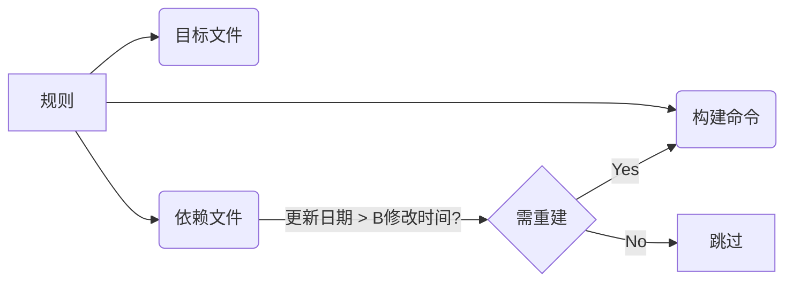

# GUN Make

## 1. make 概述 (Overview of make)

### 1.1. 基本概术(Overview of make)

> make 工具能自动检查哪些源代码需要编译（或重新编译），并执行对应的编译命令。
> 要使用 make 工具，必须先编写名为 makefile 的配置文件，其中需定义：
>
> 1. 程序文件间的依赖关系
> 2. 更新每个文件的编译指令

简单一句话：make是一个决定哪些需要被重新编译和确定用哪些命令来重新编译的工具，makefile是指导工具如何运行的。

- Makefile文件描述了整个工程的编译、连接等规则。其中包括：工程中的哪些源文件需要编译以及如何编译、需要创建那些库文件以及如何创建这些库文件、如何最后产生我们想要得可执行文件。
- Makefile的好处是能够使用一行命令来完成“自动化编译”，一旦提供一个（通常对于一个工程来说会是多个）正确的Makefile。编译整个工程你所要做的唯一的一件事就是在shell 提示符下输入make命令。整个工程完全自动编译，极大提高了效率。
  - make是一个命令工具，它解释Makefile中的指令（应该说是规则）在Makefile文件中描述了整个工程所有文件的编译顺序、编译规则。Makefile有自己的书写**格式**、**关键字**、**函数**。像其他编程语言一样有自己的格式、关键字和函数一样。而且在Makefile中可以使用系统shell所提供的任何命令来完成想要的工作。Makefile（在其它的系统上可能是另外的文件名）在绝大多数的IDE开发环境中都在使用，已经成为一种工程的编译方法。

### 1.2. 准备知识

make的讨论之前，首先需要明确一些基本概念：

- 编译的流程 **预处理**，**汇编**，**编译**，**连接**

  - **预处理(Preprocessing)**：在代码翻译前处理宏展开、文件包含和条件编译的编译阶段，将从C/C++源文件做预处理，包含的头文件全部展开到源文件中 `g++ -E mian.cpp -o main.i`
  - **汇编(Assembly)**：将汇编语言助记符翻译为机器码指令的过程。将展开后的预处理文件转化为汇编文件 `g++ -S mian.cpp/main.i -o main.s`
  - **编译(compile)**：把高级语言书写的代码转换为机器可识别的机器指令文件，即二进制文件。`g++ -c main.cpp/main.i/main.s -o main.o`
  - **链接(link)**：将多.o文件，或者.o文件和库文件链接成为可被操作系统执行的可执行程序（Linux环境下，可执行文件的格式为“ELF”格式）`g++ main.cpp/main.i/main.s/main.o -o main`

- 完整编译流程术语链


总结一下，源文件首先会生成中间目标文件，再由中间目标文件生成执行文件。在编译时，**编译器只检测程序语法和函数、变量是否被声明。如果函数未被声明，编译器会给出一个警告**，但可以生成ObjectFile。**链接程序时，链接器会在所有的Object File中找寻函数的实现，如果找不到，那到就会报链接错误码**（Linker Error），在VC下，这种错误一般是：Link 2001错误，意思说是说，链接器未能找到函数的实现。你需要指定函数的Object File。

- 库文件格式**静态库**，**动态库**

  - **静态库**：是多个.o文件的集合。Linux中静态库文件的后缀为“.a”，Windows中则是“.lib”。静态库中的各个成员（.o文件）没有特殊的存在格式，仅仅是一个.o文件的集合。使用“ar”工具维护和管理静态库。
  - **动态库**：也是多个.o文件的集合，但是这些.o文件时有编译器按照一种特殊的方式生成（Linux中，共享库文件格式通常为“ELF”格式。共享库已经具备了可执行条件）。模块中各个成员的地址（变量引用和函数调用）都是相对地址。使用此共享库的程序在运行时，共享库被动态加载到内存并和主程序在内存中进行连接。多个可执行程序可共享库文件的代码段（多个程序可以共享的使用库中的某一个模块，共享代码，不共享数据）(Windows(.dll)，Linux(.so))

## 2. Makefile 简介(An Introduction to Makefiles)

**需要一个名为 makefile 的文件来告知 make 的执行内容。通常，makefile 会指示 make 如何编译和链接程序。**

**当 make 重新编译编辑器时：**

1. 每个被修改的 C 源文件必须重新编译
2. 若头文件被修改，则所有包含该头文件的 C 源文件必须重新编译（确保安全）
3. 每次编译生成与源文件对应的目标文件
4. 若任一源文件被重新编译，则所有目标文件（无论新生成或既往编译留存）必须链接生成新的可执行编辑器**

### 2.1. make规则的构成要素(What a Rule Looks Like)


```makefile
target: dependencies
	commands
```

**target**：可以是一个object file(目标文件)，也可以是一个执行文件，还可以是一个标签（label）。对于标签这种特性，在后续的“伪目标”章节中会有叙述。
**dependencies**：生成该target所依赖的文件和/或target。
**commands**：该target要执行的命令(任意的shell命令)。

**：每一个命令行必须以[Tab]字符开始，[Tab]字符告诉make此行是一个命令行**，如果想用别的需用 `.RECIPEPREFIX` 指定。不建议修改



### 2.2. 一个简单的 Makefile(A Simple Makefile)

c文件

```c
#include <stdio.h>
int main()
{
        printf("hello,make\n");
}
```

makefile文件

```makefile
hello:hello.c
   gcc hello.c -o hello
clean:
   rm hello
```

clean不是别的目标的依赖，所以只在执行 make clean时候才被执行，这种被称为伪目标。为避免存在clean文件。我们显式指定为伪目标，用关键词 **`.PHONY`**. 出错继续执行在 rm前面加-

```makefile
hello:hello.c
        gcc hello.c -o hello

.PHONY: clean
clean:
        -rm hello
```

### 2.3. How make Processes a Makefile

1. 通常我们运行make，它只会查找第一个目标执行。如果我们想指定运行某个目标可以使用 **`.DEFAULT_GOAL`** 关键词手动指定。
2. make根据依赖是否发生变化来判断是否需要重新生成目标。

可以看到依赖未变化，不会重新生成目标。

### 2.4. Variables Make Makefiles Simpler

变量使Makefile变的更简单。

```makfile
objs = hello.o

hello: $(objs)
        gcc $(objs) -o hello

$(objs): hello.c
        gcc -c hello.c -o $(objs)

.PHONY: clean
clean:
        -rm hello hello.o
```

### 2.5 Letting make Deduce the Recipes

make自动推断命令
我们不需要指明编译的C文件，make可以自动推导出来。隐式规则。上述例子可以简化为：

```makefile
objs = hello.o

hello:

$(objs):

.PHONY: clean
clean:
    -rm hello hello.o
```

## 3. Writing Makefiles

### 3.1 What Makefiles Contain

Makefiles contain five kinds of things: **explicit rules**, **implicit rules**, **variable definitions**,**directives**, and **comments**
显示规则，隐式规则，变量定义，指令和注释

#### 3.1.1. Splitting Without Adding Whitespace

如果你想把一行长串字符分行后，在中间不加空格，需要用$符号

```makefile
var :=one$\
    world
```

**`oneworld.`**  $代表一个变量，为空

### 3.2 What Name to Give Your Makefile

1. 对于GNU的make来说有三种命名：makefile、Makefile、GNUmakefile
2. 可以用 -f 或者 -file来指定要执行的makefile

如果三个文件都存在，优先级的顺序为: GNUmakefile > makefile >Makefile

### 3.3 Including Other Makefile

1. The include directive tells make to suspend reading the current makefile and read one or more other makefiles before continuing 。

   ```makefile
   include ./inc/makefile.mk
   ```

   **`makefile`**

   ```makefile
   include ./inc/makefile.mk
   .PHNOY: test
   test:
           @echo $(var2)
   ```

   **`./inc/makefile.mk`**

   ```makefile
   var2 = inc/makefile
   ```
2. 头文件查找

   - `.INCLUDE_DIRS`  这个变量记录了默认搜索头文件的路径
   - `-I` 可以指定搜索头文件路径

### 3.4. The Variable MAKEFILES

make会使用环境变量，`env`和 `set`命令可查看。

```makefile
.PHONY test
test:
	echo $(USER)
```

通常我们也可以通过 `export`来定义临时环境变量。

```makefile
export HELLO := hi
```

### 3.5. How Makefiles Are Remade

双冒号规则：

1. 对于一个没有依赖而只有命令行的双冒号规则,**当引用此目标时,规则的命令将会被无条件执行**。
2. 而普通单冒号规则,当规则的目标文件存在时,此规则的命令永远不会被执行(目标文件永远是最新的

```makefile
hello::
        gcc hello.c -o hello
clean:
        rm hello
```

跟下面伪目标的效果是相同的。

```makefile
.PHONY: hello
hello:
	gcc hello.c -o hello
```

### 3.6. Overriding Part of Another Makefile

如果存在多个目标相同，以最后一个目标为准

### 3.7. How make Reads a Makefile

GNU make 分两个不同的阶段完成它的工作。立即展开和延迟展开

1. 读取所有makefiles和include makefile，(internalizes )内在化所有显式规则和隐式规则的变量和值，建立一个所有目标和所有依赖的关系图
2. make通过这些内在化的数据来决定执行更新目标和执行命令
   变量和函数的展开发生在第一阶段，就叫做**立即展开**，否则称为**延迟展开**

### 3.8. How Makefiles Are Parsed

GNU make是一行一行解析makefiles的，解析的流程：

1. 读取完整的逻辑行，包含反斜线的转义
2. 去除注释
3. 如果该行以命令前缀字符(tab)开头，并且我们处于规则上下文中，将该行添加到当前命令并阅读下一行
4. 将立即展开的元素展开
5. 扫描行中的分隔符（如“：”或“=”），以确定该行是宏定义还是规则
6. 内化(Internalize )生成的操作并阅读下一行

### 3.9. Secondary Expansion

```Makefile
.SECONDEXPANSION: #添加二阶段展开关键词
objs = hello
.PHONY: print
print: $$(objs)
	@echo $^
 objs = hello.o
```

## 4. Writing Rules

### 4.1. Rule Syntax

2种规则语法：

如果你要用 `$`,需要写 `$$` ,开启了二阶段展开则需要写成 `$$$$`

### 4.2. Types of Prerequisites

有两种前提：一种是普通依赖，另外一种是order-only依赖
语法：
`targets : normal-prerequisites | order-only-prerequisites`
普通依赖比目标新，则目标会被更新。但是order-only不管比不比目标新，都不会更新目标

### 4.3. Using Wildcard Characters in File Names

#### 4.3.1. Wildcard Examples

`objects = *.o` 这种变量定义，在**目标**或**先决条件**中使用对象的值，则将在此处进行通配符扩展，如果在命令行中使用可能会被认为shell中的值，为避免这种麻烦，需要写成这种形式 `objects := $(wildcard *.o)`

#### 4.3.2. The Function wildcard

语法：`$(wildcard pattern...)`

### 4.4. Searching Directories for Prerequisites

#### 4.4.1. VPATH: Search Path for All Prerequisites

VPATH指定make目标和依赖的寻找的一系列路径。
`VPATH = src:../headers`标记 `src`和 `../headers`两个路径

```makefile
VPATH = src:headers

hello: hello.o
        gcc -o hello hello.o
hello.o: hello.c hello.h
        gcc -c ./src/hello.c -o hello.o -I./headers/
.PHONY:clean

clean:
        rm *.o
        rm hello
```

#### 4.4.2. The vpath Directive

`vpath %.h ../headers`在 `../header`中查找头文件
`vpath %.c foo:bar ` 先在foo中查找后缀为 `.c`的文件,然后再bar中查找。

#### 4.4.3. How Directory Searches are Performed

### 4.5. Phony Targets

伪目标仅仅是为了执行相关的命令，而没有实际的目标文件。几种用法：

1. 为了不与实际的文件产生冲突
   避免冲突，修改为
2. 递归调用发挥make的多线程能力：
   原始写法：
   使用伪目标，发挥多线程能力：
3. 同时构建多个目标
4. 当一个伪目标是另外一个的前提，那么这个伪目标作为另外一个的子线程

### 4.6. Rules without Recipes or Prerequisites

如果一个规则，既没有前提也没有执行的命令。那么make会认为这个这个目标总是需要被更新的。那么依赖这个规则的目标，每次执行都会更新。

```makefile
clean: FORCE
	rm $(objects)
FORCE:
```

这种方式跟 `.PHONY clean` 是一个效果，伪目标方式更有效率些。但是有些make不支持伪目标。

### 4.7. Empty Target Files to Record Events

**空目标是伪目标的变体**；它用于保存您不时明确请求的某个操作的配方。与虚假目标不同，此目标文件确实可以存在；但是文件的内容并不重要，通常是空的。

我们只希望依赖改动后，执行print，那么我们touch 一个print 用于记录更新时间，当前提的修改时间比print时间更新时，执行。

### 4.8. Special Built-in Target Names

- **`.PHONY`**：特殊目标 .PHONY 的先决条件被认为是假目标。当需要考虑这样的目标时，make 将无条件地运行其配方，无论是否存在具有该名称的文件或其上次修改时间。
- **`.SUFFIXES`**：特殊目标 .SUFFIXES 的先决条件是用于检查后缀规则的后缀列表。
- **`.DEFAULT`**：为A指定的配方将用于任何没有找到规则的目标(无论是显式规则还是隐式规则)。如果指定了一个配方，那么在规则中作为先决条件而不是目标提到的每个文件都将执行该配方。
- **`.PRECIOUS`**：.PRECIOUS 所依赖的目标被给予以下特殊处理：如果在执行其配方期间杀死或中断了目标，则不会删除目标。此外，如果目标是一个中间文件，那么在不再需要它之后，它将不会被删除，就像通常所做的那样。在后一方面，它与 .SECONDARY 特殊目标重叠。
- **`.INTERMEDIATE`**：.INTERMEDIATE 所依赖的目标被视为中间文件。没有先决条件的 .INTERMEDIATE 没有效果。
- **`.SECONDARY`**：.SECONDARY 所依赖的目标被视为中间文件，只是它们永远不会被自动删除。没有先决条件的 .SECONDARY 会导致所有目标都被视为次要目标（即，没有目标被删除，因为它被认为是中间目标）。
- **`.SECONDEXPANSION`**：如果在 makefile 的任何地方提到 .SECONDEXPANSION 作为目标，那么在它出现后定义的所有先决条件列表将在所有 makefile 被读取后第二次展开。
- **`.DELETE_ON_ERROR`**：如果在 makefile 中的任何位置将 .DELETE_ON_ERROR 作为目标提及，则 make 将删除规则的目标（如果规则已更改，并且其配方以非零退出状态退出），就像它收到信号时一样。
- **`.IGNORE`**：如果为 .IGNORE 指定先决条件，则 make 将忽略在执行这些特定文件的配方时出现的错误。.IGNORE 的配方（如果有）将被忽略。如果将它作为一个没有先决条件的目标，.IGNORE 表示忽略所有文件的配方执行过程中的错误。’.IGNORE’ 的这种用法只支持历史兼容性。因为这会影响到makefile中的每个配方，所以它不是很有用；我们建议您使用更有选择性的方法来忽略特定配方中的错误。
- **`.LOW_RESOLUTION_TIME`**：如果为 .LOW_RESOLUTION_TIME 指定先决条件，则假定这些文件是由生成低分辨率时间戳的命令创建的。.LOW_RESOLUTION_TIME 目标的配方将被忽略。许多现代文件系统的高分辨率文件时间戳减少了错误地得出文件是最新的结论的机会。遗憾的是，某些主机不提供设置高分辨率文件时间戳的方法，因此像 ‘cp -p’ 这样显式设置文件时间戳的命令必须丢弃其亚秒部分。如果文件是由此类命令创建的，则应将其列为 A 的先决条件，以便 make 不会错误地断定该文件已过期。例如：
- **`.LOW_RESOLUTION_TIME`**（连接上面）：由于 ‘cp -p’ 丢弃了 src 时间戳的亚秒部分，因此即使 dst 是最新的，它通常也比 src 略旧。如果dst的时间戳与 src 的时间戳在同一秒的开始，则 .LOW_RESOLUTION_TIME 行使dst被认为是最新的。由于归档格式的限制，归档成员时间戳的分辨率总是很低。您无需将存档成员列为 .LOW_RESOLUTION_TIME 的先决条件，因为 make 会自动执行此操作。
- **`.SILENT`**：如果为 .SILENT 指定先决条件，则 make 在执行这些文件之前不会打印用于重制这些特定文件的配方。.SILENT 的配方将被忽略。如果作为一个没有先决条件的目标，a说在执行之前不要打印任何配方。您还可以使用更有选择性的方法来静默特定的配方命令行。如果您想对特定运行的 make 禁用所有配方，请使用 ‘-s’ 或 ‘–silent’ 选项。
- **`.EXPORT_ALL_VARIABLES`**：只需将其作为目标提及，这就会告诉 make 在默认情况下将所有变量导出到子进程。
- **`.NOTPARALLEL`**：如果将 .NOTPARALLEL 作为目标提及，则即使给出了 ‘-j’ 选项，也会按顺序运行此 make 调用。任何递归调用的 make 命令仍将并行运行配方（除非其 makefile 也包含此目标）。此目标上的任何先决条件都将被忽略。
- **`.ONESHELL`**：如果将 .ONESHELL 作为目标提到，那么在构建目标时，配方的所有行都将被交给shell的单个调用，而不是单独调用每一行。
- **`.POSIX`**：如果将 .POSIX 作为目标提及，则将解析 makefile 并在符合 POSIX 的模式下运行。这并不意味着只有符合 POSIX 的 makefile 才会被接受：所有高级 GNU make 功能仍然可用。相反，此目标会导致 make 在 make 的默认行为不同的区域中按照 POSIX 的要求运行。特别是，如果提到此目标，则将调用配方，就好像 shell 已传递 -e 标志一样：配方中的第一个失败命令将导致配方立即失败。

### 4.9. Multiple Targets in a Rule

- You want just prerequisites, no recipe

```makefile
kbd.o command.o files.o: command.h
```

 相当于

```makefile
kbd.o: command.h
command.o: command.h
files.o: command.h
```

- Similar recipes work for all the targets

相当于

#### 4.9.1 Rules with Grouped Targets

分组目标，当一个目标更新。所有目标更新.&符号可以理解为all
注意的是，每个独立的目标不能有命令。

```makefile
add.o sub.o mul.o &: common.h
        echo hello

add.o:common.h
```

### 4.10. Multiple Rules for One Target

```makefile
target: dep1 dep2
    rule1

target: dep3 dep4
    rule2
```

### 4.11. Static Pattern Rules

### 4.11.1 Syntax of Static Pattern Rules

```makefile
targets ...: target-pattern: prereq-patterns ...
	recipe
	...
```

- **`TARGETS`**： 列出此规则的一系列**目标文件**，可以包含通配符。
- **`TARGET-PATTERN`**： 目标模式。一般会包含"%"，其中"%"可以匹配目标文件中的任何部分，匹配的部分称为"茎"
- **`PREREQ-PATTERNS`**： 依赖模式。每个目标的依赖文件使用目标模式的"茎"代替依赖模式中的"%"而得到
  相当于：

```makefile
foo.o : foo.c
	$(CC) -c $(CFLAGS) foo.c -o foo.o

bar.o : bar.c
	$(CC) -c $(CFLAGS) bar.c -o bar.o
```

### 4.12. Double-Colon Rules

```makefile
test::
        @echo "1"

test::
        @echo "2"
```

双冒号的话，会打印1和2. 如果是单冒号，则会有warning，而且只执行最后一个 打印2.

### 4.13. Generating Prerequisites Automatically

-M 参数，列出所有的依赖文件包含系统头文件
-MM参数，列出所有依赖文件不含系统头文件
gcc -MM main.c
解析下面：

## 5. Writing Recipes in Rules

逐条执行，默认用 `/bin/bash`

### 5.1. Recipe Syntax

1. 空行如果有tab空格，不被认为是空行。会被认为是一个空命令
2. 命令行不要加注释，会被认为是shell的参数
3. 参数定义不要在前面加tab，不然会被认为是命令的一部分

#### 5.1.1. Splitting Recipe Lines

#### 5.1.2. Using Variables in Recipes

```makefile
LIST = one two three
all:
	for i in $(LIST); do \
		echo $$i; \
	done
```

展开后：

```makefile
for i in one two three; do \
	echo $i; \
done
```

打印：one two three

### 5.2. Recipe Echoing

1. 在echo前面添加@符号就不会打印这行命令
2. -n 或者--just-print，会打印要执行的命令，而不会真正执行
3. -s或者--silent会阻止make打印。 **`.SILENT`**  也具有同样的作用

### 5.3. Recipe Execution

When it is time to execute recipes to update a target, they are executed by invoking a new sub-shell for each line of the recipe, unless the .ONESHELL special target is in effect

#### 5.3.1. Using One Shell

#### 5.3.2. Choosing the Shell

1. The program used as the shell is taken from the variable **SHELL**. If this variable is not set in your makefile, the program **`/bin/sh`** is used as the shell
2. The default value of **`.SHELLFLAGS`** is `-c` normally
   查看

```bash
make --help
make -p
```

### 5.4. Parallel Execution

我们可以通过指定 `-j`或者 `--jobs`来并行的执行。 后面跟数字 或者不跟
如果其中一个失败，则会终止。不想终止可以添加参数 `-k`或者 `--keep-going`

#### 5.4.1. Disabling Parallel Execution

#### 5.4.2. Errors in Recipes

命令前面加 `-`，不管此条命令是否执行成功都会继续执行

```makefile
clean:
        -rm *.o
        rm 1.txt
```

### 5.5. Defining Canned Recipes

```makefile
define run-gcc =
gcc -c $^
endef

hello.o: hello.c
        $(run-gcc)
```

### 5.6. Using Empty Recipes

```makefile
target: ;
```

1. 阻止目标使用隐式规则
2. make会认为它是过期的

## 6. How to Use Variables

makefile中变量时严格区分大小写的

1. `.`开头的变量一般为make中有特殊含义的变量。
2. 我们自定义的变量建议用小写字母。
3. 为控制隐式规则的参数或用户应使用命令选项重写的参数保留大写，如$(MAKE)

### 6.1. Basics of Variable References

一般变量我们用 `$,`比如 `$(foo)`或者 `${foo}`,如果我们想表示 `$`符号，我们要写为 `$$`.
如果你不带括号或者大括号，变量被认为 `$`后面的一个字母。比如 `$foo`,会被理解为 `$f`,然后跟 `oo`

### 6.2. The Two Flavors of Variables

#### 6.2.1. Recursively Expanded Variable Assignment

递归展开:

```makefile
foo = $(bar)
bar = $(ugh)
all:
        echo $(foo)
ugh = HUh?
```

缺陷:

```makefile
CFLAGS = $(include_dirs) -O
include_dirs = -Ifoo -Ibar
CFLAGS = $(CFLAGS) -O

all:
        echo $(CFLAGS)
```

**报错: makefile:3: *** Recursive variable 'CFLAGS' references itself (eventually).  Stop**

#### 6.2.2. Simply Expanded Variable Assignment

简单展开变量，定义为 `:=`或 `::=`

```makefile
x := foo
y := $(x) bar
x := later
all:
    echo $(y)
```

另外一个注意

```makefile
dir := /foo/bar ## directory to put the frobs in
all:
        echo $(dir)ss
```

如果加了注释，dir会在替换字符串后面加一个空格，变为 `"/foo/bar "`

#### 6.2.3. Immediately Expanded Variable Assignment

经过测试，`:::=`在ubuntu下的make中不支持

#### 6.2.4. Conditional Variable Assignment

`?=` 如果未定义，则定义

```makefile
FOO ?= bar
```

### 6.3. Advanced Features for Reference to Variables

#### 6.3.1. Substitution References

```makefile
foo := a.o b.o l.a c.o
bar := $(foo:.o=.c)
all:
	echo $(bar)
## 另外一种格式
foo := a.o b.o l.a c.o
bar := $(foo:%.o=%.c)
```

#### 6.3.2. Computed Variable Names

```makefile
x = y
y = z
z = u
a := $($($(x)))
```

### 6.4. How Variables Get Their Values

- You can specify an overriding value when you run make override变量
- You can specify a value in the makefile, either with an assignment define变量
- You can specify a short-lived value with the let function  or with the foreach function，let和foreach变量
- Variables in the environment become make variables 环境变量
- Several automatic variables are given new values for each rule. Each of these has a single conventional use. 自动变量
- Several variables have constant initial values 隐式规则变量

### 6.5. Setting Variables

```makefile
hash := $(shell printf ’\043’)
```

### 6.6. Appending More Text to Variables

```makefile
objects = main.o foo.o bar.o utils.o
objects += another.o
```

### 6.7. The override Directive

```makefile
override 关键词
override variable := value
override variable += more text
```

### 6.8. Defining Multi-Line Variables

```makefile
define two-lines
echo foo
echo $(bar)
endef
.PHONY:print
print:
        @$(two-lines)
```

### 6.9. Undefining Variables

```makefile
foo := foo
bar = bar
undefine foo
undefine bar
$(info $(origin foo))
$(info $(flavor bar))
```

### 6.10. Variables from the Environment

```makefile
CFLAGS
 SHELL
```

使用 `export`定义环境变量

### 6.11. Target-specific Variable Values

```makefile
prog : CFLAGS = -g
prog : prog.o foo.o bar.o
```

### 6.12. Pattern-specific Variable Values

```makefile
%.o : CFLAGS = -O
%.o: %.c
	$(CC) -c $(CFLAGS) $(CPPFLAGS) $< -o $@
```

### 6.13. Suppressing Inheritance

### 6.14. Other Special Variables

## 7. Conditional Parts of Makefiles

#### 7.1.1 Example of a Conditional

#### 7.1.2 Syntax of Conditionals

## 8. Functions for Transforming Text

### 8.1. Function Call Syntax

格式：

```makefile
$(function arguments)
${function arguments}
```

如果是特殊字符需要用变量来隐藏：

### 8.2. Functions for String Substitution and Analysis

1. **`$(subst from,to,text)`**  将text中from的字符串替换为to

   ```makefile
   $(subst ee,EE,feet on the street) # ee 替换为EE
   ```
2. **`$(patsubst pattern,replacement,text)`** 将通配符pattern，替换为replacement

   ```makefile
   $(patsubst %.c,%.o,x.c.c bar.c) #将.c替换为.o
   ```
3. **`$(strip string)`**  删除string前后空格，并将中间多个空格变为一个

   ```makefile
   ‘$(strip a b c ) #去掉后面的空格后 变为 a b c
   ```
4. **`$(findstring find,in)`** 在in中查找find，找到返回find，找不到返回空

   ```makefile
   $(findstring a,a b c)
   $(findstring a,b c)
   ```
5. **`$(filter pattern...,text)`** 返回text中空格隔开，匹配pattern的字符串

   ```makefile
   sources := foo.c bar.c baz.s ugh.h
   $(filter %.c %.s,$(sources))
   ```
6. **`$(filter-out pattern...,text)`** 返回text中空格隔开，未匹配到pattern的字符串的值

   ```makefile
   objects=main1.o foo.o main2.o bar.o
   mains=main1.o main2.o
   $(filter-out $(mains),$(objects))
   ```
7. **`$(sort list)`** 将list的字符串排序，并去除重复的值

   ```makefile
   $(sort foo bar lose) #bar foo lose
   ```
8. **`$(word n,text)`** 返回text中空格分开的，第n个字符串

   ```makefile
   $(word 2, foo bar baz)
   ```
9. **`$(wordlist s,e,text)`** 返回从s开始到e结束的字符串

   ```makefile
   $(wordlist 2, 3, foo bar baz)  #bar baz
   ```
10. **`$(words text)`** 返回text中字符串的个数

```makefile
   $(word $(words text),text) #返回最后一个字符串
```

11. **`$(firstword names...)`** 返回以空格分开的names的第一个字符串

```makefile
   $(firstword foo bar)  #foo
```

12. **`$(lastword names...)`** 返回以空格分开的names的最后一个字符串

```makefile
   $(lastword foo bar)  #bar
```

### 8.3. Functions for File Names

1. **`$(dir names...)`** 提取 names 中每个文档名的目录部分。

   ```makefile
   $(dir src/foo.c hacks) #src/ ./
   ```
2. **`$(notdir names...)`** 提取 names 中每个文档名的非目录部分。

   ```makefile
   $(dir src/foo.c hacks) # foo.c hacks
   ```
3. **`$(suffix names...)`** 提取后缀

   ```makefile
   $(suffix src/foo.c src-1.0/bar.c hacks) # .c .c
   ```
4. **`$(basename names...)`** 提取除了 后缀部分

   ```makefile
   $(suffix src/foo.c src-1.0/bar.c hacks) # src/foo src-1.0/bar hacks
   ```
5. **`$(addsuffix suffix,names...)`** 添加后缀

   ```makefile
   $(addsuffix .c,foo bar)  #foo.c bar.c
   ```
6. **`$(addprefix prefix,names...)`** 添加前缀

   ```makefile
   $(addprefix src/,foo bar) #src/foo src/bar
   ```
7. **`$(join list1,list2)`**

   ```makefile
   ‘$(join a b,.c .o) # a.c b.o
   ```
8. **`$(wildcard pattern)`**
9. **`$(realpath names...)`** 返回真实路径，如果路径不存在返回空

   ```makefile
   var = $(realpath src/ ../make/) # /workspace/make
   ```
10. **`$(abspath names...)`** 返回绝对路径，但是不管是否路径真实存在

```makefile
   var = $(abspath src/ ../make/) #/workspace/make/src /workspace/make
```

### 8.4. Functions for Conditionals

1. **`$(if condition,then-part[,else-part])`**

   ```makefile
    var = 1
    var1 = $(if $(var), true,false)

    .PHONY: print
    print:
            @echo $(var1)
   ```makefile

   ```
2. **`$(or condition1[,condition2[,condition3...]])`**

   ```makefile
   var = 1
   var2 = 3
   var3 =
   var1 = $(or $(var3), $(var),$(var2))

   .PHONY: print
   print:
   @echo $(var1)
   ```
3. **`$(and condition1[,condition2[,condition3...]])`**

   ```makefile
   var = 1
   var2 = 3
   var3 = 4
   var1 = $(and $(var3), $(var),$(var2))

   .PHONY: print
   print:
           @echo $(var1)
   ```
4. `$(intcmp lhs,rhs[,lt-part[,eq-part[,gt-part]]])`  GNU make不支持

### 8.5. The let Function

语法

```makefile
$(let var [var ...],[list],text)
```

将list的值分别展开到var 的列表中，如果var列表多于list值，则后面的都置为空。如果var的数量少于list值的数量，则用list最后的值填充不够的var值。展开完成后替换text中的变量。
测试不能使用

```makefile
list = a b c d
var = $(let v1 v2 v3 v4 v5,$(list), this is $(v1) $(v2))
.PHONY : print
print:
	@echo $(var)
```

### 8.6. The foreach Function

语法：

```makefile
$(foreach var,list,text)

```

```makefile
dirs := a b c d
files := $(foreach dir,$(dirs),this is $(dir))
.PHONY : print
print:
        @echo $(files)

```

### 8.7. The file Function

file 函数允许 makefile 写入文档或从文档读取。两种方式：override和append
语法：

```makefile
$(file op filename[,text])
```

op：有三种>、>>、<

```makefile
hello: hello.o
        $(file >$@.in,$^)
hello.o:hello.c
        gcc -o hello.o -c hello.c

.PHONY:clean
clean:
        rm hello.o
```

### 8.8. The call Function

call函数的独特之处在于它可用于创建新的参数化函数
语法：

```makefile
$(call variable,param,param,...)
```

```makefile
reverse = $(2) $(1)
foo = $(call reverse,a,b)
.PHONY:print
	@echo $(foo)
```

### 8.9. The value Function

value 函数提供了一种使用变量的值而不让变量展开的方式。通常跟eval函数配合使用
语法：

```makefile
$(value variable)
FOO = $PATH
all:
	@echo $(FOO)
    @echo $(value FOO)
```

### 8.10. The eval Function

`eval`函数会对它的参数进行两次展开，第一次展开是函数本身完成的，第二次是函数展开后的结果被作为Makefile内容时，由make解析时展开的。eval函数没有返回值，或者返回值为空。

语法：

```makefile
$(eval ...)
```

```makefile
apple_tree:=3

define test
foo:=$($(1)_tree)
endef

$(info $(eval $(call test,apple)))

all:
        @echo foo=$(foo).
```

### 8.11. The origin Function

origin函数告诉你变量的值来源于哪里，比如命令行或环境变量等.返回值有：

`undefined` `default` `environment` `environment override` `file` `command line` `override` `automatic`

语法：

```makefile
$(origin variable)
```

### 8.12. The flavor Function

flavor函数告诉你变量的风格,`undefined` `recursive` `simple`
语法：

```makefile
$(flavor variable)
```

## 9. How to Run make

make退出的状态有三种：

- 0 make成功执行完成
- 2 有任何错误，退出状态为2
- 1 如果你使用-q参数和make 确定某些目标尚未更新。

### 9.1. Arguments to Specify the Makefile

-f 或者--file选项，来指定文件为make执行的makefile

### 9.2. Arguments to Specify the Goals

通常makefile的目标是第一个目标，也可以通过指定.DEFAULT_GOAL 参数来指定默认目标。
获取 GNU 软件包使用的所有标准目标名称的详细列表：
all：编译所有的目标
clean：删除所有被make创建的文件
distclean：

### 9.3. Instead of Executing Recipes

1. ‘-n’
   ‘--just-print’
   ‘--dry-run’
   ‘--recon’
   并非真正执行，只是打印执行的命令
2. ‘-t’
   ‘--touch
   更新目标，也并非真正的执行
3. ‘-q’
   ‘--question’
   静默检查目标是否是最新的，但是不执行命令。
4. ‘-W file’
   ‘--what-if=file’
   ‘--assume-new=file’
   ‘--new-file=file
   文件的修改时间被make记录为当前时间，实际的修改时间不变。可以配合-n参数来使用。
5. -n
   打印执行的命令，但是不是真正的执行。

### 9.4. Avoiding Recompilation of Some Files

有时候你改变一个源文件，但是你不想重新编译所有的依赖它的文件。比如你在头文件中加入一个宏。make假定头文件改变，所有依赖改头文件的文件都会被重新编译。但是你知道他们不是都需要重新编译。

1. 使用命令make来重新编译真正需要重新编译的源文件。
2. 修改头文件
3. 使用命令make -t来标记目标文件为最新。后面再使用make，也不会编译。

### 9.5. Overriding Variables

```makefile
override variable := value
override variable += more text
```

### 9.6. Testing the Compilation of a Program

make -k 使make出现错误继续执行下去，来测试makefile，找到错误。

### 9.7. Temporary Files

如果 `MAKE_TMPDIR` 参数被指定，临时文档将放在这里。如果没指定 `TMPDIR` 这个环境变量中的地址，或者 `/tmp`中

### 9.8. Summary of Options

一些选项的总结：

## 10. Using Implicit Rules

有些约定好的规则，比如c的编译就使用cc。我们不用显式指定了。

### 10.1. Using Imlicit Rules

```makefile
hello: hello.o
        gcc hello.o -o hello $(CFLAGS) $(LDFLAGS)
```

上述例子中，没有关于hello.o的编译目标。依然可以执行成功，就是运用了make的隐式规则。

### 10.2. Catalogue of Built-In Rules

查看make中所有的默认规则和内置变量，使用命令 `make -p`

1. 编译C

   ```makefile
   $(CC) $(CPPFLAGS) $(CFLAGS) -c
   ```
2. 编译C++

   ```makefile
   $(CXX) $(CPPFLAGS) $(CXXFLAGS) -c
   ```

‘-r’ 选项或者'--no-builtin-rules’可以取消预定义的规则。

### 10.3. Variables Used by Implicit Rules

几个例子

### 10.4. Defining and Redefining Pattern Rules

#### 10.4.1. Automatic Variables

**`$@`**   目标名称

```makefile
all:
	@echo $@
```

**`$%`** : 如果目标不是归档文件，则为空；如果目标是归档文件成员，则为对应的成员文件名

```makefile
hellolib(hello.o) : hello.o
	ar cr hellolib hello.o
```

**`$<`**     第一个依赖项

```makefile
hello:hello.c
	gcc -o $@ $<
  echo $<
```

**`$?`**     依赖中修改时间晚于目标文件修改时间的所有文件名，以空格隔开

```makefile
hello:hello.c
	gcc -o $@ $<
  echo $?
```

**`$^`**     所有依赖文件名，文件名不会重复，不包含order-only依赖

```makefile
hello:hello.c hello.h
        @gcc -o $@ $<
        @echo $^
```

**`$+`**     表示所有依赖文件名，包括重复的文件名，不包含order-only依赖

```makefile
hello:hello.c hello.c hello.h
        @gcc -o $@ $<
        @echo $+
```

**`$|`**       所有order-only依赖文件名

```makefile
hello:hello.c hello.c |hello.h
        @gcc -o $@ $<
        @echo $|
```

**`$*`**       (简单理解)目标文件名的主干部分(即不包括后缀名),不太建议使用

```makefile
hello.o:hello.c hello.c |hello.h
        @gcc -o $@ $<
        @echo $*
```

以下变量对应上述变量，D为对应变量所在的目录，结尾不带/，F为对应变量除去目录部分的文件名

**`$(@D)`**
**`$(@F)`**
**`$(*D)`**
**`$(*F)`**
**`$(%D)`**
**`$(%F)`**
**`$(<D)`**
**`$(<F)`**
**`$(^D)`**
**`$(^F)`**
**`$(+D)`**
**`$(+F)`**
**`$(?D)`**
**`$(?F)`**

```makefile
/repo/exuxchu/xcs-work/make/hello:hello.c hello.c |hello.h
        @gcc -o $@ $<
        @echo $(@D)
        @echo $(@F)
```

### 11. Using make to Update Archive File

ar文件主要作用是让子程序链接使用。

#### 11.1 Archive Members as Targets

一个独立的归档文件在make中可以被用来作为目标或者依赖。
格式

`archive(member)`

```makefile
hellolib(hello.o) : hello.o
	ar cr hellolib hello.o
```

#### 11.2 Implicit Rule for Archive Member Targets
