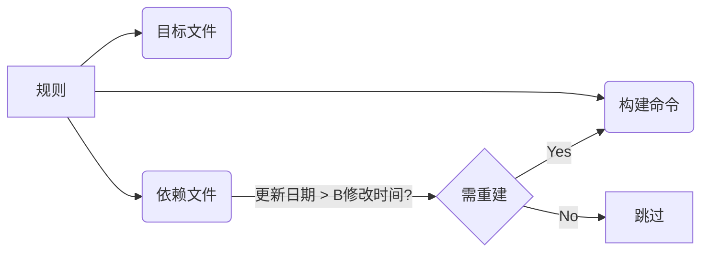
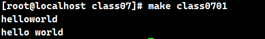
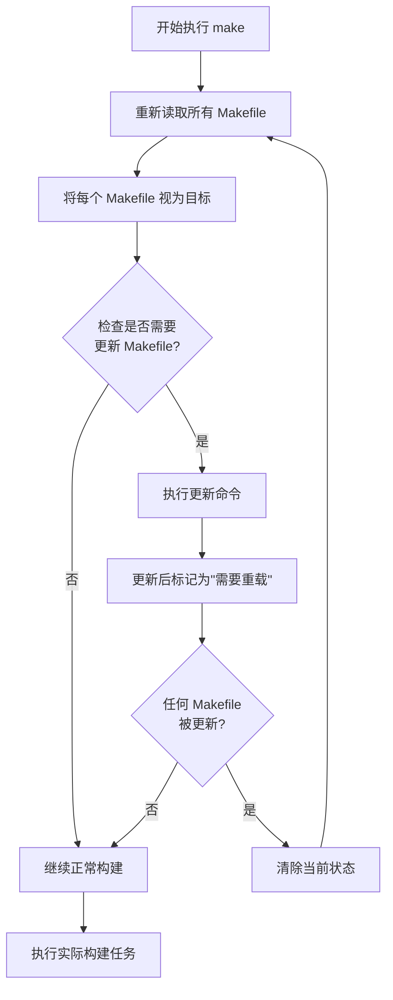
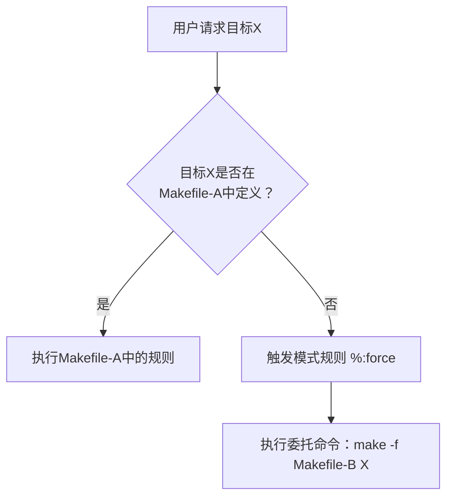

# GUN Make

## 1. make 概述 (Overview of make)

### 1.1. 概术(Overview of make)

makefile：一个工程中的源文件不计其数，并且按类型、功能、模块分别放在若干个目录中，makefile **定义一系列的规则**，哪些文件需要先编译，哪些文件需要后编译，哪些文件需要重新编译，甚至于进行更复杂的功能操作，因为 makefile 就像一个 Shell 脚本一样，其中也可以执行操作系统的命令。

> make 工具能自动检查哪些源代码需要编译（或重新编译），并执行对应的编译命令。
> 要使用 make 工具，必须先编写名为 makefile 的配置文件，其中需定义：
>
> 1. 程序文件间的依赖关系
> 2. 更新每个文件的编译指令

简单一句话：make是一个决定哪些需要被重新编译和确定用哪些命令来重新编译的工具，makefile是指导工具如何运行的。

- Makefile文件描述了整个工程的编译、连接等规则。其中包括：工程中的哪些源文件需要编译以及如何编译、需要创建那些库文件以及如何创建这些库文件、如何最后产生我们想要得可执行文件。
- Makefile的好处是能够使用一行命令来完成“自动化编译”，一旦提供一个（通常对于一个工程来说会是多个）正确的Makefile。编译整个工程你所要做的唯一的一件事就是在shell 提示符下输入make命令。整个工程完全自动编译，极大提高了效率。
  - make是一个命令工具，它解释Makefile中的指令（应该说是规则）在Makefile文件中描述了整个工程所有文件的编译顺序、编译规则。Makefile有自己的书写**格式**、**关键字**、**函数**。像其他编程语言一样有自己的格式、关键字和函数一样。而且在Makefile中可以使用系统shell所提供的任何命令来完成想要的工作。Makefile（在其它的系统上可能是另外的文件名）在绝大多数的IDE开发环境中都在使用，已经成为一种工程的编译方法。

### 1.2. 准备知识(How to Read This Manual)

make的讨论之前，首先需要明确一些基本概念：

- 编译的流程 **预处理(Preprocessing)**，**汇编(Assembly)**，**编译(compile)**，**连接(link)**

  - **预处理(Preprocessing)**：在代码翻译前处理宏展开、文件包含和条件编译的编译阶段，将从C/C++源文件做预处理，包含的头文件全部展开到源文件中 `g++ -E mian.cpp -o main.i`
  - **汇编(Assembly)**：将汇编语言助记符翻译为机器码指令的过程。将展开后的预处理文件转化为汇编文件 `g++ -S mian.cpp/main.i -o main.s`
  - **编译(compile)**：把高级语言书写的代码转换为机器可识别的机器指令文件，即二进制文件。`g++ -c main.cpp/main.i/main.s -o main.o`
  - **链接(link)**：将多.o文件，或者.o文件和库文件链接成为可被操作系统执行的可执行程序（Linux环境下，可执行文件的格式为“ELF”格式）`g++ main.cpp/main.i/main.s/main.o -o main`
- 完整编译流程术语链


总结一下，源文件首先会生成中间目标文件，再由中间目标文件生成执行文件。在编译时，**编译器只检测程序语法和函数、变量是否被声明。如果函数未被声明，编译器会给出一个警告**，但可以生成ObjectFile。**链接程序时，链接器会在所有的Object File中找寻函数的实现，如果找不到，那到就会报链接错误码**（Linker Error），在VC下，这种错误一般是：Link 2001错误，意思说是说，链接器未能找到函数的实现。你需要指定函数的Object File。

- 库文件格式**静态库**，**动态库**

  - **静态库**：是多个.o文件的集合。Linux中静态库文件的后缀为“.a”，Windows中则是“.lib”。静态库中的各个成员（.o文件）没有特殊的存在格式，仅仅是一个.o文件的集合。使用"`ar`"工具维护和管理静态库。
  - **动态库**：也是多个.o文件的集合，但是这些.o文件时有编译器按照一种特殊的方式生成（Linux中，共享库文件格式通常为“ELF”格式。共享库已经具备了可执行条件）。模块中各个成员的地址（变量引用和函数调用）都是相对地址。使用此共享库的程序在运行时，共享库被动态加载到内存并和主程序在内存中进行连接。多个可执行程序可共享库文件的代码段（多个程序可以共享的使用库中的某一个模块，共享代码，不共享数据）(Windows(.dll)，Linux(.so))

## 2. Makefile 简介(An Introduction to Makefiles)

**make在执行时，需要一个名为 makefile 的文件来告知 make 的执行内容。通常，makefile 会指示 make 如何编译和链接程序。**

**当 make 重新编译编辑器时：**

通过比较对应文件(规则的目标和依赖，)的最后修改时间，来决定哪些文件需要更新、那些文件不需要更新。

1. **所有的源文件没有被编译过，则对各个C源文件进行编译并进行链接，生成最后的可执行程序；**
2. **每一个在上次执行make之后修改过的C源代码文件在本次执行make时将会被重新编译；**
3. **头文件在上一次执行make之后被修改。则所有包含此头文件的C源文件在本次执行make时将会被重新编译。**

### 2.1. make规则的构成要素(What a Rule Looks Like)


```makefile
target: dependencies
	commands
```

**target**：可以是一个object file(目标文件)，也可以是一个执行文件，还可以是一个标签（label）。对于标签这种特性，在后续的“伪目标”章节中会有叙述。
**dependencies**：生成该target所依赖的文件和/或target。
**commands**：该target要执行的命令(任意的shell命令)。

**：每一个命令行必须以[Tab]字符开始，[Tab]字符告诉make此行是一个命令行**。make按照命令完成相应的动作。这也是书写Makefile中容易产生，而且比较隐蔽的错误。
命令就是在任何一个目标的依赖文件发生变化后重建目标的动作描述。可以没有依赖只有命令，最常用的就是 `make clean`。
规则就是描述在什么情况下、如何重建规则的目标文件，通常规则中包括了目标的依赖关系（目标的依赖文件）和重建目标的命令。规则就是包含了文件之间的依赖关系和更新此规则目标所需要的命令。



一个最简单的Makefile可能只包含规则。规则在有些Makefile中可能看起来非常复杂，但是无论规则的书写是多么的复杂，它都符合规则的基本格式。
**make程序根据规则的依赖关系，决定是否执行规则所定义的命令的过程我们称之为执行规则。**

### 2.2. 一个简单的 Makefile(A Simple Makefile)

c文件

```c
#include <stdio.h>
int main()
{
        printf("hello,make\n");
}
```

makefile文件

```makefile
hello:hello.c
   gcc hello.c -o hello
clean:
   rm hello
```

clean不是别的目标的依赖，所以只在执行 make clean时候才被执行，这种被称为伪目标。为避免存在clean文件。我们显式指定为伪目标，用关键词 **`.PHONY`**. 出错继续执行在 rm前面加-

```makefile
hello:hello.c
        gcc hello.c -o hello

.PHONY: clean
clean:
        -rm hello
```

书写时，可以将一个较长行使用反斜线（\）来分解为多行。**但需要注意：反斜线之后不能有空格**
**所有的命令行必需以[Tab] 字符开始，但并不是所有的以[Tab]键出现行都是命令行。但make程序会把出现在第一条规则之后的所有以[Tab]字符开始的行都作为命令行来处理。**
**Makefile中把那些没有任何依赖只有执行动作的目标称为“伪目标”（phony targets）** 例如:make clean

### 2.3. make 是如何工作的(How make Processes a Makefile)

`make` 是一个自动化构建工具，它通过解析 `Makefile` 文件来确定项目中文件的依赖关系，并仅重新构建已更改的部分。以下是其工作原理的详细说明：

---

#### 2.3.1. **核心流程**

1. **读取 `Makefile`**
   - 默认读取名为 `Makefile` 或 `makefile` 的文件（可通过 `-f` 指定其他文件）。
   - 解析变量定义（如 `CC = gcc`）、隐式规则（如 `.c.o:`）和显式规则。

2. **确定构建目标**
   - 若命令行未指定目标（如 `make`），则构建第一个目标（通常为 `all`）。
   - 若指定目标（如 `make clean`），则构建该目标。

3. **构建依赖树**
   - 递归分析目标的所有依赖项，形成有向无环图（DAG）。
   *示例规则：*

   ```makefile
   app: main.o utils.o          # 目标 `app` 依赖 main.o 和 utils.o
       gcc -o app main.o utils.o  # 构建命令
   ```

4. **检查文件时间戳**
   - 对每个目标，比较其依赖项的修改时间：
     - 若目标文件不存在，**执行命令**。
     - 若依赖项比目标更新（依赖项修改时间更晚），**执行命令**。
     - 否则跳过构建。

5. **执行构建命令**
   - 在 Shell 中执行规则中的命令（每行命令独立运行，除非用 `\` 连接）。
   - 若命令以 `@` 开头，抑制输出回显。

6. **递归更新依赖**
   - 若依赖项本身是其他规则的目标，则先递归构建该依赖项。

---

#### 2.3.2. **关键机制**

##### 1. **变量展开**

- 变量使用 `$(VAR)` 或 `${VAR}` 引用：

```makefile
CC = gcc
app: main.c
   $(CC) -o app main.c  # 展开为 gcc -o app main.c
```

##### 2. **自动推导（隐式规则）**

- `make` 内置常见规则（如从 `.c` 生成 `.o`）：

```makefile
main.o: main.h  # 无需写命令，make 自动调用 `$(CC) -c main.c -o main.o`
```

##### 3. **伪目标（`.PHONY`）**

- 声明不生成文件的目标（如 `clean`）：

```makefile
.PHONY: clean
clean:
   rm -f *.o app
```

##### 4. **模式规则**

- 通用规则匹配多个文件：

```makefile
%.o: %.c        # 从任意 .c 文件构建同名 .o 文件
   $(CC) -c $< -o $@
```

- `$<` 表示第一个依赖项，`$@` 表示目标。

##### 5. **函数调用**

- 使用内置函数处理文本：

```makefile
FILES = $(wildcard *.c)  # 获取所有 .c 文件
OBJS = $(patsubst %.c,%.o,$(FILES))  # 将 .c 替换为 .o
```

---

#### 2.3.3. **示例解析**

假设 `Makefile` 内容如下：

```makefile
CC = gcc
CFLAGS = -Wall

app: main.o utils.o
	$(CC) $(CFLAGS) -o app main.o utils.o

main.o: main.c utils.h
	$(CC) $(CFLAGS) -c main.c

utils.o: utils.c utils.h
	$(CC) $(CFLAGS) -c utils.c

clean:
	rm -f *.o app
.PHONY: clean
```

##### 1. 执行 `make` 时：

1. 构建第一个目标 `app`。
2. 检查依赖项 `main.o` 和 `utils.o`：
   - 若 `main.o` 不存在或 `main.c/utils.h` 比 `main.o` 新，则重新编译 `main.o`。
   - 同理处理 `utils.o`。
3. 若 `main.o` 或 `utils.o` 被更新，则链接生成 `app`。

##### 2. 执行 `make clean` 时：

- 因声明为 `.PHONY`，直接执行 `rm -f *.o app` 清理文件。

---

#### 2.3.4. **总结**

`make` 的核心是 **依赖驱动的时间戳检查**：

1. 解析 `Makefile` 构建依赖树。
2. 对比目标与依赖项的时间戳。
3. 仅重建过时或缺失的文件。
4. 通过变量、隐式规则和函数减少重复代码。

这种机制显著提升构建效率，尤其适用于大型项目！

### 2.4. makefile中使用变量(Variables Make Makefiles Simpler)

变量使Makefile变的更简单。

如果存在多个依赖.o文件。”增加一个的依赖文件，我们就需要在多个地方添加，就会给后期维护和修改带来很多不方便，添加或修改时出现遗漏。

```makfile
objs = hello.o

hello: $(objs)
        gcc $(objs) -o hello

$(objs): hello.c
        gcc -c hello.c -o $(objs)

.PHONY: clean
clean:
        -rm hello hello.o
```

### 2.5. 让make自动推导(Letting make Deduce the Recipes)

在使用make编译.c源文件时，编译.c源文件规则的命令可以不用明确给出。这是因为make本身存在一个默认的规则，能够自动完成对.c文件的编译并生成对应的.o文件。
它执行命令“cc -c”来编译.c源文件。make会自动为这个.o文件寻找合适的依赖文件（对应的.c文件。对应是指：文件名除后缀外，其余都相同的两个文件）。
此默认规则就使用命令`cc -c hello.c -o hello.o`。。对一个目标文件是`N.o`，倚赖文件是`N.c`的规则，完全可以省略其规则的命令行，而由make自身决定使用默认命令。
此默认规则称为make的隐含规则。

```makefile
objs = hello.o

hello:

$(objs):

.PHONY: clean
clean:
    -rm hello hello.o
```

### 2.6. 另类风格的makefile(Another Style of Makefile)

所有的.o目标文件都可以使用隐含规则由make自动重建，我们可以根据这一点书写更加简洁的Makefile。书写可能存在多个目标规则，
规则中多个目标同时依赖于对应的头文件，而且同一个文件可能同时存在多个规则中。

这种风格的 Makefile 并不值得我们借鉴。问题在于：同时把多个目标文件的依赖放在同一个规则中进行描述（一个规则中含有多个目标文件），这样导致规则定义不明
了，比较混乱。建议大家不要在 Makefile 中采用这种方式了书写。否则后期维护将会是一件非常痛苦的事情。

书写规则建议的方式是：**单目标，多依赖。就是说尽量要做到一个规则中只存在一个目标文件，可有多个依赖文件。尽量避免使用多目标，单依赖的方式。**
这样书写的好处是后期维护会非常方便，而且这样做会使Makefile会更清晰、明了。

### 2.7. 清除工作目录过程文件(Rules for Cleaning the Directory)

```makefile
.PHONY:clean
clean:
    -rm edit $(objs)
```

1. 通过`.PHONY`特殊目标将`clean`目标声明为伪目标。避免当磁盘上存在一个名为`clean`文件时，目标`clean`所在规则的命令无法执行。
2. 在命令行之前使用`-`，意思是忽略命令`rm`的执行错误。

## 3. Makefile 总述(Writing Makefiles)

### 3.1. Makefile的内容(What Makefiles Contain)

在一个完整的Makefile 中，包含了 5个东西：**显式规则**、**隐含规则**、**变量定义**、**指示符**和**注释**

- **显式规则**：它描述了在何种情况下如何更新一个或者多个被称为目标的文件（Makefile 的目标文件）。Makefile中需要明确地给出目标文件、目标的依赖文件列表以及更新目标文件所需要的命令（有些规则没有命令，这样的规则只是纯粹的描述了文件之间的依赖关系）。
- **隐含规则**：它是make根据一类目标文件（典型的是根据文件名的后缀）而自动推导出来的规则。make根据目标文件的名，自动产生目标的依赖文件并使用默认的命令来对目标进行更新（建立一个规则）。关于隐含规则可参考 第十章 make的隐含规则。
- **变量定义**：使用一个字符或字符串代表一段文本串，当定义了一个变量以后，Makefile后续在需要使用此文本串的地方，通过引用这个变量来实现对文本串的使用。第一章的例子中，我们就定义了一个变量“objects”来表示一个.o文件列表。关于变量的详细讨论可参考 第六章 Makefile中的变量
- **Makefile 指示符**：指示符指明在make程序读取makefile 文件过程中所要执行的一个动作。其中包括：
  - **读取一个文件，读取给定文件名的文件，将其内容作为makefile文件的一部分**。参考 3.3 包含其它makefile文件一节。
  - **决定（通常是根据一个变量的得值）处理或者忽略Makefile中的某一特定部分**。参考 第七章Makefile的条件执。
  - **定义一个多行变量**。参考 6.8 多行定义一节。
- **注释**：以`#`字符后的内容被作为是注释内容。

#### 3.1.1. 添加`$`表示精确控制换行时的空格(Splitting Without Adding Whitespace)

如果你想把一行长串字符分行后，在中间不加空格，需要用$符号

```makefile
#class0701 $\ 用于精确控制空白，\ 用于通用续行（自动插入空格）。
var=hello$\
world
var2=hello\
world

class0701:
	@echo $(var)
	@echo $(var2)
```

执行 make 输出内容 `hello world`


**注意**：

- 所有以[Tab]字符开始的的行都是执行规则。make会将其交给系统shell程序去解释执行。包括注释行也会交给shell来处理。
- 使用指示符`define`定义一个多行的变量或者命令包时，其定义体(`define`和`endef`之间的内容)会被完整的展开到Makefile中引用此变量的地方(包含定义体中的注释行)；make 在引用此变量的地方对所有的定义体进行处理，决定是注释还是有效内容。Makefile 中变量的引用和 C 语言中的宏类似（但是其实质并不相同）。对一个变量引用的地方make所做的就是将这个变量根据定义进行基于文本的展开，展开变量的过程不涉及到任何变量的具体含义和功能分析。

### 3.2 makefile文件的命名(What Name to Give Your Makefile)

1. 对于GNU的make来说有三种命名：`makefile`、`Makefile`、`GNUmakefile`
2. 可以用 `-f` 或者 `-file`来指定要执行的makefile

如果三个文件都存在，优先级的顺序为: GNUmakefile > makefile >Makefile

### 3.3 包含其它makefile文件(Including Other Makefile)

1. `include`指示符告诉 make 暂停读取当前的 Makefile，而转去读取`include`指定的一个或者多个文件，完成以后再继续当前Makefile 的读取。其形式如下：

   ```makefile
   include ./inc/makefile.mk
   ```

   **`makefile`**

   ```makefile
   include ./inc/makefile.mk
   .PHONY: class0702
   class0702:
      @echo $(class0702var2)
   ```

   **`./inc/makefile.mk`**

   ```makefile
   class0702var2 = inc/makefile
   ```

2. include指定的文件没有给出路径那么头文件查找
   - `.INCLUDE_DIRS`  这个变量记录了默认搜索头文件的路径
   - `-I` 可以指定搜索头文件路径
   - `/usr/gnu/include`
   - `/usr/local/include`
   - `/usr/include`

### 3.4. 变量 MAKEFILES(The Variable MAKEFILES)

在 Makefile 中，`MAKEFILES` 是一个特殊的环境变量，用于在 **make 启动前自动包含其他 Makefile**。理解它的关键点如下：

#### 3.4.1. 核心作用

```bash
export MAKEFILES=/path/to/file1.mk:/path/to/file2.mk
make  # 自动加载指定文件
```

1. **预加载机制**：在读取当前目录的 Makefile **之前**，自动包含指定的文件
2. **隐式包含**：不需要在 Makefile 中使用 `include` 指令
3. **环境级配置**：适用于需要全局生效的共享配置

#### 3.4.2. 典型使用场景

| 场景                | 示例                          | 优势                     |
|---------------------|-------------------------------|--------------------------|
| 共享工具链配置      | `MAKEFILES=~/toolchains.mk`   | 多项目统一编译参数       |
| 企业级构建规范      | `MAKEFILES=/corp/build_rules` | 强制执行代码质量检查     |
| 开发环境默认设置    | `MAKEFILES=~/.make-defaults`  | 个性化开发环境配置       |
| 跨项目通用函数库    | `MAKEFILES=lib/make_utils.mk` | 复用复杂逻辑函数         |

#### 3.4.3. 关键特性解析

```makefile
# 假设设置：export MAKEFILES=preload.mk
# preload.mk 内容：
COMMON_FLAGS := -O2 -Wall

# Makefile 内容：
all:
    @echo "Flags: $(COMMON_FLAGS)"
```

1. **加载顺序**：

   ``` bash
   MAKEFILES → Makefile → include 指令
   ```

2. **变量覆盖**：
   - MAKEFILES 中的定义可被 Makefile 覆盖
   - 类似命令行 `make VAR=value` 的优先级

3. **递归忽略**：
   - 子 make 调用时 **不会** 继承 MAKEFILES
   - 避免嵌套包含导致冲突

#### 3.4.3. 与 `include` 指令的区别

| 特性                | MAKEFILES                     | include 指令               |
|---------------------|-------------------------------|---------------------------|
| **作用时机**        | make 启动前                   | make 解析时               |
| **作用范围**        | 全局影响                      | 显式局部包含              |
| **错误处理**        | 文件不存在时静默忽略           | 默认报错(-include可忽略)  |
| **继承性**          | 不传递给子make                | 随Makefile传递            |
| **可控性**          | 环境变量控制                  | Makefile内部控制          |

#### 3.4.4. 实际应用示例

**共享配置场景**：

```bash
# 用户配置 ~/.make_profile
export MAKEFILES=$HOME/.make/colors.mk:$HOME/.make/docker.mk
```

**企业级构建系统**：

```bash
# CI 环境设置
export MAKEFILES=/build-system/security-checks.mk:/build-system/metrics.mk
```

#### 3.4.5. 注意事项

1. **谨慎使用**：
   - 可能造成隐式依赖，导致构建行为不透明
   - GNU make 文档明确建议："通常应该避免使用"

2. **路径分隔符**：
   - Unix 使用 `:` 分隔 (`file1.mk:file2.mk`)
   - Windows 使用 `;` 分隔 (`file1.mk;file2.mk`)

3. **调试技巧**：

   ```bash
   make -p | grep MAKEFILES  # 查看实际加载的文件
   make --debug=v            # 显示详细加载过程
   ```

#### 3.4.6. 替代方案推荐

```makefile
# 更可控的显式包含方式
include $(wildcard *.mk)
-include $(PROJECT_CONFIG)

# 命令行指定
make -f common.mk -f Makefile
```

总结：`MAKEFILES` 是 make 的 **预加载机制**，适用于需要 **全局生效的共享配置**，但由于其隐式特性，在现代构建系统中更推荐使用显式的 `include` 机制。

### 3.5. makefile文件的重建(How Makefiles Are Remade)

#### 3.5.1. 核心概念解析：Makefile 的重建机制

这段内容描述了 Makefile 的一个高级特性：**Makefile 本身也可以作为构建目标**。这意味着：

1. Makefile 可以由其他文件生成（如 RCS/SCCS 版本控制文件）
2. 当 Makefile 需要更新时，make 会先重建它再重新加载
3. 这个机制会影响 make 的工作流程

#### 3.5.2. 重建过程详解（分步骤说明）



#### 3.5.3. 关键机制解释

1. **Makefile 作为构建目标**
   - Makefile 可以像普通文件一样有构建规则
   - 示例：从模板生成 Makefile

     ```makefile
     Makefile: Makefile.template
         sed 's/__VERSION__/1.0/' $< > $@
     ```

2. **自动重载机制**
   - 如果任何 Makefile 在初始读取后被更新：
     - make 会**清除当前状态**
     - **重新读取**所有 Makefile
     - 再次检查是否需要更新（通常不需要）
     - 然后执行实际构建任务

3. **防止循环重建**
   - 危险情况：无条件的 Makefile 更新规则

     ```makefile
     # 危险！会导致无限循环
     Makefile:
         touch $@
     ```

   - make 的特殊处理：
     - 自动忽略**没有依赖项**的 Makefile 目标规则
     - 防止 makefile 不断重建→重载→重建的死循环

4. **命令行选项的特殊行为**

   | 选项 | 对 Makefile 目标的影响 |
   |------|------------------------|
   | `-t` (touch) | **不**更新时间戳 |
   | `-q` (question) | 正常检查更新 |
   | `-n` (dry-run) | 打印命令但不执行 |

   - 例外：当 Makefile 被指定为**最终目标**时，选项会生效

#### 3.5.4. 实际场景示例

**场景1：自动配置生成 Makefile**

```bash
# 首次执行（无 Makefile）
$ make
# 自动执行：
#   1. 发现没有 Makefile
#   2. 找到生成规则：通过 configure 脚本生成
#   3. 运行 ./configure > Makefile
#   4. 重新加载 Makefile
#   5. 执行实际构建
```

**场景2：安全更新 Makefile**

```makefile
# 正确写法：添加依赖项防止循环
Makefile: Makefile.in config.status
    ./config.status
```

**场景3：避免重建的技巧**

```bash
# 不希望重建 mfile 时：
make -f mfile -n mfile target

# 执行流程：
#   1. 读取 mfile
#   2. 将 mfile 视为目标执行 -n 更新（只打印不执行）
#   3. 构建 target（使用原始 mfile）
```

#### 3.5.5. 为什么需要这个机制？

1. **动态构建系统**：当构建规则本身需要根据环境生成时
   - 例如：autotools 生成的 Makefile

2. **版本控制集成**：从 RCS/SCCS 检出最新 Makefile

3. **条件化构建**：根据检测结果生成不同的构建规则

#### 3.5.6. 重点注意事项

1. **默认 Makefile 的自动创建**：
   - 当不存在默认 Makefile 时
   - make 会尝试按顺序创建：

     ```bash
     GNUmakefile → makefile → Makefile
     ```

2. **重建不是必须的**：
   - 即使无法创建默认 Makefile，make 也不会报错
   - 可以使用预定义的隐式规则继续构建

3. **性能影响**：
   - 重建 Makefile 会导致整个 make 重启
   - 应避免频繁重建

这个机制主要用在**高级构建系统**中（如 autoconf/automake），日常开发中较少需要手动处理 Makefile 的重建。理解它有助于调试复杂的构建问题，特别是当 Makefile 本身是由脚本生成的情况。

### 3.6. 重载另外一个makefile(Overriding Part of Another Makefile)

#### 🔍 3.6.1. 问题本质

当两个 Makefile 中存在**同名目标但不同规则**时：

```makefile
# Makefile-A
target:
    command_A

# Makefile-B
target:
    command_B  # 与A冲突
```

直接使用 `include` 会导致致命错误：

```bash
*** target has conflicting commands. Stop.
```

#### 💡 3.6.2. 解决方案：优先级委托模式

通过**模式规则**实现智能委托，解决冲突：

```makefile
# Makefile-A (主控制文件)
# 1. 定义需要自定义的目标
target:
    custom_command  # 自定义实现

# 2. 委托规则：处理其他所有目标
%: force
    @$(MAKE) -f Makefile-B $@  # 委托给B

# 3. 强制触发机制
force: ;
```

#### 🛠️ 3.6.3. 工作原理（同名目标处理流程）



#### ✅ 3.6.4. 同名目标处理示例

| 请求目标 | 处理结果 |
|----------|----------|
| `make target` | 执行 `Makefile-A` 中的 `custom_command` |
| `make other_target` | 委托执行 `Makefile-B` 中的同名规则 |

#### ⚠️ 3.6.5. 关键防御机制：`force` 目标

```makefile
force: ;  # 空命令声明
```

1. **强制触发**：确保模式规则始终执行（因 `force` 是伪目标）
2. **防循环**：空命令阻止 make 查找构建 `force` 的规则
3. **无副作用**：不产生实际文件，仅作为触发机制

#### 🔧 3.6.6. 实际应用场景

假设有两个项目：

```bash
project-A/
  ├── Makefile   # 基础构建
  └── src/

project-B/
  ├── Makefile   # 增强构建（需复用A）
  └── tests/
```

**项目B的 Makefile 实现：**

```makefile
# 自定义测试目标
test:
    ./run_advanced_tests

# 委托其他目标给项目A
%: force
    @$(MAKE) -C ../project-A $@

force: ;
```

#### 💡 3.6.7. 执行效果

```bash
# 执行自定义目标（B优先）
$ make test
> ./run_advanced_tests

# 执行基础目标（委托给A）
$ make build
> make -C ../project-A build
```

#### 🌟 3.6.8. 技术优势

1. **无冲突继承**：

   ```mermaid
   graph LR
     A[主Makefile] -- 自定义目标 --> B[专用规则]
     A -- 其他目标 --> C[子Makefile规则]
   ```

2. **动态扩展**：添加新目标无需修改基础Makefile
3. **隔离性**：基础构建系统保持独立稳定

#### 🚫 3.6.9. 替代方案对比

| 方案 | 优点 | 缺点 |
|------|------|------|
| **模式规则委托** | 目标隔离，无冲突 | 需要精心设计规则 |
| `include` + `.SECONDEXPANSION` | 代码复用率高 | 同名目标直接冲突 |
| 重构为通用模板 | 架构清晰 | 需要大规模改造 |

> 这种模式在**嵌入式开发**和**多版本项目维护**中仍常见，例如：
>
> - Linux内核驱动扩展
> - 产品线差异化构建（社区版/企业版）
> - 遗留系统渐进式改造

### 3.7. make如何解析makefile文件(How make Reads a Makefile)

#### 📌 3.7.1. make 执行的完整流程


#### 🔍 3.7.2. 阶段详解

**第一阶段：读取与解析（立即展开）**

1. **读取所有 Makefile**：
   - 包括 `MAKEFILES` 变量指定的
   - `include` 指令包含的
   - `-f` 选项指定的文件

2. **构建依赖关系图**：

   ```mermaid
   graph TB
     A[目标] --> B[依赖1]
     A --> C[依赖2]
     C --> D[子依赖]
   ```

3. **立即展开的元素**：
   - 所有变量定义（根据赋值类型）
   - 条件语句（`ifdef/ifeq` 等）
   - 规则的目标和依赖部分

**第二阶段：执行构建（延后展开）**

1. **决定构建目标**：
   - 基于文件时间戳检查
   - 确定需要重建的目标

2. **执行规则命令**：
   - 命令行中的变量和函数
   - 自动变量（如 `$@`, `$<`）

#### ⚡ 3.7.3. 变量展开时机（关键区别）

| 赋值方式          | 展开时机 | 示例                  | 特点                     |
|-------------------|----------|-----------------------|--------------------------|
| `VAR = value`     | 延后     | `CC = gcc`            | 每次引用时重新计算       |
| `VAR := value`    | 立即     | `CUR_DIR := $(PWD)`   | 定义时立即固定值         |
| `VAR ?= value`    | 延后     | `OPT ?= -O2`          | 仅当未定义时赋值         |
| `VAR += value`    | 混合     | `CFLAGS += -Wall`     | 依赖原始变量类型         |
| `define VAR ... endef` | 立即定义<br>延后值 | 多行变量 | 定义立即存在，值使用时展开 |

**特殊说明 `+=`：**

```makefile
# 情况1：原始变量是 := 定义（立即）
VAR1 := start
VAR1 += end  # 立即展开 → "start end"

# 情况2：原始变量是 = 定义（延后）
VAR2 = start
VAR2 += end  # 延后展开 → $(VAR2) + " end"
```

#### 🧩 3.7.4. 条件语句处理

```makefile
ifeq ($(OS),Windows)
    # Windows 特定规则（立即展开）
else
    # Linux/Mac 规则（立即展开）
endif
```

- **立即展开**：在解析阶段就确定分支
- **实际效果**：如同编译器预处理

#### ⚙️ 3.7.5. 规则展开模式

```makefile
# 语法模板
目标: 依赖 ; 命令
	命令
```

| 组件     | 展开时机 | 示例                  |
|----------|----------|-----------------------|
| 目标     | 立即     | `$(EXE): $(OBJS)`    |
| 依赖     | 立即     | `OBJS = main.o util.o` |
| 命令     | 延后     | `gcc -o $@ $^`       |

**示例解析：**

```makefile
# 第一阶段处理：
TARGET := app  # 立即展开
SOURCES = $(wildcard *.c)  # 延后展开

# 第二阶段执行：
$(TARGET): $(SOURCES)  # 目标立即→app, 依赖延后→*.c
    gcc -o $@ $^  # 命令延后展开
```

#### 💡 3.7.6. 关键理解要点

1. **立即展开**发生在：
   - 变量定义时（`:=`）
   - 条件语句判断时
   - 规则的目标/依赖解析时

2. **延后展开**发生在：
   - 命令行执行时
   - 递归变量（`=`）使用时
   - 自动变量（`$@`等）求值时

3. **设计哲学**：

   ```mermaid
   graph LR
     A[静态依赖图] -->|立即确定| B[构建计划]
     C[动态执行] -->|延后处理| D[实际命令]
   ```

#### 🚀 3.7.7. 实际应用技巧

**技巧1：性能优化**

```makefile
# 立即展开提高性能
FILES := $(shell find . -name '*.c')  # 避免多次执行find
```

**技巧2：动态命令**

```makefile
# 延后展开实现动态性
print-%:
    @echo '$* = $($*)'  # 运行时展开变量名
```

**技巧3：安全条件判断**

```makefile
# 立即展开确保正确分支
ifneq ($(MAKECMDGOALS),clean)
    include config.mk  # 非clean目标时才包含
endif
```

理解两阶段模型能帮助您：

1. 避免变量展开错误
2. 优化 Makefile 性能
3. 设计更可靠的构建系统
4. 调试复杂的依赖问题

当遇到变量行为不符合预期时，首先考虑它的展开时机，这是解决大多数 Makefile 谜题的关键！

### 3.8. 如何解析 Makefile(How Makefiles Are Parsed)

GNU make是一行一行解析makefiles的，解析的流程：

make 的执行过程如下：

1. 依次读取变量“MAKEFILES”定义的makefile文件列表
2. 读取工作目录下的 makefile 文件（根据命名的查找顺序“GNUmakefile”，“makefile”，“Makefile”，首先找到那个就读取那个）
3. 依次读取工作目录makefile文件中使用指示符“include”包含的文件
4. 查找重建所有已读取的makefile文件的规则（如果存在一个目标是当前读取的某一个makefile文件，则执行此规则重建此makefile文件，完成以后从第一步开始重新执行）
5. 初始化变量值并展开那些需要立即展开的变量和函数并根据预设条件确定执行分支
6. 根据“终极目标”以及其他目标的依赖关系建立依赖关系链表
7. 执行除“终极目标”以外的所有的目标的规则（规则中如果依赖文件中任一个文件的时间戳比目标文件新，则使用规则所定义的命令重建目标文件）
8. 执行“终极目标”所在的规则

### 3.9. 二次扩展(Secondary Expansion)

#### 📌 3.9.1. 核心概念：什么是二次展开？

二次展开是 GNU Make 的**高级特性**，它在标准的两阶段模型（立即展开 + 延迟展开）基础上增加了**第三个展开时机**。当启用此功能时：

1. **标准流程**：

   ```mermaid
   graph LR
     A[第一阶段] -->|立即展开| B[依赖关系图]
     B --> C[第二阶段]
     C -->|延迟展开| D[执行命令]
   ```

2. **二次展开流程**：

   ```mermaid
   graph LR
     A[第一阶段] --> B[依赖关系图]
     B --> C[二次展开]
     C --> D[第二阶段]
     D --> E[执行命令]
   ```

#### 🔑 3.9.2. 关键特性

| 特性 | 说明 |
|------|------|
| **启用方式** | 必须定义特殊目标：`.SECONDEXPANSION:` |
| **作用范围** | **仅针对依赖列表**（不包括目标或命令） |
| **触发时机** | 检查目标依赖关系时（第二阶段开始前） |
| **核心机制** | 使用 `$$` 转义变量/函数使其延迟到此时展开 |

#### ⏰ 3.9.3. 三次展开时机对比

| 展开类型 | 发生时机 | 典型元素 | 示例 |
|----------|----------|----------|------|
| **立即展开** | 第一阶段读取时 | `:=` 变量<br>条件语句<br>规则目标/依赖 | `TARGET := app` |
| **延迟展开** | 第二阶段执行命令时 | 命令中的变量<br>`=` 变量 | `gcc $$@` |
| **二次展开** | 第二阶段开始前<br>检查依赖时 | 转义的依赖变量<br>`$$()` 语法 | `$$($$@_OBJS)` |

#### 🛠️ 3.9.4. 启用与使用语法

```makefile
# 必须在文件顶部声明
.SECONDEXPANSION:

# 使用 $$ 转义需要二次展开的内容
target: $$(VARIABLE) $$(function $$@)
```

#### 💡 3.9.5. 为什么需要二次展开？（使用场景）

##### 场景1：依赖基于目标名动态生成

```makefile
.SECONDEXPANSION:
main_OBJS = main.o util.o
lib_OBJS = lib.o api.o

main lib: $$($$@_OBJS)
```

- **执行过程**：
  1. 首次展开：`main: $($@_OBJS)` → 未展开
  2. 二次展开：`$@ = main` → `$(main_OBJS)` → `main.o util.o`

##### 场景2：依赖包含自动变量

```makefile
.SECONDEXPANSION:
%.o: $$(addsuffix /%.c,src dirs)
    gcc -c $<
```

- 当构建 `foo.o` 时：
  - 二次展开：`$(addsuffix /foo.c,src dirs)` → `src/foo.c dirs/foo.c`

##### 场景3：解决变量覆盖问题

```makefile
.SECONDEXPANSION:
VAR = initial
target1: $(VAR)    # 立即展开 → initial
target2: $$(VAR)   # 二次展开 → final
VAR = final
```

#### 🔍 3.9.6. 自动变量在二次展开中的行为

| 自动变量 | 二次展开值 | 示例 |
|----------|------------|------|
| `$$@` | 当前目标名 | `main` |
| `$$*` | 词干（stem） | `foo`（对 `foo.o`） |
| `$$<` | 第一个依赖 | `input.txt` |
| `$$^` | 所有不重复依赖 | `file1.o file2.o` |
| `$$+` | 所有依赖（含重复） | `file.o file.o` |

##### 显式规则示例

```makefile
.SECONDEXPANSION:
target: dep1 dep2 $$< $$^ $$+
```

- `$$<` = `dep1`
- `$$^` = `dep1 dep2`
- `$$+` = `dep1 dep2`

#### ⚠️ 3.9.7. 特殊注意事项

1. **作用域限制**：

   ```makefile
   # 仅影响此后的规则
   .SECONDEXPANSION:
   rule1: ...   # 启用

   # 不影响之前的规则
   rule2: ...   # 未启用
   ```

2. **不可用变量**：
   - `$$?`（更新的依赖）始终为空
   - `$$*` 在显式规则中无意义

3. **隐式规则处理**：

   ```makefile
   .SECONDEXPANSION:
   %: %.c $$(wildcard $$@_*.h)
       gcc $< -o $@
   ```

   - 构建 `app` 时：`wildcard app_*.h` 动态查找头文件

#### 🧪 3.9.8. 实际应用案例

##### 案例1：多项目统一管理

```makefile
.SECONDEXPANSION:
PROJECTS = frontend backend

# 动态生成每个项目的依赖
$(PROJECTS): $$($$@_DEPS)
    $(MAKE) -C $@

frontend_DEPS = ui-lib auth-lib
backend_DEPS = api-lib db-lib
```

##### 案例2：带路径重构的编译

```makefile
.SECONDEXPANSION:
OBJ_DIR = build

%.o: src/%.c $$(OBJ_DIR)/%.d
    gcc -I$$(dir $$<) -c $< -o $@

$(OBJ_DIR)/%.d: src/%.c
    generate_dep $< > $@
```

##### 案例3：条件依赖注入

```makefile
.SECONDEXPANSION:
DEBUG_LIBS = debug.o
RELEASE_LIBS = optim.o

app: $$(if $$(DEBUG),$$(DEBUG_LIBS),$$(RELEASE_LIBS))
```

#### 💎 3.9.9. 总结：何时使用二次展开？

1. **需要基于目标名动态生成依赖**（最常见场景）
2. **依赖列表中需要自动变量**（`$$@`, `$$*` 等）
3. **解决变量值被后续覆盖的问题**
4. **复杂路径/文件名重构**
5. **模式规则中需要上下文感知的依赖**

> **使用建议**：在简单项目中避免过度使用，但在管理复杂构建系统（如内核编译）时，这是强大的元编程工具。掌握它能写出更动态、更灵活的 Makefile。不需要掌握，知道即可，知道什么是二次展开，看到会知道，做简单的修改。

## 4. Writing Rules

### 4.1. Rule Syntax

2种规则语法：

如果你要用 `$`,需要写 `$$` ,开启了二阶段展开则需要写成 `$$$$`

### 4.2. Types of Prerequisites

有两种前提：一种是普通依赖，另外一种是order-only依赖
语法：
`targets : normal-prerequisites | order-only-prerequisites`
普通依赖比目标新，则目标会被更新。但是order-only不管比不比目标新，都不会更新目标

### 4.3. Using Wildcard Characters in File Names

#### 4.3.1. Wildcard Examples

`objects = *.o` 这种变量定义，在**目标**或**先决条件**中使用对象的值，则将在此处进行通配符扩展，如果在命令行中使用可能会被认为shell中的值，为避免这种麻烦，需要写成这种形式 `objects := $(wildcard *.o)`

#### 4.3.2. The Function wildcard

语法：`$(wildcard pattern...)`

### 4.4. Searching Directories for Prerequisites

#### 4.4.1. VPATH: Search Path for All Prerequisites

VPATH指定make目标和依赖的寻找的一系列路径。
`VPATH = src:../headers`标记 `src`和 `../headers`两个路径

```makefile
VPATH = src:headers

hello: hello.o
        gcc -o hello hello.o
hello.o: hello.c hello.h
        gcc -c ./src/hello.c -o hello.o -I./headers/
.PHONY:clean

clean:
        rm *.o
        rm hello
```

#### 4.4.2. The vpath Directive

`vpath %.h ../headers`在 `../header`中查找头文件
`vpath %.c foo:bar ` 先在foo中查找后缀为 `.c`的文件,然后再bar中查找。

#### 4.4.3. How Directory Searches are Performed

### 4.5. Phony Targets

伪目标仅仅是为了执行相关的命令，而没有实际的目标文件。几种用法：

1. 为了不与实际的文件产生冲突
   避免冲突，修改为
2. 递归调用发挥make的多线程能力：
   原始写法：
   使用伪目标，发挥多线程能力：
3. 同时构建多个目标
4. 当一个伪目标是另外一个的前提，那么这个伪目标作为另外一个的子线程

### 4.6. Rules without Recipes or Prerequisites

如果一个规则，既没有前提也没有执行的命令。那么make会认为这个这个目标总是需要被更新的。那么依赖这个规则的目标，每次执行都会更新。

```makefile
clean: FORCE
	rm $(objects)
FORCE:
```

这种方式跟 `.PHONY clean` 是一个效果，伪目标方式更有效率些。但是有些make不支持伪目标。

### 4.7. Empty Target Files to Record Events

**空目标是伪目标的变体**；它用于保存您不时明确请求的某个操作的配方。与虚假目标不同，此目标文件确实可以存在；但是文件的内容并不重要，通常是空的。

我们只希望依赖改动后，执行print，那么我们touch 一个print 用于记录更新时间，当前提的修改时间比print时间更新时，执行。

### 4.8. Special Built-in Target Names

- **`.PHONY`**：特殊目标 .PHONY 的先决条件被认为是假目标。当需要考虑这样的目标时，make 将无条件地运行其配方，无论是否存在具有该名称的文件或其上次修改时间。
- **`.SUFFIXES`**：特殊目标 .SUFFIXES 的先决条件是用于检查后缀规则的后缀列表。
- **`.DEFAULT`**：为A指定的配方将用于任何没有找到规则的目标(无论是显式规则还是隐式规则)。如果指定了一个配方，那么在规则中作为先决条件而不是目标提到的每个文件都将执行该配方。
- **`.PRECIOUS`**：.PRECIOUS 所依赖的目标被给予以下特殊处理：如果在执行其配方期间杀死或中断了目标，则不会删除目标。此外，如果目标是一个中间文件，那么在不再需要它之后，它将不会被删除，就像通常所做的那样。在后一方面，它与 .SECONDARY 特殊目标重叠。
- **`.INTERMEDIATE`**：.INTERMEDIATE 所依赖的目标被视为中间文件。没有先决条件的 .INTERMEDIATE 没有效果。
- **`.SECONDARY`**：.SECONDARY 所依赖的目标被视为中间文件，只是它们永远不会被自动删除。没有先决条件的 .SECONDARY 会导致所有目标都被视为次要目标（即，没有目标被删除，因为它被认为是中间目标）。
- **`.SECONDEXPANSION`**：如果在 makefile 的任何地方提到 .SECONDEXPANSION 作为目标，那么在它出现后定义的所有先决条件列表将在所有 makefile 被读取后第二次展开。
- **`.DELETE_ON_ERROR`**：如果在 makefile 中的任何位置将 .DELETE_ON_ERROR 作为目标提及，则 make 将删除规则的目标（如果规则已更改，并且其配方以非零退出状态退出），就像它收到信号时一样。
- **`.IGNORE`**：如果为 .IGNORE 指定先决条件，则 make 将忽略在执行这些特定文件的配方时出现的错误。.IGNORE 的配方（如果有）将被忽略。如果将它作为一个没有先决条件的目标，.IGNORE 表示忽略所有文件的配方执行过程中的错误。’.IGNORE’ 的这种用法只支持历史兼容性。因为这会影响到makefile中的每个配方，所以它不是很有用；我们建议您使用更有选择性的方法来忽略特定配方中的错误。
- **`.LOW_RESOLUTION_TIME`**：如果为 .LOW_RESOLUTION_TIME 指定先决条件，则假定这些文件是由生成低分辨率时间戳的命令创建的。.LOW_RESOLUTION_TIME 目标的配方将被忽略。许多现代文件系统的高分辨率文件时间戳减少了错误地得出文件是最新的结论的机会。遗憾的是，某些主机不提供设置高分辨率文件时间戳的方法，因此像 ‘cp -p’ 这样显式设置文件时间戳的命令必须丢弃其亚秒部分。如果文件是由此类命令创建的，则应将其列为 A 的先决条件，以便 make 不会错误地断定该文件已过期。例如：
- **`.LOW_RESOLUTION_TIME`**（连接上面）：由于 ‘cp -p’ 丢弃了 src 时间戳的亚秒部分，因此即使 dst 是最新的，它通常也比 src 略旧。如果dst的时间戳与 src 的时间戳在同一秒的开始，则 .LOW_RESOLUTION_TIME 行使dst被认为是最新的。由于归档格式的限制，归档成员时间戳的分辨率总是很低。您无需将存档成员列为 .LOW_RESOLUTION_TIME 的先决条件，因为 make 会自动执行此操作。
- **`.SILENT`**：如果为 .SILENT 指定先决条件，则 make 在执行这些文件之前不会打印用于重制这些特定文件的配方。.SILENT 的配方将被忽略。如果作为一个没有先决条件的目标，a说在执行之前不要打印任何配方。您还可以使用更有选择性的方法来静默特定的配方命令行。如果您想对特定运行的 make 禁用所有配方，请使用 ‘-s’ 或 ‘–silent’ 选项。
- **`.EXPORT_ALL_VARIABLES`**：只需将其作为目标提及，这就会告诉 make 在默认情况下将所有变量导出到子进程。
- **`.NOTPARALLEL`**：如果将 .NOTPARALLEL 作为目标提及，则即使给出了 ‘-j’ 选项，也会按顺序运行此 make 调用。任何递归调用的 make 命令仍将并行运行配方（除非其 makefile 也包含此目标）。此目标上的任何先决条件都将被忽略。
- **`.ONESHELL`**：如果将 .ONESHELL 作为目标提到，那么在构建目标时，配方的所有行都将被交给shell的单个调用，而不是单独调用每一行。
- **`.POSIX`**：如果将 .POSIX 作为目标提及，则将解析 makefile 并在符合 POSIX 的模式下运行。这并不意味着只有符合 POSIX 的 makefile 才会被接受：所有高级 GNU make 功能仍然可用。相反，此目标会导致 make 在 make 的默认行为不同的区域中按照 POSIX 的要求运行。特别是，如果提到此目标，则将调用配方，就好像 shell 已传递 -e 标志一样：配方中的第一个失败命令将导致配方立即失败。

### 4.9. Multiple Targets in a Rule

- You want just prerequisites, no recipe

```makefile
kbd.o command.o files.o: command.h
```

 相当于

```makefile
kbd.o: command.h
command.o: command.h
files.o: command.h
```

- Similar recipes work for all the targets

相当于

#### 4.9.1 Rules with Grouped Targets

分组目标，当一个目标更新。所有目标更新.&符号可以理解为all
注意的是，每个独立的目标不能有命令。

```makefile
add.o sub.o mul.o &: common.h
        echo hello

add.o:common.h
```

### 4.10. Multiple Rules for One Target

```makefile
target: dep1 dep2
    rule1

target: dep3 dep4
    rule2
```

### 4.11. Static Pattern Rules

### 4.11.1 Syntax of Static Pattern Rules

```makefile
targets ...: target-pattern: prereq-patterns ...
	recipe
	...
```

- **`TARGETS`**： 列出此规则的一系列**目标文件**，可以包含通配符。
- **`TARGET-PATTERN`**： 目标模式。一般会包含"%"，其中"%"可以匹配目标文件中的任何部分，匹配的部分称为"茎"
- **`PREREQ-PATTERNS`**： 依赖模式。每个目标的依赖文件使用目标模式的"茎"代替依赖模式中的"%"而得到
  相当于：

```makefile
foo.o : foo.c
	$(CC) -c $(CFLAGS) foo.c -o foo.o

bar.o : bar.c
	$(CC) -c $(CFLAGS) bar.c -o bar.o
```

### 4.12. Double-Colon Rules

```makefile
test::
        @echo "1"

test::
        @echo "2"
```

双冒号的话，会打印1和2. 如果是单冒号，则会有warning，而且只执行最后一个 打印2.

### 4.13. Generating Prerequisites Automatically

-M 参数，列出所有的依赖文件包含系统头文件
-MM参数，列出所有依赖文件不含系统头文件
gcc -MM main.c
解析下面：

## 5. Writing Recipes in Rules

逐条执行，默认用 `/bin/bash`

### 5.1. Recipe Syntax

1. 空行如果有tab空格，不被认为是空行。会被认为是一个空命令
2. 命令行不要加注释，会被认为是shell的参数
3. 参数定义不要在前面加tab，不然会被认为是命令的一部分

#### 5.1.1. Splitting Recipe Lines

#### 5.1.2. Using Variables in Recipes

```makefile
LIST = one two three
all:
	for i in $(LIST); do \
		echo $$i; \
	done
```

展开后：

```makefile
for i in one two three; do \
	echo $i; \
done
```

打印：one two three

### 5.2. Recipe Echoing

1. 在echo前面添加@符号就不会打印这行命令
2. -n 或者--just-print，会打印要执行的命令，而不会真正执行
3. -s或者--silent会阻止make打印。 **`.SILENT`**  也具有同样的作用

### 5.3. Recipe Execution

When it is time to execute recipes to update a target, they are executed by invoking a new sub-shell for each line of the recipe, unless the .ONESHELL special target is in effect

#### 5.3.1. Using One Shell

#### 5.3.2. Choosing the Shell

1. The program used as the shell is taken from the variable **SHELL**. If this variable is not set in your makefile, the program **`/bin/sh`** is used as the shell
2. The default value of **`.SHELLFLAGS`** is `-c` normally
   查看

```bash
make --help
make -p
```

### 5.4. Parallel Execution

我们可以通过指定 `-j`或者 `--jobs`来并行的执行。 后面跟数字 或者不跟
如果其中一个失败，则会终止。不想终止可以添加参数 `-k`或者 `--keep-going`

#### 5.4.1. Disabling Parallel Execution

#### 5.4.2. Errors in Recipes

命令前面加 `-`，不管此条命令是否执行成功都会继续执行

```makefile
clean:
        -rm *.o
        rm 1.txt
```

### 5.5. Defining Canned Recipes

```makefile
define run-gcc =
gcc -c $^
endef

hello.o: hello.c
        $(run-gcc)
```

### 5.6. Using Empty Recipes

```makefile
target: ;
```

1. 阻止目标使用隐式规则
2. make会认为它是过期的

## 6. How to Use Variables

makefile中变量时严格区分大小写的

1. `.`开头的变量一般为make中有特殊含义的变量。
2. 我们自定义的变量建议用小写字母。
3. 为控制隐式规则的参数或用户应使用命令选项重写的参数保留大写，如$(MAKE)

### 6.1. Basics of Variable References

一般变量我们用 `$,`比如 `$(foo)`或者 `${foo}`,如果我们想表示 `$`符号，我们要写为 `$$`.
如果你不带括号或者大括号，变量被认为 `$`后面的一个字母。比如 `$foo`,会被理解为 `$f`,然后跟 `oo`

### 6.2. The Two Flavors of Variables

#### 6.2.1. Recursively Expanded Variable Assignment

递归展开:

```makefile
foo = $(bar)
bar = $(ugh)
all:
        echo $(foo)
ugh = HUh?
```

缺陷:

```makefile
CFLAGS = $(include_dirs) -O
include_dirs = -Ifoo -Ibar
CFLAGS = $(CFLAGS) -O

all:
        echo $(CFLAGS)
```

**报错: makefile:3: *** Recursive variable 'CFLAGS' references itself (eventually).  Stop**

#### 6.2.2. Simply Expanded Variable Assignment

简单展开变量，定义为 `:=`或 `::=`

```makefile
x := foo
y := $(x) bar
x := later
all:
    echo $(y)
```

另外一个注意

```makefile
dir := /foo/bar ## directory to put the frobs in
all:
        echo $(dir)ss
```

如果加了注释，dir会在替换字符串后面加一个空格，变为 `"/foo/bar "`

#### 6.2.3. Immediately Expanded Variable Assignment

经过测试，`:::=`在ubuntu下的make中不支持

#### 6.2.4. Conditional Variable Assignment

`?=` 如果未定义，则定义

```makefile
FOO ?= bar
```

### 6.3. Advanced Features for Reference to Variables

#### 6.3.1. Substitution References

```makefile
foo := a.o b.o l.a c.o
bar := $(foo:.o=.c)
all:
	echo $(bar)
## 另外一种格式
foo := a.o b.o l.a c.o
bar := $(foo:%.o=%.c)
```

#### 6.3.2. Computed Variable Names

```makefile
x = y
y = z
z = u
a := $($($(x)))
```

### 6.4. How Variables Get Their Values

- You can specify an overriding value when you run make override变量
- You can specify a value in the makefile, either with an assignment define变量
- You can specify a short-lived value with the let function  or with the foreach function，let和foreach变量
- Variables in the environment become make variables 环境变量
- Several automatic variables are given new values for each rule. Each of these has a single conventional use. 自动变量
- Several variables have constant initial values 隐式规则变量

### 6.5. Setting Variables

```makefile
hash := $(shell printf ’\043’)
```

### 6.6. Appending More Text to Variables

```makefile
objects = main.o foo.o bar.o utils.o
objects += another.o
```

### 6.7. The override Directive

```makefile
override 关键词
override variable := value
override variable += more text
```

### 6.8. Defining Multi-Line Variables

```makefile
define two-lines
echo foo
echo $(bar)
endef
.PHONY:print
print:
        @$(two-lines)
```

### 6.9. Undefining Variables

```makefile
foo := foo
bar = bar
undefine foo
undefine bar
$(info $(origin foo))
$(info $(flavor bar))
```

### 6.10. Variables from the Environment

```makefile
CFLAGS
 SHELL
```

使用 `export`定义环境变量

### 6.11. Target-specific Variable Values

```makefile
prog : CFLAGS = -g
prog : prog.o foo.o bar.o
```

### 6.12. Pattern-specific Variable Values

```makefile
%.o : CFLAGS = -O
%.o: %.c
	$(CC) -c $(CFLAGS) $(CPPFLAGS) $< -o $@
```

### 6.13. Suppressing Inheritance

### 6.14. Other Special Variables

## 7. Conditional Parts of Makefiles

#### 7.1.1 Example of a Conditional

#### 7.1.2 Syntax of Conditionals

## 8. Functions for Transforming Text

### 8.1. Function Call Syntax

格式：

```makefile
$(function arguments)
${function arguments}
```

如果是特殊字符需要用变量来隐藏：

### 8.2. Functions for String Substitution and Analysis

1. **`$(subst from,to,text)`**  将text中from的字符串替换为to

   ```makefile
   $(subst ee,EE,feet on the street) # ee 替换为EE
   ```
2. **`$(patsubst pattern,replacement,text)`** 将通配符pattern，替换为replacement

   ```makefile
   $(patsubst %.c,%.o,x.c.c bar.c) #将.c替换为.o
   ```
3. **`$(strip string)`**  删除string前后空格，并将中间多个空格变为一个

   ```makefile
   ‘$(strip a b c ) #去掉后面的空格后 变为 a b c
   ```
4. **`$(findstring find,in)`** 在in中查找find，找到返回find，找不到返回空

   ```makefile
   $(findstring a,a b c)
   $(findstring a,b c)
   ```
5. **`$(filter pattern...,text)`** 返回text中空格隔开，匹配pattern的字符串

   ```makefile
   sources := foo.c bar.c baz.s ugh.h
   $(filter %.c %.s,$(sources))
   ```
6. **`$(filter-out pattern...,text)`** 返回text中空格隔开，未匹配到pattern的字符串的值

   ```makefile
   objects=main1.o foo.o main2.o bar.o
   mains=main1.o main2.o
   $(filter-out $(mains),$(objects))
   ```
7. **`$(sort list)`** 将list的字符串排序，并去除重复的值

   ```makefile
   $(sort foo bar lose) #bar foo lose
   ```
8. **`$(word n,text)`** 返回text中空格分开的，第n个字符串

   ```makefile
   $(word 2, foo bar baz)
   ```
9. **`$(wordlist s,e,text)`** 返回从s开始到e结束的字符串

   ```makefile
   $(wordlist 2, 3, foo bar baz)  #bar baz
   ```
10. **`$(words text)`** 返回text中字符串的个数

```makefile
   $(word $(words text),text) #返回最后一个字符串
```

11. **`$(firstword names...)`** 返回以空格分开的names的第一个字符串

```makefile
   $(firstword foo bar)  #foo
```

12. **`$(lastword names...)`** 返回以空格分开的names的最后一个字符串

```makefile
   $(lastword foo bar)  #bar
```

### 8.3. Functions for File Names

1. **`$(dir names...)`** 提取 names 中每个文档名的目录部分。

   ```makefile
   $(dir src/foo.c hacks) #src/ ./
   ```
2. **`$(notdir names...)`** 提取 names 中每个文档名的非目录部分。

   ```makefile
   $(dir src/foo.c hacks) # foo.c hacks
   ```
3. **`$(suffix names...)`** 提取后缀

   ```makefile
   $(suffix src/foo.c src-1.0/bar.c hacks) # .c .c
   ```
4. **`$(basename names...)`** 提取除了 后缀部分

   ```makefile
   $(suffix src/foo.c src-1.0/bar.c hacks) # src/foo src-1.0/bar hacks
   ```
5. **`$(addsuffix suffix,names...)`** 添加后缀

   ```makefile
   $(addsuffix .c,foo bar)  #foo.c bar.c
   ```
6. **`$(addprefix prefix,names...)`** 添加前缀

   ```makefile
   $(addprefix src/,foo bar) #src/foo src/bar
   ```
7. **`$(join list1,list2)`**

   ```makefile
   ‘$(join a b,.c .o) # a.c b.o
   ```
8. **`$(wildcard pattern)`**
9. **`$(realpath names...)`** 返回真实路径，如果路径不存在返回空

   ```makefile
   var = $(realpath src/ ../make/) # /workspace/make
   ```
10. **`$(abspath names...)`** 返回绝对路径，但是不管是否路径真实存在

```makefile
   var = $(abspath src/ ../make/) #/workspace/make/src /workspace/make
```

### 8.4. Functions for Conditionals

1. **`$(if condition,then-part[,else-part])`**

   ```makefile
    var = 1
    var1 = $(if $(var), true,false)

    .PHONY: print
    print:
            @echo $(var1)
   ```makefile

   ```
2. **`$(or condition1[,condition2[,condition3...]])`**

   ```makefile
   var = 1
   var2 = 3
   var3 =
   var1 = $(or $(var3), $(var),$(var2))

   .PHONY: print
   print:
   @echo $(var1)
   ```
3. **`$(and condition1[,condition2[,condition3...]])`**

   ```makefile
   var = 1
   var2 = 3
   var3 = 4
   var1 = $(and $(var3), $(var),$(var2))

   .PHONY: print
   print:
           @echo $(var1)
   ```
4. `$(intcmp lhs,rhs[,lt-part[,eq-part[,gt-part]]])`  GNU make不支持

### 8.5. The let Function

语法

```makefile
$(let var [var ...],[list],text)
```

将list的值分别展开到var 的列表中，如果var列表多于list值，则后面的都置为空。如果var的数量少于list值的数量，则用list最后的值填充不够的var值。展开完成后替换text中的变量。
测试不能使用

```makefile
list = a b c d
var = $(let v1 v2 v3 v4 v5,$(list), this is $(v1) $(v2))
.PHONY : print
print:
	@echo $(var)
```

### 8.6. The foreach Function

语法：

```makefile
$(foreach var,list,text)

```

```makefile
dirs := a b c d
files := $(foreach dir,$(dirs),this is $(dir))
.PHONY : print
print:
        @echo $(files)

```

### 8.7. The file Function

file 函数允许 makefile 写入文档或从文档读取。两种方式：override和append
语法：

```makefile
$(file op filename[,text])
```

op：有三种>、>>、<

```makefile
hello: hello.o
        $(file >$@.in,$^)
hello.o:hello.c
        gcc -o hello.o -c hello.c

.PHONY:clean
clean:
        rm hello.o
```

### 8.8. The call Function

call函数的独特之处在于它可用于创建新的参数化函数
语法：

```makefile
$(call variable,param,param,...)
```

```makefile
reverse = $(2) $(1)
foo = $(call reverse,a,b)
.PHONY:print
	@echo $(foo)
```

### 8.9. The value Function

value 函数提供了一种使用变量的值而不让变量展开的方式。通常跟eval函数配合使用
语法：

```makefile
$(value variable)
FOO = $PATH
all:
	@echo $(FOO)
    @echo $(value FOO)
```

### 8.10. The eval Function

`eval`函数会对它的参数进行两次展开，第一次展开是函数本身完成的，第二次是函数展开后的结果被作为Makefile内容时，由make解析时展开的。eval函数没有返回值，或者返回值为空。

语法：

```makefile
$(eval ...)
```

```makefile
apple_tree:=3

define test
foo:=$($(1)_tree)
endef

$(info $(eval $(call test,apple)))

all:
        @echo foo=$(foo).
```

### 8.11. The origin Function

origin函数告诉你变量的值来源于哪里，比如命令行或环境变量等.返回值有：

`undefined` `default` `environment` `environment override` `file` `command line` `override` `automatic`

语法：

```makefile
$(origin variable)
```

### 8.12. The flavor Function

flavor函数告诉你变量的风格,`undefined` `recursive` `simple`
语法：

```makefile
$(flavor variable)
```

## 9. How to Run make

make退出的状态有三种：

- 0 make成功执行完成
- 2 有任何错误，退出状态为2
- 1 如果你使用-q参数和make 确定某些目标尚未更新。

### 9.1. Arguments to Specify the Makefile

-f 或者--file选项，来指定文件为make执行的makefile

### 9.2. Arguments to Specify the Goals

通常makefile的目标是第一个目标，也可以通过指定.DEFAULT_GOAL 参数来指定默认目标。
获取 GNU 软件包使用的所有标准目标名称的详细列表：
all：编译所有的目标
clean：删除所有被make创建的文件
distclean：

### 9.3. Instead of Executing Recipes

1. ‘-n’
   ‘--just-print’
   ‘--dry-run’
   ‘--recon’
   并非真正执行，只是打印执行的命令
2. ‘-t’
   ‘--touch
   更新目标，也并非真正的执行
3. ‘-q’
   ‘--question’
   静默检查目标是否是最新的，但是不执行命令。
4. ‘-W file’
   ‘--what-if=file’
   ‘--assume-new=file’
   ‘--new-file=file
   文件的修改时间被make记录为当前时间，实际的修改时间不变。可以配合-n参数来使用。
5. -n
   打印执行的命令，但是不是真正的执行。

### 9.4. Avoiding Recompilation of Some Files

有时候你改变一个源文件，但是你不想重新编译所有的依赖它的文件。比如你在头文件中加入一个宏。make假定头文件改变，所有依赖改头文件的文件都会被重新编译。但是你知道他们不是都需要重新编译。

1. 使用命令make来重新编译真正需要重新编译的源文件。
2. 修改头文件
3. 使用命令make -t来标记目标文件为最新。后面再使用make，也不会编译。

### 9.5. Overriding Variables

```makefile
override variable := value
override variable += more text
```

### 9.6. Testing the Compilation of a Program

make -k 使make出现错误继续执行下去，来测试makefile，找到错误。

### 9.7. Temporary Files

如果 `MAKE_TMPDIR` 参数被指定，临时文档将放在这里。如果没指定 `TMPDIR` 这个环境变量中的地址，或者 `/tmp`中

### 9.8. Summary of Options

一些选项的总结：

## 10. Using Implicit Rules

有些约定好的规则，比如c的编译就使用cc。我们不用显式指定了。

### 10.1. Using Imlicit Rules

```makefile
hello: hello.o
        gcc hello.o -o hello $(CFLAGS) $(LDFLAGS)
```

上述例子中，没有关于hello.o的编译目标。依然可以执行成功，就是运用了make的隐式规则。

### 10.2. Catalogue of Built-In Rules

查看make中所有的默认规则和内置变量，使用命令 `make -p`

1. 编译C

   ```makefile
   $(CC) $(CPPFLAGS) $(CFLAGS) -c
   ```
2. 编译C++

   ```makefile
   $(CXX) $(CPPFLAGS) $(CXXFLAGS) -c
   ```

‘-r’ 选项或者'--no-builtin-rules’可以取消预定义的规则。

### 10.3. Variables Used by Implicit Rules

几个例子

### 10.4. Defining and Redefining Pattern Rules

#### 10.4.1. Automatic Variables

**`$@`**   目标名称

```makefile
all:
	@echo $@
```

**`$%`** : 如果目标不是归档文件，则为空；如果目标是归档文件成员，则为对应的成员文件名

```makefile
hellolib(hello.o) : hello.o
	ar cr hellolib hello.o
```

**`$<`**     第一个依赖项

```makefile
hello:hello.c
	gcc -o $@ $<
  echo $<
```

**`$?`**     依赖中修改时间晚于目标文件修改时间的所有文件名，以空格隔开

```makefile
hello:hello.c
	gcc -o $@ $<
  echo $?
```

**`$^`**     所有依赖文件名，文件名不会重复，不包含order-only依赖

```makefile
hello:hello.c hello.h
        @gcc -o $@ $<
        @echo $^
```

**`$+`**     表示所有依赖文件名，包括重复的文件名，不包含order-only依赖

```makefile
hello:hello.c hello.c hello.h
        @gcc -o $@ $<
        @echo $+
```

**`$|`**       所有order-only依赖文件名

```makefile
hello:hello.c hello.c |hello.h
        @gcc -o $@ $<
        @echo $|
```

**`$*`**       (简单理解)目标文件名的主干部分(即不包括后缀名),不太建议使用

```makefile
hello.o:hello.c hello.c |hello.h
        @gcc -o $@ $<
        @echo $*
```

以下变量对应上述变量，D为对应变量所在的目录，结尾不带/，F为对应变量除去目录部分的文件名

**`$(@D)`**
**`$(@F)`**
**`$(*D)`**
**`$(*F)`**
**`$(%D)`**
**`$(%F)`**
**`$(<D)`**
**`$(<F)`**
**`$(^D)`**
**`$(^F)`**
**`$(+D)`**
**`$(+F)`**
**`$(?D)`**
**`$(?F)`**

```makefile
/repo/exuxchu/xcs-work/make/hello:hello.c hello.c |hello.h
        @gcc -o $@ $<
        @echo $(@D)
        @echo $(@F)
```

### 11. Using make to Update Archive File

ar文件主要作用是让子程序链接使用。

#### 11.1 Archive Members as Targets

一个独立的归档文件在make中可以被用来作为目标或者依赖。
格式

`archive(member)`

```makefile
hellolib(hello.o) : hello.o
	ar cr hellolib hello.o
```

#### 11.2 Implicit Rule for Archive Member Targets
