# GUN Make

---

## 1. make 概述 (Overview of make)

---

### 1.1. 概术(Overview of make)

makefile：一个工程中的源文件不计其数，并且按类型、功能、模块分别放在若干个目录中，makefile **定义一系列的规则**，哪些文件需要先编译，哪些文件需要后编译，哪些文件需要重新编译，甚至于进行更复杂的功能操作，因为 makefile 就像一个 Shell 脚本一样，其中也可以执行操作系统的命令。

> make 工具能自动检查哪些源代码需要编译（或重新编译），并执行对应的编译命令。
> 要使用 make 工具，必须先编写名为 makefile 的配置文件，其中需定义：
>
> 1. 程序文件间的依赖关系
> 2. 更新每个文件的编译指令

简单一句话：make是一个决定哪些需要被重新编译和确定用哪些命令来重新编译的工具，makefile是指导工具如何运行的。

- Makefile文件描述了整个工程的编译、连接等规则。其中包括：工程中的哪些源文件需要编译以及如何编译、需要创建那些库文件以及如何创建这些库文件、如何最后产生我们想要得可执行文件。
- Makefile的好处是能够使用一行命令来完成“自动化编译”，一旦提供一个（通常对于一个工程来说会是多个）正确的Makefile。编译整个工程你所要做的唯一的一件事就是在shell 提示符下输入make命令。整个工程完全自动编译，极大提高了效率。
  - make是一个命令工具，它解释Makefile中的指令（应该说是规则）在Makefile文件中描述了整个工程所有文件的编译顺序、编译规则。Makefile有自己的书写**格式**、**关键字**、**函数**。像其他编程语言一样有自己的格式、关键字和函数一样。而且在Makefile中可以使用系统shell所提供的任何命令来完成想要的工作。Makefile（在其它的系统上可能是另外的文件名）在绝大多数的IDE开发环境中都在使用，已经成为一种工程的编译方法。

---

### 1.2. 准备知识(How to Read This Manual)

make的讨论之前，首先需要明确一些基本概念：

- 编译的流程 **预处理(Preprocessing)**，**汇编(Assembly)**，**编译(compile)**，**连接(link)**

  - **预处理(Preprocessing)**：在代码翻译前处理宏展开、文件包含和条件编译的编译阶段，将从C/C++源文件做预处理，包含的头文件全部展开到源文件中 `g++ -E mian.cpp -o main.i`
  - **汇编(Assembly)**：将汇编语言助记符翻译为机器码指令的过程。将展开后的预处理文件转化为汇编文件 `g++ -S mian.cpp/main.i -o main.s`
  - **编译(compile)**：把高级语言书写的代码转换为机器可识别的机器指令文件，即二进制文件。`g++ -c main.cpp/main.i/main.s -o main.o`
  - **链接(link)**：将多.o文件，或者.o文件和库文件链接成为可被操作系统执行的可执行程序（Linux环境下，可执行文件的格式为“ELF”格式）`g++ main.cpp/main.i/main.s/main.o -o main`
- 完整编译流程术语链


总结一下，源文件首先会生成中间目标文件，再由中间目标文件生成执行文件。在编译时，**编译器只检测程序语法和函数、变量是否被声明。如果函数未被声明，编译器会给出一个警告**，但可以生成ObjectFile。**链接程序时，链接器会在所有的Object File中找寻函数的实现，如果找不到，那到就会报链接错误码**（Linker Error），在VC下，这种错误一般是：Link 2001错误，意思说是说，链接器未能找到函数的实现。你需要指定函数的Object File。

- 库文件格式**静态库**，**动态库**

  - **静态库**：是多个.o文件的集合。Linux中静态库文件的后缀为“.a”，Windows中则是“.lib”。静态库中的各个成员（.o文件）没有特殊的存在格式，仅仅是一个.o文件的集合。使用"`ar`"工具维护和管理静态库。
  - **动态库**：也是多个.o文件的集合，但是这些.o文件时有编译器按照一种特殊的方式生成（Linux中，共享库文件格式通常为“ELF”格式。共享库已经具备了可执行条件）。模块中各个成员的地址（变量引用和函数调用）都是相对地址。使用此共享库的程序在运行时，共享库被动态加载到内存并和主程序在内存中进行连接。多个可执行程序可共享库文件的代码段（多个程序可以共享的使用库中的某一个模块，共享代码，不共享数据）(Windows(.dll)，Linux(.so))

## 2. Makefile 简介(An Introduction to Makefiles)

**make在执行时，需要一个名为 makefile 的文件来告知 make 的执行内容。通常，makefile 会指示 make 如何编译和链接程序。**

**当 make 重新编译编辑器时：**

通过比较对应文件(规则的目标和依赖，)的最后修改时间，来决定哪些文件需要更新、那些文件不需要更新。

1. **所有的源文件没有被编译过，则对各个C源文件进行编译并进行链接，生成最后的可执行程序；**
2. **每一个在上次执行make之后修改过的C源代码文件在本次执行make时将会被重新编译；**
3. **头文件在上一次执行make之后被修改。则所有包含此头文件的C源文件在本次执行make时将会被重新编译。**

---

### 2.1. make规则的构成要素(What a Rule Looks Like)


```makefile
target: dependencies
	commands
```

**target**：可以是一个object file(目标文件)，也可以是一个执行文件，还可以是一个标签（label）。对于标签这种特性，在后续的“伪目标”章节中会有叙述。
**dependencies**：生成该target所依赖的文件和/或target。
**commands**：该target要执行的命令(任意的shell命令)。

**：每一个命令行必须以[Tab]字符开始，[Tab]字符告诉make此行是一个命令行**。make按照命令完成相应的动作。这也是书写Makefile中容易产生，而且比较隐蔽的错误。
命令就是在任何一个目标的依赖文件发生变化后重建目标的动作描述。可以没有依赖只有命令，最常用的就是 `make clean`。
规则就是描述在什么情况下、如何重建规则的目标文件，通常规则中包括了目标的依赖关系（目标的依赖文件）和重建目标的命令。规则就是包含了文件之间的依赖关系和更新此规则目标所需要的命令。

```mermaid
graph LR
A[规则] --> B(目标文件)
A --> C(依赖文件)
A --> D(构建命令)
C -- 更新日期 > B修改时间? --> E{需重建}
E -- Yes --> D
E -- No --> F[跳过]
```



一个最简单的Makefile可能只包含规则。规则在有些Makefile中可能看起来非常复杂，但是无论规则的书写是多么的复杂，它都符合规则的基本格式。
**make程序根据规则的依赖关系，决定是否执行规则所定义的命令的过程我们称之为执行规则。**

---

### 2.2. 一个简单的 Makefile(A Simple Makefile)

c文件

```c
#include <stdio.h>
int main()
{
        printf("hello,make\n");
}
```

makefile文件

```makefile
hello:hello.c
   gcc hello.c -o hello
clean:
   rm hello
```

clean不是别的目标的依赖，所以只在执行 make clean时候才被执行，这种被称为伪目标。为避免存在clean文件。我们显式指定为伪目标，用关键词 **`.PHONY`**. 出错继续执行在 rm前面加-

```makefile
hello:hello.c
        gcc hello.c -o hello

.PHONY: clean
clean:
        -rm hello
```

书写时，可以将一个较长行使用反斜线（\）来分解为多行。**但需要注意：反斜线之后不能有空格**
**所有的命令行必需以[Tab] 字符开始，但并不是所有的以[Tab]键出现行都是命令行。但make程序会把出现在第一条规则之后的所有以[Tab]字符开始的行都作为命令行来处理。**
**Makefile中把那些没有任何依赖只有执行动作的目标称为“伪目标”（phony targets）** 例如:make clean

---

### 2.3. make 是如何工作的(How make Processes a Makefile)

`make` 是一个自动化构建工具，它通过解析 `Makefile` 文件来确定项目中文件的依赖关系，并仅重新构建已更改的部分。以下是其工作原理的详细说明：

---

#### 2.3.1. **核心流程**

1. **读取 `Makefile`**
   - 默认读取名为 `Makefile` 或 `makefile` 的文件（可通过 `-f` 指定其他文件）。
   - 解析变量定义（如 `CC = gcc`）、隐式规则（如 `.c.o:`）和显式规则。

2. **确定构建目标**
   - 若命令行未指定目标（如 `make`），则构建第一个目标（通常为 `all`）。
   - 若指定目标（如 `make clean`），则构建该目标。

3. **构建依赖树**
   - 递归分析目标的所有依赖项，形成有向无环图（DAG）。
   *示例规则：*

   ```makefile
   app: main.o utils.o          # 目标 `app` 依赖 main.o 和 utils.o
       gcc -o app main.o utils.o  # 构建命令
   ```

4. **检查文件时间戳**
   - 对每个目标，比较其依赖项的修改时间：
     - 若目标文件不存在，**执行命令**。
     - 若依赖项比目标更新（依赖项修改时间更晚），**执行命令**。
     - 否则跳过构建。

5. **执行构建命令**
   - 在 Shell 中执行规则中的命令（每行命令独立运行，除非用 `\` 连接）。
   - 若命令以 `@` 开头，抑制输出回显。

6. **递归更新依赖**
   - 若依赖项本身是其他规则的目标，则先递归构建该依赖项。

---

#### 2.3.2. **关键机制**

##### 1. **变量展开**

- 变量使用 `$(VAR)` 或 `${VAR}` 引用：

```makefile
CC = gcc
app: main.c
   $(CC) -o app main.c  # 展开为 gcc -o app main.c
```

##### 2. **自动推导（隐式规则）**

- `make` 内置常见规则（如从 `.c` 生成 `.o`）：

```makefile
main.o: main.h  # 无需写命令，make 自动调用 `$(CC) -c main.c -o main.o`
```

##### 3. **伪目标（`.PHONY`）**

- 声明不生成文件的目标（如 `clean`）：

```makefile
.PHONY: clean
clean:
   rm -f *.o app
```

##### 4. **模式规则**

- 通用规则匹配多个文件：

```makefile
%.o: %.c        # 从任意 .c 文件构建同名 .o 文件
   $(CC) -c $< -o $@
```

- `$<` 表示第一个依赖项，`$@` 表示目标。

##### 5. **函数调用**

- 使用内置函数处理文本：

```makefile
FILES = $(wildcard *.c)  # 获取所有 .c 文件
OBJS = $(patsubst %.c,%.o,$(FILES))  # 将 .c 替换为 .o
```

---

#### 2.3.3. **示例解析**

假设 `Makefile` 内容如下：

```makefile
CC = gcc
CFLAGS = -Wall

app: main.o utils.o
	$(CC) $(CFLAGS) -o app main.o utils.o

main.o: main.c utils.h
	$(CC) $(CFLAGS) -c main.c

utils.o: utils.c utils.h
	$(CC) $(CFLAGS) -c utils.c

clean:
	rm -f *.o app
.PHONY: clean
```

##### 1. 执行 `make` 时：

1. 构建第一个目标 `app`。
2. 检查依赖项 `main.o` 和 `utils.o`：
   - 若 `main.o` 不存在或 `main.c/utils.h` 比 `main.o` 新，则重新编译 `main.o`。
   - 同理处理 `utils.o`。
3. 若 `main.o` 或 `utils.o` 被更新，则链接生成 `app`。

##### 2. 执行 `make clean` 时：

- 因声明为 `.PHONY`，直接执行 `rm -f *.o app` 清理文件。

---

#### 2.3.4. **总结**

`make` 的核心是 **依赖驱动的时间戳检查**：

1. 解析 `Makefile` 构建依赖树。
2. 对比目标与依赖项的时间戳。
3. 仅重建过时或缺失的文件。
4. 通过变量、隐式规则和函数减少重复代码。

这种机制显著提升构建效率，尤其适用于大型项目！

---

### 2.4. makefile中使用变量(Variables Make Makefiles Simpler)

变量使Makefile变的更简单。

如果存在多个依赖.o文件。”增加一个的依赖文件，我们就需要在多个地方添加，就会给后期维护和修改带来很多不方便，添加或修改时出现遗漏。

```makfile
objs = hello.o

hello: $(objs)
        gcc $(objs) -o hello

$(objs): hello.c
        gcc -c hello.c -o $(objs)

.PHONY: clean
clean:
        -rm hello hello.o
```

---

### 2.5. 让make自动推导(Letting make Deduce the Recipes)

在使用make编译.c源文件时，编译.c源文件规则的命令可以不用明确给出。这是因为make本身存在一个默认的规则，能够自动完成对.c文件的编译并生成对应的.o文件。
它执行命令“cc -c”来编译.c源文件。make会自动为这个.o文件寻找合适的依赖文件（对应的.c文件。对应是指：文件名除后缀外，其余都相同的两个文件）。
此默认规则就使用命令`cc -c hello.c -o hello.o`。。对一个目标文件是`N.o`，倚赖文件是`N.c`的规则，完全可以省略其规则的命令行，而由make自身决定使用默认命令。
此默认规则称为make的隐含规则。

```makefile
objs = hello.o

hello:

$(objs):

.PHONY: clean
clean:
    -rm hello hello.o
```

---

### 2.6. 另类风格的makefile(Another Style of Makefile)

所有的.o目标文件都可以使用隐含规则由make自动重建，我们可以根据这一点书写更加简洁的Makefile。书写可能存在多个目标规则，
规则中多个目标同时依赖于对应的头文件，而且同一个文件可能同时存在多个规则中。

这种风格的 Makefile 并不值得我们借鉴。问题在于：同时把多个目标文件的依赖放在同一个规则中进行描述（一个规则中含有多个目标文件），这样导致规则定义不明
了，比较混乱。建议大家不要在 Makefile 中采用这种方式了书写。否则后期维护将会是一件非常痛苦的事情。

书写规则建议的方式是：**单目标，多依赖。就是说尽量要做到一个规则中只存在一个目标文件，可有多个依赖文件。尽量避免使用多目标，单依赖的方式。**
这样书写的好处是后期维护会非常方便，而且这样做会使Makefile会更清晰、明了。

---

### 2.7. 清除工作目录过程文件(Rules for Cleaning the Directory)

```makefile
.PHONY:clean
clean:
    -rm edit $(objs)
```

1. 通过`.PHONY`特殊目标将`clean`目标声明为伪目标。避免当磁盘上存在一个名为`clean`文件时，目标`clean`所在规则的命令无法执行。
2. 在命令行之前使用`-`，意思是忽略命令`rm`的执行错误。

## 3. Makefile 总述(Writing Makefiles)

---

### 3.1. Makefile的内容(What Makefiles Contain)

在一个完整的Makefile 中，包含了 5个东西：**显式规则**、**隐含规则**、**变量定义**、**指示符**和**注释**

- **显式规则**：它描述了在何种情况下如何更新一个或者多个被称为目标的文件（Makefile 的目标文件）。Makefile中需要明确地给出目标文件、目标的依赖文件列表以及更新目标文件所需要的命令（有些规则没有命令，这样的规则只是纯粹的描述了文件之间的依赖关系）。
- **隐含规则**：它是make根据一类目标文件（典型的是根据文件名的后缀）而自动推导出来的规则。make根据目标文件的名，自动产生目标的依赖文件并使用默认的命令来对目标进行更新（建立一个规则）。关于隐含规则可参考 第十章 make的隐含规则。
- **变量定义**：使用一个字符或字符串代表一段文本串，当定义了一个变量以后，Makefile后续在需要使用此文本串的地方，通过引用这个变量来实现对文本串的使用。第一章的例子中，我们就定义了一个变量“objects”来表示一个.o文件列表。关于变量的详细讨论可参考 第六章 Makefile中的变量
- **Makefile 指示符**：指示符指明在make程序读取makefile 文件过程中所要执行的一个动作。其中包括：
  - **读取一个文件，读取给定文件名的文件，将其内容作为makefile文件的一部分**。参考 3.3 包含其它makefile文件一节。
  - **决定（通常是根据一个变量的得值）处理或者忽略Makefile中的某一特定部分**。参考 第七章Makefile的条件执。
  - **定义一个多行变量**。参考 6.8 多行定义一节。
- **注释**：以`#`字符后的内容被作为是注释内容。

#### 3.1.1. 添加`$`表示精确控制换行时的空格(Splitting Without Adding Whitespace)

如果你想把一行长串字符分行后，在中间不加空格，需要用$符号

```makefile
#class0701 $\ 用于精确控制空白，\ 用于通用续行（自动插入空格）。
var=hello$\
world
var2=hello\
world

class0701:
	@echo $(var)
	@echo $(var2)
```

执行 make 输出内容 `hello world`


**注意**：

- 所有以[Tab]字符开始的的行都是执行规则。make会将其交给系统shell程序去解释执行。包括注释行也会交给shell来处理。
- 使用指示符`define`定义一个多行的变量或者命令包时，其定义体(`define`和`endef`之间的内容)会被完整的展开到Makefile中引用此变量的地方(包含定义体中的注释行)；make 在引用此变量的地方对所有的定义体进行处理，决定是注释还是有效内容。Makefile 中变量的引用和 C 语言中的宏类似（但是其实质并不相同）。对一个变量引用的地方make所做的就是将这个变量根据定义进行基于文本的展开，展开变量的过程不涉及到任何变量的具体含义和功能分析。

---

### 3.2 makefile文件的命名(What Name to Give Your Makefile)

1. 对于GNU的make来说有三种命名：`makefile`、`Makefile`、`GNUmakefile`
2. 可以用 `-f` 或者 `-file`来指定要执行的makefile

如果三个文件都存在，优先级的顺序为: GNUmakefile > makefile >Makefile

---

### 3.3 包含其它makefile文件(Including Other Makefile)

1. `include`指示符告诉 make 暂停读取当前的 Makefile，而转去读取`include`指定的一个或者多个文件，完成以后再继续当前Makefile 的读取。其形式如下：

   ```makefile
   include ./inc/makefile.mk
   ```

   **`makefile`**

   ```makefile
   include ./inc/makefile.mk
   .PHONY: class0702
   class0702:
      @echo $(class0702var2)
   ```

   **`./inc/makefile.mk`**

   ```makefile
   class0702var2 = inc/makefile
   ```

2. include指定的文件没有给出路径那么头文件查找
   - `.INCLUDE_DIRS`  这个变量记录了默认搜索头文件的路径
   - `-I` 可以指定搜索头文件路径
   - `/usr/gnu/include`
   - `/usr/local/include`
   - `/usr/include`

---

### 3.4. 变量 MAKEFILES(The Variable MAKEFILES)

在 Makefile 中，`MAKEFILES` 是一个特殊的环境变量，用于在 **make 启动前自动包含其他 Makefile**。理解它的关键点如下：

#### 3.4.1. 核心作用

```bash
export MAKEFILES=/path/to/file1.mk:/path/to/file2.mk
make  # 自动加载指定文件
```

1. **预加载机制**：在读取当前目录的 Makefile **之前**，自动包含指定的文件
2. **隐式包含**：不需要在 Makefile 中使用 `include` 指令
3. **环境级配置**：适用于需要全局生效的共享配置

#### 3.4.2. 典型使用场景

| 场景                | 示例                          | 优势                     |
|---------------------|-------------------------------|--------------------------|
| 共享工具链配置      | `MAKEFILES=~/toolchains.mk`   | 多项目统一编译参数       |
| 企业级构建规范      | `MAKEFILES=/corp/build_rules` | 强制执行代码质量检查     |
| 开发环境默认设置    | `MAKEFILES=~/.make-defaults`  | 个性化开发环境配置       |
| 跨项目通用函数库    | `MAKEFILES=lib/make_utils.mk` | 复用复杂逻辑函数         |

#### 3.4.3. 关键特性解析

```makefile
# 假设设置：export MAKEFILES=preload.mk
# preload.mk 内容：
COMMON_FLAGS := -O2 -Wall

# Makefile 内容：
all:
    @echo "Flags: $(COMMON_FLAGS)"
```

1. **加载顺序**：

   ``` bash
   MAKEFILES → Makefile → include 指令
   ```

2. **变量覆盖**：
   - MAKEFILES 中的定义可被 Makefile 覆盖
   - 类似命令行 `make VAR=value` 的优先级

3. **递归忽略**：
   - 子 make 调用时 **不会** 继承 MAKEFILES
   - 避免嵌套包含导致冲突

#### 3.4.3. 与 `include` 指令的区别

| 特性                | MAKEFILES                     | include 指令               |
|---------------------|-------------------------------|---------------------------|
| **作用时机**        | make 启动前                   | make 解析时               |
| **作用范围**        | 全局影响                      | 显式局部包含              |
| **错误处理**        | 文件不存在时静默忽略           | 默认报错(-include可忽略)  |
| **继承性**          | 不传递给子make                | 随Makefile传递            |
| **可控性**          | 环境变量控制                  | Makefile内部控制          |

#### 3.4.4. 实际应用示例

**共享配置场景**：

```bash
# 用户配置 ~/.make_profile
export MAKEFILES=$HOME/.make/colors.mk:$HOME/.make/docker.mk
```

**企业级构建系统**：

```bash
# CI 环境设置
export MAKEFILES=/build-system/security-checks.mk:/build-system/metrics.mk
```

#### 3.4.5. 注意事项

1. **谨慎使用**：
   - 可能造成隐式依赖，导致构建行为不透明
   - GNU make 文档明确建议："通常应该避免使用"

2. **路径分隔符**：
   - Unix 使用 `:` 分隔 (`file1.mk:file2.mk`)
   - Windows 使用 `;` 分隔 (`file1.mk;file2.mk`)

3. **调试技巧**：

   ```bash
   make -p | grep MAKEFILES  # 查看实际加载的文件
   make --debug=v            # 显示详细加载过程
   ```

#### 3.4.6. 替代方案推荐

```makefile
# 更可控的显式包含方式
include $(wildcard *.mk)
-include $(PROJECT_CONFIG)

# 命令行指定
make -f common.mk -f Makefile
```

总结：`MAKEFILES` 是 make 的 **预加载机制**，适用于需要 **全局生效的共享配置**，但由于其隐式特性，在现代构建系统中更推荐使用显式的 `include` 机制。

---

### 3.5. makefile文件的重建(How Makefiles Are Remade)

#### 3.5.1. 核心概念解析：Makefile 的重建机制

这段内容描述了 Makefile 的一个高级特性：**Makefile 本身也可以作为构建目标**。这意味着：

1. Makefile 可以由其他文件生成（如 RCS/SCCS 版本控制文件）
2. 当 Makefile 需要更新时，make 会先重建它再重新加载
3. 这个机制会影响 make 的工作流程

#### 3.5.2. 重建过程详解（分步骤说明）


#### 3.5.3. 关键机制解释

1. **Makefile 作为构建目标**
   - Makefile 可以像普通文件一样有构建规则
   - 示例：从模板生成 Makefile

     ```makefile
     Makefile: Makefile.template
         sed 's/__VERSION__/1.0/' $< > $@
     ```

2. **自动重载机制**
   - 如果任何 Makefile 在初始读取后被更新：
     - make 会**清除当前状态**
     - **重新读取**所有 Makefile
     - 再次检查是否需要更新（通常不需要）
     - 然后执行实际构建任务

3. **防止循环重建**
   - 危险情况：无条件的 Makefile 更新规则

     ```makefile
     # 危险！会导致无限循环
     Makefile:
         touch $@
     ```

   - make 的特殊处理：
     - 自动忽略**没有依赖项**的 Makefile 目标规则
     - 防止 makefile 不断重建→重载→重建的死循环

4. **命令行选项的特殊行为**

   | 选项 | 对 Makefile 目标的影响 |
   |------|------------------------|
   | `-t` (touch) | **不**更新时间戳 |
   | `-q` (question) | 正常检查更新 |
   | `-n` (dry-run) | 打印命令但不执行 |

   - 例外：当 Makefile 被指定为**最终目标**时，选项会生效

#### 3.5.4. 实际场景示例

**场景1：自动配置生成 Makefile**

```bash
# 首次执行（无 Makefile）
$ make
# 自动执行：
#   1. 发现没有 Makefile
#   2. 找到生成规则：通过 configure 脚本生成
#   3. 运行 ./configure > Makefile
#   4. 重新加载 Makefile
#   5. 执行实际构建
```

**场景2：安全更新 Makefile**

```makefile
# 正确写法：添加依赖项防止循环
Makefile: Makefile.in config.status
    ./config.status
```

**场景3：避免重建的技巧**

```bash
# 不希望重建 mfile 时：
make -f mfile -n mfile target

# 执行流程：
#   1. 读取 mfile
#   2. 将 mfile 视为目标执行 -n 更新（只打印不执行）
#   3. 构建 target（使用原始 mfile）
```

#### 3.5.5. 为什么需要这个机制？

1. **动态构建系统**：当构建规则本身需要根据环境生成时
   - 例如：autotools 生成的 Makefile

2. **版本控制集成**：从 RCS/SCCS 检出最新 Makefile

3. **条件化构建**：根据检测结果生成不同的构建规则

#### 3.5.6. 重点注意事项

1. **默认 Makefile 的自动创建**：
   - 当不存在默认 Makefile 时
   - make 会尝试按顺序创建：

     ```bash
     GNUmakefile → makefile → Makefile
     ```

2. **重建不是必须的**：
   - 即使无法创建默认 Makefile，make 也不会报错
   - 可以使用预定义的隐式规则继续构建

3. **性能影响**：
   - 重建 Makefile 会导致整个 make 重启
   - 应避免频繁重建

这个机制主要用在**高级构建系统**中（如 autoconf/automake），日常开发中较少需要手动处理 Makefile 的重建。理解它有助于调试复杂的构建问题，特别是当 Makefile 本身是由脚本生成的情况。

---

### 3.6. 重载另外一个makefile(Overriding Part of Another Makefile)

#### 🔍 3.6.1. 问题本质

当两个 Makefile 中存在**同名目标但不同规则**时：

```makefile
# Makefile-A
target:
    command_A

# Makefile-B
target:
    command_B  # 与A冲突
```

直接使用 `include` 会导致致命错误：

```bash
*** target has conflicting commands. Stop.
```

#### 💡 3.6.2. 解决方案：优先级委托模式

通过**模式规则**实现智能委托，解决冲突：

```makefile
# Makefile-A (主控制文件)
# 1. 定义需要自定义的目标
target:
    custom_command  # 自定义实现

# 2. 委托规则：处理其他所有目标
%: force
    @$(MAKE) -f Makefile-B $@  # 委托给B

# 3. 强制触发机制
force: ;
```

#### 🛠️ 3.6.3. 工作原理（同名目标处理流程）


#### ✅ 3.6.4. 同名目标处理示例

| 请求目标 | 处理结果 |
|----------|----------|
| `make target` | 执行 `Makefile-A` 中的 `custom_command` |
| `make other_target` | 委托执行 `Makefile-B` 中的同名规则 |

#### ⚠️ 3.6.5. 关键防御机制：`force` 目标

```makefile
force: ;  # 空命令声明
```

1. **强制触发**：确保模式规则始终执行（因 `force` 是伪目标）
2. **防循环**：空命令阻止 make 查找构建 `force` 的规则
3. **无副作用**：不产生实际文件，仅作为触发机制

#### 🔧 3.6.6. 实际应用场景

假设有两个项目：

```bash
project-A/
  ├── Makefile   # 基础构建
  └── src/

project-B/
  ├── Makefile   # 增强构建（需复用A）
  └── tests/
```

**项目B的 Makefile 实现：**

```makefile
# 自定义测试目标
test:
    ./run_advanced_tests

# 委托其他目标给项目A
%: force
    @$(MAKE) -C ../project-A $@

force: ;
```

#### 💡 3.6.7. 执行效果

```bash
# 执行自定义目标（B优先）
$ make test
> ./run_advanced_tests

# 执行基础目标（委托给A）
$ make build
> make -C ../project-A build
```

#### 🌟 3.6.8. 技术优势

1. **无冲突继承**：

   ```mermaid
   graph LR
     A[主Makefile] -- 自定义目标 --> B[专用规则]
     A -- 其他目标 --> C[子Makefile规则]
   ```

2. **动态扩展**：添加新目标无需修改基础Makefile
3. **隔离性**：基础构建系统保持独立稳定

#### 🚫 3.6.9. 替代方案对比

| 方案 | 优点 | 缺点 |
|------|------|------|
| **模式规则委托** | 目标隔离，无冲突 | 需要精心设计规则 |
| `include` + `.SECONDEXPANSION` | 代码复用率高 | 同名目标直接冲突 |
| 重构为通用模板 | 架构清晰 | 需要大规模改造 |

> 这种模式在**嵌入式开发**和**多版本项目维护**中仍常见，例如：
>
> - Linux内核驱动扩展
> - 产品线差异化构建（社区版/企业版）
> - 遗留系统渐进式改造

---

### 3.7. make如何解析makefile文件(How make Reads a Makefile)

#### 📌 3.7.1. make 执行的完整流程


#### 🔍 3.7.2. 阶段详解

**第一阶段：读取与解析（立即展开）**

1. **读取所有 Makefile**：
   - 包括 `MAKEFILES` 变量指定的
   - `include` 指令包含的
   - `-f` 选项指定的文件

2. **构建依赖关系图**：

   ```mermaid
   graph TB
     A[目标] --> B[依赖1]
     A --> C[依赖2]
     C --> D[子依赖]
   ```

3. **立即展开的元素**：
   - 所有变量定义（根据赋值类型）
   - 条件语句（`ifdef/ifeq` 等）
   - 规则的目标和依赖部分

**第二阶段：执行构建（延后展开）**

1. **决定构建目标**：
   - 基于文件时间戳检查
   - 确定需要重建的目标

2. **执行规则命令**：
   - 命令行中的变量和函数
   - 自动变量（如 `$@`, `$<`）

#### ⚡ 3.7.3. 变量展开时机（关键区别）

| 赋值方式          | 展开时机 | 示例                  | 特点                     |
|-------------------|----------|-----------------------|--------------------------|
| `VAR = value`     | 延后     | `CC = gcc`            | 每次引用时重新计算       |
| `VAR := value`    | 立即     | `CUR_DIR := $(PWD)`   | 定义时立即固定值         |
| `VAR ?= value`    | 延后     | `OPT ?= -O2`          | 仅当未定义时赋值         |
| `VAR += value`    | 混合     | `CFLAGS += -Wall`     | 依赖原始变量类型         |
| `define VAR ... endef` | 立即定义<br>延后值 | 多行变量 | 定义立即存在，值使用时展开 |

**特殊说明 `+=`：**

```makefile
# 情况1：原始变量是 := 定义（立即）
VAR1 := start
VAR1 += end  # 立即展开 → "start end"

# 情况2：原始变量是 = 定义（延后）
VAR2 = start
VAR2 += end  # 延后展开 → $(VAR2) + " end"
```

#### 🧩 3.7.4. 条件语句处理

```makefile
ifeq ($(OS),Windows)
    # Windows 特定规则（立即展开）
else
    # Linux/Mac 规则（立即展开）
endif
```

- **立即展开**：在解析阶段就确定分支
- **实际效果**：如同编译器预处理

#### ⚙️ 3.7.5. 规则展开模式

```makefile
# 语法模板
目标: 依赖 ; 命令
	命令
```

| 组件     | 展开时机 | 示例                  |
|----------|----------|-----------------------|
| 目标     | 立即     | `$(EXE): $(OBJS)`    |
| 依赖     | 立即     | `OBJS = main.o util.o` |
| 命令     | 延后     | `gcc -o $@ $^`       |

**示例解析：**

```makefile
# 第一阶段处理：
TARGET := app  # 立即展开
SOURCES = $(wildcard *.c)  # 延后展开

# 第二阶段执行：
$(TARGET): $(SOURCES)  # 目标立即→app, 依赖延后→*.c
    gcc -o $@ $^  # 命令延后展开
```

#### 💡 3.7.6. 关键理解要点

1. **立即展开**发生在：
   - 变量定义时（`:=`）
   - 条件语句判断时
   - 规则的目标/依赖解析时

2. **延后展开**发生在：
   - 命令行执行时
   - 递归变量（`=`）使用时
   - 自动变量（`$@`等）求值时

3. **设计哲学**：

   ```mermaid
   graph LR
     A[静态依赖图] -->|立即确定| B[构建计划]
     C[动态执行] -->|延后处理| D[实际命令]
   ```

#### 🚀 3.7.7. 实际应用技巧

**技巧1：性能优化**

```makefile
# 立即展开提高性能
FILES := $(shell find . -name '*.c')  # 避免多次执行find
```

**技巧2：动态命令**

```makefile
# 延后展开实现动态性
print-%:
    @echo '$* = $($*)'  # 运行时展开变量名
```

**技巧3：安全条件判断**

```makefile
# 立即展开确保正确分支
ifneq ($(MAKECMDGOALS),clean)
    include config.mk  # 非clean目标时才包含
endif
```

理解两阶段模型能帮助您：

1. 避免变量展开错误
2. 优化 Makefile 性能
3. 设计更可靠的构建系统
4. 调试复杂的依赖问题

当遇到变量行为不符合预期时，首先考虑它的展开时机，这是解决大多数 Makefile 谜题的关键！

---

### 3.8. 如何解析 Makefile(How Makefiles Are Parsed)

GNU make是一行一行解析makefiles的，解析的流程：

make 的执行过程如下：

1. 依次读取变量“MAKEFILES”定义的makefile文件列表
2. 读取工作目录下的 makefile 文件（根据命名的查找顺序“GNUmakefile”，“makefile”，“Makefile”，首先找到那个就读取那个）
3. 依次读取工作目录makefile文件中使用指示符“include”包含的文件
4. 查找重建所有已读取的makefile文件的规则（如果存在一个目标是当前读取的某一个makefile文件，则执行此规则重建此makefile文件，完成以后从第一步开始重新执行）
5. 初始化变量值并展开那些需要立即展开的变量和函数并根据预设条件确定执行分支
6. 根据“终极目标”以及其他目标的依赖关系建立依赖关系链表
7. 执行除“终极目标”以外的所有的目标的规则（规则中如果依赖文件中任一个文件的时间戳比目标文件新，则使用规则所定义的命令重建目标文件）
8. 执行“终极目标”所在的规则

---

### 3.9. 二次扩展(Secondary Expansion)

#### 📌 3.9.1. 核心概念：什么是二次展开？

二次展开是 GNU Make 的**高级特性**，它在标准的两阶段模型（立即展开 + 延迟展开）基础上增加了**第三个展开时机**。当启用此功能时：

1. **标准流程**：

   ```mermaid
   graph LR
     A[第一阶段] -->|立即展开| B[依赖关系图]
     B --> C[第二阶段]
     C -->|延迟展开| D[执行命令]
   ```

2. **二次展开流程**：

   ```mermaid
   graph LR
     A[第一阶段] --> B[依赖关系图]
     B --> C[二次展开]
     C --> D[第二阶段]
     D --> E[执行命令]
   ```

#### 🔑 3.9.2. 关键特性

| 特性 | 说明 |
|------|------|
| **启用方式** | 必须定义特殊目标：`.SECONDEXPANSION:` |
| **作用范围** | **仅针对依赖列表**（不包括目标或命令） |
| **触发时机** | 检查目标依赖关系时（第二阶段开始前） |
| **核心机制** | 使用 `$$` 转义变量/函数使其延迟到此时展开 |

#### ⏰ 3.9.3. 三次展开时机对比

| 展开类型 | 发生时机 | 典型元素 | 示例 |
|----------|----------|----------|------|
| **立即展开** | 第一阶段读取时 | `:=` 变量<br>条件语句<br>规则目标/依赖 | `TARGET := app` |
| **延迟展开** | 第二阶段执行命令时 | 命令中的变量<br>`=` 变量 | `gcc $$@` |
| **二次展开** | 第二阶段开始前<br>检查依赖时 | 转义的依赖变量<br>`$$()` 语法 | `$$($$@_OBJS)` |

#### 🛠️ 3.9.4. 启用与使用语法

```makefile
# 必须在文件顶部声明
.SECONDEXPANSION:

# 使用 $$ 转义需要二次展开的内容
target: $$(VARIABLE) $$(function $$@)
```

#### 💡 3.9.5. 为什么需要二次展开？（使用场景）

##### 场景1：依赖基于目标名动态生成

```makefile
.SECONDEXPANSION:
main_OBJS = main.o util.o
lib_OBJS = lib.o api.o

main lib: $$($$@_OBJS)
```

- **执行过程**：
  1. 首次展开：`main: $($@_OBJS)` → 未展开
  2. 二次展开：`$@ = main` → `$(main_OBJS)` → `main.o util.o`

##### 场景2：依赖包含自动变量

```makefile
.SECONDEXPANSION:
%.o: $$(addsuffix /%.c,src dirs)
    gcc -c $<
```

- 当构建 `foo.o` 时：
  - 二次展开：`$(addsuffix /foo.c,src dirs)` → `src/foo.c dirs/foo.c`

##### 场景3：解决变量覆盖问题

```makefile
.SECONDEXPANSION:
VAR = initial
target1: $(VAR)    # 立即展开 → initial
target2: $$(VAR)   # 二次展开 → final
VAR = final
```

#### 🔍 3.9.6. 自动变量在二次展开中的行为

| 自动变量 | 二次展开值 | 示例 |
|----------|------------|------|
| `$$@` | 当前目标名 | `main` |
| `$$*` | 词干（stem） | `foo`（对 `foo.o`） |
| `$$<` | 第一个依赖 | `input.txt` |
| `$$^` | 所有不重复依赖 | `file1.o file2.o` |
| `$$+` | 所有依赖（含重复） | `file.o file.o` |

##### 显式规则示例

```makefile
.SECONDEXPANSION:
target: dep1 dep2 $$< $$^ $$+
```

- `$$<` = `dep1`
- `$$^` = `dep1 dep2`
- `$$+` = `dep1 dep2`

#### ⚠️ 3.9.7. 特殊注意事项

1. **作用域限制**：

   ```makefile
   # 仅影响此后的规则
   .SECONDEXPANSION:
   rule1: ...   # 启用

   # 不影响之前的规则
   rule2: ...   # 未启用
   ```

2. **不可用变量**：
   - `$$?`（更新的依赖）始终为空
   - `$$*` 在显式规则中无意义

3. **隐式规则处理**：

   ```makefile
   .SECONDEXPANSION:
   %: %.c $$(wildcard $$@_*.h)
       gcc $< -o $@
   ```

   - 构建 `app` 时：`wildcard app_*.h` 动态查找头文件

#### 🧪 3.9.8. 实际应用案例

##### 案例1：多项目统一管理

```makefile
.SECONDEXPANSION:
PROJECTS = frontend backend

# 动态生成每个项目的依赖
$(PROJECTS): $$($$@_DEPS)
    $(MAKE) -C $@

frontend_DEPS = ui-lib auth-lib
backend_DEPS = api-lib db-lib
```

##### 案例2：带路径重构的编译

```makefile
.SECONDEXPANSION:
OBJ_DIR = build

%.o: src/%.c $$(OBJ_DIR)/%.d
    gcc -I$$(dir $$<) -c $< -o $@

$(OBJ_DIR)/%.d: src/%.c
    generate_dep $< > $@
```

##### 案例3：条件依赖注入

```makefile
.SECONDEXPANSION:
DEBUG_LIBS = debug.o
RELEASE_LIBS = optim.o

app: $$(if $$(DEBUG),$$(DEBUG_LIBS),$$(RELEASE_LIBS))
```

#### 💎 3.9.9. 总结：何时使用二次展开？

1. **需要基于目标名动态生成依赖**（最常见场景）
2. **依赖列表中需要自动变量**（`$$@`, `$$*` 等）
3. **解决变量值被后续覆盖的问题**
4. **复杂路径/文件名重构**
5. **模式规则中需要上下文感知的依赖**

> **使用建议**：在简单项目中避免过度使用，但在管理复杂构建系统（如内核编译）时，这是强大的元编程工具。掌握它能写出更动态、更灵活的 Makefile。不需要掌握，知道即可，知道什么是二次展开，看到会知道，做简单的修改。

## 4. Makefile的规则(Writing Rules)

---

### 4.1. 语法规则(Rule Syntax)

> **核心作用**：定义文件之间的**依赖关系**和**构建规则**，实现自动化编译。

---

#### 4.1.1. 规则三要素（专业定义）

| 要素         | 专业描述                                                                 | 通俗解释                          |
|--------------|--------------------------------------------------------------------------|-----------------------------------|
| **目标 (Target)**      | 需要生成的文件或执行的操作名                                               | 你要做的“菜”（最终成果）          |
| **依赖 (Prerequisites)** | 生成目标所需的输入文件或其他目标                                           | 做菜的“食材”                      |
| **命令 (Commands)**    | 生成目标的具体 Shell 指令（**必须 Tab 缩进**）                              | 烹饪的“步骤”                      |

```makefile
# 示例规则（编译C程序）
app: main.o utils.o       # 目标：app | 依赖：main.o, utils.o
    gcc -o app main.o utils.o  # 命令 (Tab开头！)
```

---

#### 4.1.2. 规则执行逻辑（专业机制）

1. **触发条件**（何时执行命令？）

   - 目标文件**不存在**
   - 目标文件**比任意依赖旧**（依赖文件修改时间 > 目标修改时间）

   ```bash
   # 专业表述：基于时间戳的增量构建
   if (target == null || any_prerequisite.mtime > target.mtime)
        execute_commands()
   ```

2. **依赖链解析**（专业：拓扑排序）

   - Make 递归检查依赖是否也是目标，按**依赖顺序执行**

   ```makefile
   app: main.o utils.o   # app 依赖 main.o 和 utils.o
   main.o: main.c        # main.o 是目标，依赖 main.c
        gcc -c main.c
   utils.o: utils.c      # utils.o 是目标，依赖 utils.c
        gcc -c utils.c
   ```

   - 执行顺序：`main.c -> main.o` → `utils.c -> utils.o` → `app`

---

#### 4.1.3. 语法要点（专业约束）

| 规则                | 专业描述                     | 示例/注意事项                     |
|---------------------|----------------------------|----------------------------------|
| **命令缩进**        | 命令前**必须用 Tab**         | 空格会导致 `Missing separator` 错误 |
| **变量引用**        | 用 `$(VAR)` 引用变量         | `CFLAGS = -Wall`<br>`gcc $(CFLAGS) ...` |
| **特殊字符转义**    | `$` 需写为 `$$`             | `echo "PATH=$$PATH"`             |
| **多行命令**        | 用 `\` 连接跨行命令          | `command1 arg1 \`<br>`    arg2`  |

---

#### 4.1.4. 高级概念速记表

| 概念               | 专业定义                                                                 | 通俗类比                     |
|--------------------|--------------------------------------------------------------------------|------------------------------|
| **伪目标 (Phony Target)** | 非文件目标（如 `clean`），用 `.PHONY` 声明避免冲突                   | “洗碗”任务（不生成文件）     |
| **静态模式规则 (Static Pattern)** | 批量定义相似规则：`%.o: %.c`                                       | 菜谱模板（所有炒菜都用同一步骤） |
| **自动变量 (Automatic Variables)** | 动态获取目标/依赖名（`$@`=目标, `$<`=第一个依赖）                 | 做菜时自动拿对应食材         |

```makefile
# 静态模式规则示例 (专业写法)
%.o: %.c
    gcc -c $< -o $@  # $<=输入(.c), $@=输出(.o)

# 伪目标示例
.PHONY: clean
clean:
    rm -f *.o app    # 清理生成的文件
```

---

#### 4.1.5. 总结：Makefile 规则的本质（一句话）

> **专业表述**：Makefile 规则通过声明 **目标-依赖拓扑图** 和 **构建命令**，利用文件时间戳实现增量编译。
> **通俗理解**：告诉电脑“什么菜（目标）需要什么食材（依赖），食材变了如何重新做菜（命令）”，且只做必要的更新。

---

#### 4.1.6. 附：常见错误避坑指南（笔记速查）

1. ❌ **Tab 缩进错误** → 命令前必须用 **Tab** 不是空格！
2. ❌ **循环依赖** → 目标A依赖B，目标B又依赖A → 死循环
3. ❌ **忽略隐式依赖** → 若 `main.c` 包含 `utils.h`，需在依赖中声明：

   ```makefile
   main.o: main.c utils.h  # 缺少 utils.h 会导致头文件更新不触发编译
   ```

---

### 4.2. 依赖的类型(Types of Prerequisites)

**核心定义**：
> 一种特殊依赖类型（语法：`target: normal-deps | order-only-deps`），仅在目标**不存在时**参与构建；当目标已存在时，即使 order-only 依赖更新，**也不会触发目标重建**。

---

#### 4.2.1. 核心机制对比

##### 依赖类型行为差异

| **场景**               | **常规依赖**                  | **`order-only` 依赖(谨慎使用了解即可)** |
|------------------------|-----------------------------|------------------------------|
| **目标不存在时**        | 执行命令重建目标              | 执行命令重建目标             |
| **目标存在时**          | 依赖更新 → **触发重建**       | 依赖更新 → **不触发重建**     |
| **首次构建**           | ✅ 参与构建                  | ✅ 参与构建                  |
| **增量构建**           | ✅ 可能触发重建              | ❌ 永不触发重建              |

##### 文件修改检查逻辑


---

#### 4.2.2. 适用场景与优点

##### ✅ 推荐使用场景

| **场景**         | **示例**                           | **效率提升原理**           |
| ---------------- | ---------------------------------- | -------------------------- |
| **目录创建**     | `obj : \| mkdir -p obj/`          | 避免目录时间戳变化触发重建 |
| **工具链路径**   | `app: src.c \| /opt/gcc/bin/gcc`   | 编译器更新不触发全量重编译 |
| **静态数据文件** | `report.pdf: data.py \| template/` | 模板更新不重新生成数据     |
| **动态库 (.so)** | `app: main.o \| libshared.so`      | 避免不必要的重链接操作     |

##### ⭐ 核心优势

1. **显著提升构建速度**
   避免非必要的重建操作（尤其对耗时任务）

   ```makefile
   # 节省目录重建时间（大型项目）
   big_data.bin: process.py | input_dir/  # 避免每次检查数千个文件
       python $< > $@
   ```

2. **解决循环依赖问题**
   打破构建顺序死锁

   ```makefile
   # 目录必须先于文件存在，但目录本身由规则生成
   log/2023/app.log: log/2023/ | app
       ./app > $@

   log/%/:  # 目录创建规则
       mkdir -p $@
   ```

3. **简化复杂构建系统**
   明确区分"必须重建"和"只需存在"的依赖

---

#### 4.2.3. 致命风险与禁忌场景

##### ☠️ 高风险场景（绝对避免！）

| **场景**         | **错误示例**                      | **潜在后果**                  |
|------------------|----------------------------------|-----------------------------|
| **静态库 (.a)**  | `app: main.c | libutils.a`      | 安全漏洞未修复，内存泄漏持续 |
| **头文件**       | `obj.o: src.c | config.h`       | 内存布局错误，随机崩溃       |
| **关键配置文件** | `service: bin | settings.conf`  | 配置变更未生效，数据损坏     |
| **ABI不兼容库**  | `app: main.o | libnew.so`       | 运行时符号缺失，进程崩溃     |

##### 💥 实际灾难案例

```makefile
# 安全系统错误配置
firewall: rules.txt | security_policy.db  # order-only!
    compile_fw $< -o $@

# 攻击者利用：
# 1. 替换 security_policy.db（恶意版本）
# 2. 因order-only依赖，防火墙未重建
# 3. 系统以旧规则运行 → 安全漏洞开放
```

---

#### 4.2.4. 安全工程最佳实践

##### 1. 默认禁用原则

```makefile
# Makefile 首行添加安全声明
.SECURITY_CRITICAL := 1
ifeq ($(.SECURITY_CRITICAL),1)
    # 强制所有依赖为常规依赖
    % :: | ; @:
endif
```

##### 2. 静态库/头文件强制重建

```makefile
# 静态库必须常规依赖
secure_app: auth.o crypto.a  # 无 | 符号!
    gcc $^ -o $@

crypto.a: aes.c rsa.c
    ar rcs $@ $^
```

##### 3. 动态库安全使用规范

```makefile
# 仅当满足以下条件时可用 order-only：
# 1. 库版本语义化 (libfoo.so.1.2.3)
# 2. 主版本号不变
# 3. 通过ABI兼容测试
app: main.c | libfoo.so.1
    gcc main.c -o $@ -l:libfoo.so.1
```

##### 4. 构建审计与版本锁定

```makefile
# 生成构建指纹
.buildhash: $(ALL_SOURCES)
    sha256sum $^ > $@

# 目标绑定源码版本
app: main.c .buildhash  # 常规依赖
    gcc main.c -o $@
    cp .buildhash $@.meta
```

---

#### 4.2.5. 决策流程图


---

#### 4.2.6. 紧急情况处理

当发现误用 `order-only` 依赖时：

```bash
# 1. 立即全量重建
make clean && make -j8

# 2. 检查版本一致性
find . -name '*.bin' -exec sha256sum {} + > audit.log

# 3. 添加安全约束（防止复发）
echo "## SECURITY NOTICE: Order-only banned for:" >> Makefile
echo "# - Static libraries" >> Makefile
echo "# - Header files" >> Makefile
echo "# - Config files" >> Makefile
```

---

#### 4.2.7. 终极总结：黄金法则

| **原则**                  | **操作**                      | **原因**                     |
|--------------------------|------------------------------|-----------------------------|
| **安全关键系统**         | 完全禁用 order-only          | 版本不一致风险不可接受       |
| **静态库/头文件**        | 永远作为常规依赖             | 二进制必须包含最新代码       |
| **动态库**               | 仅主版本兼容时使用           | ABI 破坏会导致运行时崩溃     |
| **目录/工具链**          | 推荐使用 order-only          | 无行为影响，显著提升效率     |
| **任何不确定情况**       | 优先选择常规依赖             | 安全 >> 效率                |

---

### 4.3. 文件名使用通配符(Using Wildcard Characters in File Names)

**核心原则**：
> 通配符 (`*`, `?`, `[...]`) 在 Makefile 中有严格的使用限制，错误使用会导致构建失败或意外行为。

---

#### 4.3.1. 通配符适用场景（✅ 正确使用）

##### 1. **规则的目标/依赖中** - **由 make 展开**

```makefile
# ✅ 正确：make 自动展开 *.c
print: *.c
    lpr -p $?   # $? 只包含修改过的文件
    touch print
```

- **行为**：
  `make print` → 自动展开 `*.c` 为当前目录所有 `.c` 文件

##### 2. **规则的命令中** - **由 shell 展开**

```makefile
# ✅ 正确：shell 执行时展开 *.o
clean:
    rm -f *.o
```

- **行为**：
  `make clean` → shell 执行 `rm -f *.o`

---

#### 4.3.2. 通配符禁止场景（❌ 危险操作）

##### 1. **变量定义中直接使用**

```makefile
# ❌ 错误：objects 的值是字符串 "*.o" 而非文件列表
objects = *.o

# ❌ 危险：依赖变成字面字符串 "*.o"
app: $(objects)
    gcc -o app $(objects)
```

**灾难场景**：

- 当目录无 `.o` 文件时 → `gcc -o app *.o` → 报错 `no such file: *.o`

##### 2. **函数参数中直接使用**

```makefile
# ❌ 错误：$(filter ) 不会展开 *.c
sources := $(filter *.c, $(wildcard *))
```

---

#### 4.3.3. 安全解决方案：`wildcard` 函数

##### 语法

```makefile
$(wildcard pattern1 pattern2...)
```

##### 正确用法

```makefile
# ✅ 安全：动态获取 .o 文件列表
objects := $(wildcard *.o)

# ✅ 安全：多模式匹配
headers := $(wildcard include/*.h src/*.h)
```

---

#### 4.3.4. 典型场景处理方案对比

| **场景**               | **错误写法**          | **正确写法**                     | **原因**                     |
|------------------------|----------------------|--------------------------------|-----------------------------|
| 获取当前目录 `.c` 文件 | `sources = *.c`     | `sources := $(wildcard *.c)`   | 避免字符串字面值            |
| 编译所有 `.c` 文件     | `app: *.c`          | `app: $(wildcard *.c)`         | 处理空目录情况              |
| 删除临时文件           | `rm *.tmp` (命令中) | `rm *.tmp` (命令中)            | ✅ shell 展开安全            |
| 静态库打包             | `lib.a: *.o`        | `lib.a: $(wildcard *.o)`       | 显式文件依赖更可靠          |

---

#### 4.3.5. 通配符特殊语法详解

##### 1. **转义通配符**

```makefile
# 匹配文件名 "file*.txt"
special_file := file\*.txt

# 规则中使用
process: $(special_file)
    ./script $<
```

##### 2. **波浪号 `~` 处理**

```makefile
# 用户主目录
HOME_DIR := ~/project

# 特定用户目录
john_dir := ~john/docs

# 实际使用前转换为路径
EXPANDED_HOME := $(realpath $(HOME_DIR))
```

---

#### 4.3.6. 高级模式：通配符组合技

##### 1. **动态生成目标文件**

```makefile
# 获取所有 .c 文件
sources := $(wildcard src/*.c)

# 转换为 .o 文件列表
objects := $(patsubst src/%.c, build/%.o, $(sources))

# 编译规则
build/%.o: src/%.c
    gcc -c $< -o $@

app: $(objects)
    gcc $^ -o $@
```

##### 2. **多目录通配**

```makefile
# 递归获取所有 .h 文件
all_headers := $(shell find . -name '*.h')

# Makefile 内建方式
header_dirs := include src/lib
headers := $(foreach dir,$(header_dirs),$(wildcard $(dir)/*.h))
```

---

#### 4.3.7. 致命陷阱与避坑指南

##### 陷阱 1：**空格导致通配失效**

```makefile
# ❌ 错误：引号阻止展开
files := $(wildcard "*.c")  # 匹配字面 "*.c" 文件

# ✅ 正确：无引号
files := $(wildcard *.c)
```

##### 陷阱 2：**嵌套通配符**

```makefile
# ❌ 不会递归匹配
all_src := $(wildcard src/*/*.c)

# ✅ 使用 find 命令
all_src := $(shell find src -name '*.c')
```

##### 陷阱 3：**通配符意外匹配**

```makefile
# 危险：可能匹配到 backup 文件 (e.g., file.c.bak)
sources := $(wildcard *.c)

# 安全方案：严格过滤
sources := $(filter %.c, $(wildcard *))
```

---

#### 4.3.8. 跨平台兼容性处理

| **系统**      | **通配符行为**               | **注意事项**                     |
|---------------|-----------------------------|--------------------------------|
| Linux/macOS   | 支持 `*` `?` `[...]`        | 文件名大小写敏感               |
| Windows       | 支持 `*` `?` 但行为不同     | 文件名大小写不敏感             |
| Solaris       | `[...]` 需要额外转义        | 避免使用复杂字符集             |

**跨平台解决方案**：

```makefile
# 统一使用简单通配符
sources := $(wildcard src/*.c)

# 避免使用 [?] 等特殊字符
```

---

#### 4.3.9. 最佳实践总结

1. **变量定义中**：
   **必须**使用 `$(wildcard ...)` 替代裸通配符

2. **规则依赖中**：
   - 简单场景：直接使用 `*.ext`
   - 复杂场景：使用 `$(wildcard ...)`

3. **命令中**：
   直接使用通配符（交由 shell 展开）

4. **防御性编程**：

   ```makefile
   # 检查文件是否存在
   ifeq ($(wildcard config.ini),)
     $(error config.ini not found!)
   endif
   ```

5. **性能优化**：

   ```makefile
   # 缓存通配结果（避免重复展开）
   ifndef SOURCES
     SOURCES := $(wildcard src/*.c)
   endif
   ```

> **黄金法则**：当不确定通配符何时展开时，优先使用 `$(wildcard)` 函数显式处理，可避免 90% 的构建错误。

---

#### 4.3.10. 附：通配符处理流程图


通过这份笔记，您将掌握 Makefile 通配符的安全使用方式，避免常见陷阱，并能在复杂场景中正确应用通配功能。

---

### 4.4. 目录搜索机制(Searching Directories for Prerequisites)

**核心目的**：实现源码与二进制文件分离管理，避免硬编码路径

---

#### 4.4.1. 核心搜索机制对比

| **机制**       | **语法**                     | **作用范围**       | **优先级** | **特点**                     |
|----------------|------------------------------|--------------------|------------|------------------------------|
| **VPATH**      | `VPATH = dir1:dir2`          | 全局（所有文件）   | 低         | 简单但不够精细               |
| **vpath**      | `vpath pattern dir1:dir2`    | 模式匹配文件       | 中         | 精准控制特定类型文件         |
| **GPATH**      | `GPATH = dir1:dir2`          | 需要重建的目标     | 高         | 控制重建位置                 |
| **链接库搜索** | `-Ldir` + `-lname`           | 链接库文件         | 特殊       | 自动查找 `libname.so/a`      |

---

#### 4.4.2. 关键变量详解

##### 1. **VPATH** - 全局搜索路径

```makefile
# 语法（Unix用冒号，Windows用分号）
VPATH = src:../headers:libs
```

- **行为**：
  - 当依赖/目标不在当前目录时，按顺序搜索指定目录
  - 示例：`foo.o: foo.c` → 优先查找 `src/foo.c`
- **局限**：

  ```makefile
  # 问题：所有类型文件使用相同搜索路径
  VPATH = src
  foo.o: foo.c header.h  # 也会在src中搜索header.h
  ```

##### 2. **vpath** - 模式化搜索

```makefile
# 语法（%为通配符）
vpath %.c src
vpath %.h ../headers
vpath %.a libs
```

- **优势**：
  - 为不同文件类型指定不同搜索路径
  - 多模式叠加：

  ```makefile
  vpath %.c source
  vpath %.c backup  # 按顺序搜索source→backup
  ```

- **清除指令**：

  ```makefile
  vpath %.h    # 清除.h搜索路径
  vpath        # 清除所有vpath设置
  ```

##### 3. **GPATH** - 控制重建位置

```makefile
GPATH = build
```

- **特殊行为**：

  - 当目标在 `GPATH` 目录中找到**且**需要重建时：
    - ❌ 默认行为：丢弃搜索路径，在当前目录重建
    - ✅ 启用 `GPATH`：在原始目录重建

- **使用场景**：

  ```makefile
  # 保持构建产物在build目录
  GPATH = build
  build/%.o: %.c
      gcc -c $< -o $@
  ```

##### 4. **链接库搜索**

```makefile
app: main.o -lmylib
    gcc $^ -o $@ -L./libs
```

- **自动查找**：
  1. 搜索 `libmylib.so` (优先)
  2. 搜索 `libmylib.a`
- **搜索路径**：
  - `-L` 指定目录
  - `VPATH`/`vpath` 目录
  - 系统库目录


---

#### 4.4.3. 目录搜索处理流程


---

#### 4.4.4. 命令中路径处理（关键技巧）

##### 必须使用自动变量：

| **变量** | **含义**               | **示例场景**                     |
|----------|------------------------|----------------------------------|
| `$@`     | 目标文件名             | `gcc -c -o $@`                  |
| `$<`     | 第一个依赖             | `gcc -c $<`                     |
| `$^`     | 所有依赖               | `gcc $^ -o $@`                  |
| `$*`     | 匹配符%的部分          | `gcc -c $*.c -o $@`             |

##### 正确示例：

```makefile
VPATH = src:headers
app: main.o utils.o
    gcc $^ -o $@  # 自动处理路径

main.o: main.c defs.h
    gcc -c $< -o $@  # $< = src/main.c
```

##### 错误示例：

```makefile
# 硬编码路径 - 失去可移植性
app: src/main.o src/utils.o
    gcc src/main.o src/utils.o -o app
```


---

#### 4.4.5. 与隐式规则协同工作

```makefile
# 自动应用目录搜索
VPATH = src
%.o: %.c  # 隐式规则
    gcc -c $< -o $@

app: main.o  # 自动查找src/main.c
```


---

#### 4.4.6. 最佳实践总结

1. **路径分隔符**：

   ```makefile
   # Unix/Linux
   VPATH = dir1:dir2
   # Windows
   VPATH = dir1;dir2
   ```

2. **优先级管理**：

   ```makefile
   # 1. vpath特定模式 → 2. VPATH全局 → 3. 当前目录
   vpath %.c src
   VPATH = backup
   ```

3. **构建目录分离**：

   ```makefile
   # 源码在src，构建到build
   vpath %.c src
   GPATH = build
   build/%.o: %.c
       gcc -c $< -o $@
   ```

4. **跨平台兼容**：

   ```makefile
   # 检测操作系统
   ifeq ($(OS),Windows_NT)
       PATH_SEP = ;
   else
       PATH_SEP = :
   endif

   VPATH = src$(PATH_SEP)lib
   ```

5. **避免陷阱**：
   - 始终在命令中使用**自动变量**而非硬编码路径
   - 对重建位置敏感的目标使用 `GPATH`
   - 清理规则需考虑路径：

     ```makefile
     clean:
         rm -f $(wildcard build/*.o)
     ```


---

#### 4.4.7. 典型应用场景

| **需求**               | **解决方案**                            | **优势**                     |
|------------------------|----------------------------------------|------------------------------|
| 多源码目录             | `vpath %.c src:lib`                    | 避免重复规则                 |
| 第三方库分离           | `vpath %.a extern/libs`                | 清晰依赖管理                 |
| 头文件集中管理         | `vpath %.h include`                    | 减少重复路径                 |
| 跨平台构建             | 条件判断设置 `PATH_SEP`                | 保持Makefile一致性           |
| 持续集成环境           | `GPATH = $(CI_BUILD_DIR)`              | 确保产物在正确位置           |

> **经验法则**：
> 对于超过3个目录的中大型项目，优先使用 `vpath` 模式匹配而非全局 `VPATH`，可减少意外匹配风险。

通过这套机制，Makefile 可以优雅地处理复杂目录结构，保持构建规则简洁且可维护。

---

### 4.5. 伪目标(Phony Targets)

#### **4.5.1. 核心作用**

| **场景**                | **问题**                      | **伪目标解决方案**               |
|-------------------------|------------------------------|--------------------------------|
| 同名文件存在时          | `make clean` 因文件存在不执行 | `.PHONY` 强制命令执行           |
| 纯执行任务（无输出文件）| 每次必须完整键入命令          | 封装为 `make clean` 快捷操作    |
| 多目录递归编译          | Shell循环无法处理并行/错误    | 伪目标+递归Make实现高效并行构建 |

#### **4.5.2. 远超标签的关键能力**

```makefile
# ========== 基础防冲突 ==========
.PHONY: clean
clean:  # 即使存在clean文件也执行
    rm -f *.o

# ========== 多程序统一入口 ==========
.PHONY: all
all: app1 app2  # 一键编译所有程序

app1: ...  # 真实目标1
app2: ...  # 真实目标2

# ========== 递归并行构建 ==========
SUBDIRS = lib src tests
.PHONY: all $(SUBDIRS)

all: $(SUBDIRS)  # 并行编译所有子目录

$(SUBDIRS):
    $(MAKE) -C $@  # 子目录独立构建

# 控制编译顺序
src: lib   # 先编译lib再编译src
```

#### **4.5.3. 工程级核心价值**

1. **编译系统入口**
   `all` 伪目标作为默认入口，聚合所有构建任务

2. **目录级并行构建**
   解决大型项目递归编译的**并行效率**和**错误处理**问题：

   ```makefile
   # 传统Shell循环（低效）
   build:
       for dir in $(SUBDIRS); do make -C $$dir; done

   # 伪目标方案（高效并行）
   .PHONY: build $(SUBDIRS)
   build: $(SUBDIRS)  # make -j8 自动并行化
   ```

3. **构建流程编排**

   ```makefile
   .PHONY: deploy
   deploy: test package  # 先执行测试再打包
        scart output.tar.gz server:/dap/

   test:    # 测试套件
   package: # 打包脚本
   ```


---

#### **4.5.4. 伪目标三大铁律**

1. **必须声明**

   ```makefile
   .PHONY: target  # 无此声明可能失效
   ```

2. **禁止作为真实目标依赖**

   ```makefile
   # 错误！导致每次重建app都执行clean
   app: clean app.o
       cc -o $@ $^

   # 正确用法：通过命令行调用
   make clean && make
   ```

3. **无文件产出**
   伪目标规则**永远不生成**同名文件


---

#### **4.5.5. 终极实践建议（一句话版）**

```makefile
# 所有纯操作型目标都加.PHONY声明
.PHONY: clean all test deploy help

clean:
    rm -f *.o

all: app1 app2

help:
    @echo "Usage: make [all|clean|test]"
```

> **为什么说伪目标是Makefile的灵魂？**
> 它解决了工程构建中的三大核心问题：**入口统一**、**任务编排**、**环境安全**。一个专业的Makefile中，伪目标使用量通常占目标总数的30%-50%。

---

### 4.6. 空目标文件 (Rules without Recipes or Prerequisites)

#### 4.6.1. 伪目标 (Phony Target)

**核心特性**：

1. **非文件实体**
   - 伪目标不代表实际文件名，仅作为规则标签存在
   - 典型用途：`clean`, `install`, `all` 等管理性操作

2. **强制执行机制**

   ```makefile
   clean: FORCE
       rm *.o
   FORCE:
   ```

   - `FORCE` 是特殊目标（名称可自定义）：
     - 无任何依赖项和配方
     - 目标文件必须**不存在**
   - 效果：依赖 `FORCE` 的目标（如 `clean`）总是执行配方

3. **最佳实践**
   使用 `.PHONY` 显式声明更安全高效：

   ```makefile
   .PHONY: clean
   clean:
       rm *.o
   ```


---

#### 4.6.2. 空目标 (Empty Target)

**核心特性**：

1. **文件实体占位符**
   - 物理上存在空文件（内容无关紧要）
   - 核心作用：**记录规则最后执行时间戳**
   - 典型文件名：`print`, `backup`（按需命名）

2. **时间戳驱动机制**

   ```makefile
   print: foo.c bar.c
       lpr -p $?    # 打印修改过的文件
       touch print   # 更新时间戳
   ```

   - **执行逻辑**：
     1. 当依赖文件（`foo.c`/`bar.c`）比空目标（`print`）新时执行配方
     2. 用 `touch` 更新空目标时间戳
   - `$?` 自动化变量：自动获取比目标新的依赖文件列表

3. **首次执行行为**
   若空目标文件不存在：
   - 自动创建空文件（`touch` 命令实现）
   - 规则命令正常执行


---

#### 4.6.3. 关键对比表

| **特性**         | 伪目标                 | 空目标                  |
|------------------|------------------------|-------------------------|
| **物理文件**     | 不存在                 | 存在空文件              |
| **核心目的**     | 无条件执行命令         | 基于时间戳触发命令      |
| **更新机制**     | 总是执行               | 依赖比目标新时执行      |
| **典型应用场景** | `clean`, `all`         | 打印/备份周期性任务     |
| **时间记录**     | 不记录                 | 通过 `touch` 记录时间   |
| **推荐实现**     | `.PHONY` 显式声明      | 显式 `touch` 更新目标   |


---

#### 4.6.4. 使用场景示例

##### 1. 伪目标：强制清理

```makefile
.PHONY: purge
purge:
    rm -rf bin/*.cache
```

##### 2. 空目标：源码备份

```makefile
backup: src/*.c
    tar -czvf src_backup_$(shell date +%F).tar.gz $?
    touch backup  # 更新时间戳
```

- 执行 `make backup`：仅打包**修改过的**.c 文件
- 下次执行：自动跳过未修改的文件


---

#### 4.6.5. 经验总结

1. **伪目标本质**
   - 利用 Makefile 对"已更新"目标的依赖触发机制
   - `FORCE` 是 hack 实现，`.PHONY` 是官方解决方案

2. **空目标精髓**

   - 将文件系统时间戳作为状态记录工具
   - 比伪目标更智能：依赖变更时才触发操作

3. **高级技巧**

   ```makefile
   .PHONY: FORCE
   FORCE:   # 结合伪目标声明更健壮
   monitor: FORCE
       ./monitor.sh
       touch monitor
   ```

   - 既保证每次执行（伪目标特性）
   - 又记录最后执行时间（空目标优势）

>
> **注**：自动化变量 `$?` 在空目标规则中至关重要，它自动筛选出需要处理的变更文件，避免冗余操作。
>

---

### 4.7. 特殊目标(Special Built-in Target Names)

- **`.PHONY`**：特殊目标 .PHONY 的先决条件被认为是假目标。当需要考虑这样的目标时，make 将无条件地运行其配方，无论是否存在具有该名称的文件或其上次修改时间。
- **`.SUFFIXES`**：特殊目标 .SUFFIXES 的先决条件是用于检查后缀规则的后缀列表。
- **`.DEFAULT`**：为A指定的配方将用于任何没有找到规则的目标(无论是显式规则还是隐式规则)。如果指定了一个配方，那么在规则中作为先决条件而不是目标提到的每个文件都将执行该配方。
- **`.PRECIOUS`**：.PRECIOUS 所依赖的目标被给予以下特殊处理：如果在执行其配方期间杀死或中断了目标，则不会删除目标。此外，如果目标是一个中间文件，那么在不再需要它之后，它将不会被删除，就像通常所做的那样。在后一方面，它与 .SECONDARY 特殊目标重叠。
- **`.INTERMEDIATE`**：.INTERMEDIATE 所依赖的目标被视为中间文件。没有先决条件的 .INTERMEDIATE 没有效果。
- **`.SECONDARY`**：.SECONDARY 所依赖的目标被视为中间文件，只是它们永远不会被自动删除。没有先决条件的 .SECONDARY 会导致所有目标都被视为次要目标（即，没有目标被删除，因为它被认为是中间目标）。
- **`.SECONDEXPANSION`**：如果在 makefile 的任何地方提到 .SECONDEXPANSION 作为目标，那么在它出现后定义的所有先决条件列表将在所有 makefile 被读取后第二次展开。
- **`.DELETE_ON_ERROR`**：如果在 makefile 中的任何位置将 .DELETE_ON_ERROR 作为目标提及，则 make 将删除规则的目标（如果规则已更改，并且其配方以非零退出状态退出），就像它收到信号时一样。
- **`.IGNORE`**：如果为 .IGNORE 指定先决条件，则 make 将忽略在执行这些特定文件的配方时出现的错误。.IGNORE 的配方（如果有）将被忽略。如果将它作为一个没有先决条件的目标，.IGNORE 表示忽略所有文件的配方执行过程中的错误。’.IGNORE’ 的这种用法只支持历史兼容性。因为这会影响到makefile中的每个配方，所以它不是很有用；我们建议您使用更有选择性的方法来忽略特定配方中的错误。
- **`.LOW_RESOLUTION_TIME`**：如果为 .LOW_RESOLUTION_TIME 指定先决条件，则假定这些文件是由生成低分辨率时间戳的命令创建的。.LOW_RESOLUTION_TIME 目标的配方将被忽略。许多现代文件系统的高分辨率文件时间戳减少了错误地得出文件是最新的结论的机会。遗憾的是，某些主机不提供设置高分辨率文件时间戳的方法，因此像 ‘cp -p’ 这样显式设置文件时间戳的命令必须丢弃其亚秒部分。如果文件是由此类命令创建的，则应将其列为 A 的先决条件，以便 make 不会错误地断定该文件已过期。例如：
- **`.LOW_RESOLUTION_TIME`**（连接上面）：由于 ‘cp -p’ 丢弃了 src 时间戳的亚秒部分，因此即使 dst 是最新的，它通常也比 src 略旧。如果dst的时间戳与 src 的时间戳在同一秒的开始，则 .LOW_RESOLUTION_TIME 行使dst被认为是最新的。由于归档格式的限制，归档成员时间戳的分辨率总是很低。您无需将存档成员列为 .LOW_RESOLUTION_TIME 的先决条件，因为 make 会自动执行此操作。
- **`.SILENT`**：如果为 .SILENT 指定先决条件，则 make 在执行这些文件之前不会打印用于重制这些特定文件的配方。.SILENT 的配方将被忽略。如果作为一个没有先决条件的目标，a说在执行之前不要打印任何配方。您还可以使用更有选择性的方法来静默特定的配方命令行。如果您想对特定运行的 make 禁用所有配方，请使用 ‘-s’ 或 ‘–silent’ 选项。
- **`.EXPORT_ALL_VARIABLES`**：只需将其作为目标提及，这就会告诉 make 在默认情况下将所有变量导出到子进程。
- **`.NOTPARALLEL`**：如果将 .NOTPARALLEL 作为目标提及，则即使给出了 ‘-j’ 选项，也会按顺序运行此 make 调用。任何递归调用的 make 命令仍将并行运行配方（除非其 makefile 也包含此目标）。此目标上的任何先决条件都将被忽略。
- **`.ONESHELL`**：如果将 .ONESHELL 作为目标提到，那么在构建目标时，配方的所有行都将被交给shell的单个调用，而不是单独调用每一行。
- **`.POSIX`**：如果将 .POSIX 作为目标提及，则将解析 makefile 并在符合 POSIX 的模式下运行。这并不意味着只有符合 POSIX 的 makefile 才会被接受：所有高级 GNU make 功能仍然可用。相反，此目标会导致 make 在 make 的默认行为不同的区域中按照 POSIX 的要求运行。特别是，如果提到此目标，则将调用配方，就好像 shell 已传递 -e 标志一样：配方中的第一个失败命令将导致配方立即失败。

---

### 4.8. 多目标规则(Multiple Targets in a Rule)

#### 4.8.1. 多目标规则的本质

多目标规则允许一个规则定义多个目标，所有目标共享相同的依赖关系和执行逻辑。核心价值在于：

1. **简化重复规则**：避免为相似目标重复编写规则
2. **集中管理依赖**：批量声明依赖关系
3. **自动化变量支持**：通过 `$@` 区分不同目标

#### 4.8.2. 独立目标规则 (标准分隔符 `:`)

**核心特性**：

```makefile
target1 target2 ... : prereq1 prereq2 ...
    recipe
```

1. **等效展开机制**：

   ```makefile
   kbd.o command.o files.o: command.h
   ```

   ⇨ 自动展开为：

   ```makefile
   kbd.o: command.h
   command.o: command.h
   files.o: command.h
   ```

2. **自动化变量应用**：

   ```makefile
   bigoutput littleoutput : text.g
       generate text.g -$(subst output,$@) > $@
   ```

   - `$@`：动态替换为当前目标名
   - `$(subst output,$@)`：将 "output" 替换为目标名（如 bigoutput → big）

3. **典型应用场景**：
   - **批量声明依赖**（无配方）：

     ```makefile
     obj1.o obj2.o obj3.o: common.h
     ```

   - **相似构建逻辑**：

     ```makefile
     win_app mac_app linux_app: source.c
         build_$@ source.c -o $@
     ```

4. **局限**：
   - 无法为不同目标指定不同依赖（需使用静态模式规则）

#### 4.8.3. 分组目标规则 (分隔符 `&:`)

```makefile
target1 target2 ... &: prereq1 prereq2 ...
    recipe
```

**核心特性**：

1. **原子性更新**：
   - 任一目标过期 → 所有目标重建
   - 执行一次配方 → 更新所有目标
   - 示例：

     ```makefile
     report.pdf report.html &: data.xml
         xml2pdf data.xml -o report.pdf
         xml2html data.xml -o report.html
     ```

2. **强制要求**：
   - 必须包含配方（独立目标可无配方）
   - 目标只能属于一个分组（除非使用双冒号）

3. **自动化变量特性**：
   - `$@` 仅表示触发规则的目标（非所有目标）
   - 危险示例：

     ```makefile
     # 错误：只更新触发目标
     file1 file2 &: source
         process_source > $@
     ```

   - 正确做法：

     ```makefile
     file1 file2 &: source
         process_source > file1
         process_source > file2
     ```

4. **双冒号分组 (`&::`)**：

   ```makefile
   target1 target2 &:: prereqA
       recipeA
   target1 target3 &:: prereqB
       recipeB
   ```

   - 允许目标跨多组
   - 每组独立判断更新
   - 每个配方至多执行一次

#### 4.8.4. 关键对比表

| **特性**         | 独立目标 (`:`)      | 分组目标 (`&:`)       | 双冒号分组 (`&::`)     |
|------------------|---------------------|----------------------|-----------------------|
| **更新粒度**     | 单个目标独立更新    | 全组原子更新         | 按组独立更新          |
| **配方必要性**   | 可选                | 必需                | 必需                 |
| **目标复用**     | 允许跨规则          | 禁止跨分组          | 允许跨组             |
| `$@` 的含义      | 当前目标名          | 触发规则的目标名     | 触发规则的目标名      |
| **典型场景**     | 批量依赖声明        | 单命令生成多文件     | 多维度更新目标       |

#### 4.8.5. 最佳实践示例

1. **独立目标：跨平台构建**

   ```makefile
   win_app mac_app linux_app: main.c
       $@_compiler main.c -o $@
   ```

2. **分组目标：文档生成**

   ```makefile
   manual.pdf manual.html &: manual.md
       pandoc $< -o manual.pdf
       pandoc $< -o manual.html
       touch $@  # 记录更新时间
   ```

3. **双冒号分组：多维度构建**

   ```makefile
   # 按格式分组
   report.pdf report.ps &:: data.raw
       format_$@ data.raw

   # 按语言分组
   report.pdf report_docx &:: template.conf
       localize_$@ template.conf
   ```

#### 4.8.6. 经验总结

1. **优先选择独立目标**：
   - 适用于 90% 的多目标场景
   - 简洁安全，避免意外全局更新

2. **分组目标使用场景**：
   - 单命令生成多个关联文件（如：Flex/Bison 输出）
   - 确保输出文件一致性（原子性更新）
   - 避免重复执行高开销命令

3. **双冒号分组慎用**：
   - 仅在目标需要多维度更新时使用
   - 确保配方幂等性（可重复执行）

4. **自动化变量技巧**：

   ```makefile
   # 通用构建模板
   %.o %.d &: %.c
       $(CC) -c $< -o $*.o
       $(CC) -M $< > $*.d
   ```

> **核心洞察**：多目标规则本质是 Makefile 的 DRY（Don't Repeat Yourself）原则实现。独立目标解决"规则重复"，分组目标解决"执行重复"，静态模式规则（未涵盖）则解决"模式重复"。掌握三者差异是高效 Makefile 设计的关键。

---

### 4.9. 多规则目标(Multiple Rules for One Target)

#### 4.9.1 核心概念解析

**多规则目标**指同一个目标文件出现在多个规则中。例如：

```makefile
# 规则1
target: depA
    command1

# 规则2
target: depB
    command2  # 错误！多个命令定义
```

#### 4.9.2. 核心规则

1. **依赖合并机制**：
   - 所有规则的依赖被合并为一个列表
   - 示例：

     ```makefile
     app: server.c
     app: client.c
     ```

     等效：

     ```makefile
     app: server.c client.c
     ```

2. **命令唯一性原则**：

   - 只能有一个规则定义命令
   - 多个命令定义时：

     ```makefile
     target: depA
         @echo "Command A"  # 被忽略

     target: depB
         @echo "Command B"  # 实际执行
     ```

     - Make 采用**最后一个命令**并报错（除非目标以`.`开头）

3. **更新触发逻辑**：

   - 目标比**任何依赖**旧 → 执行命令
   - 依赖来源：所有规则中声明的依赖

#### 4.9.3. 双冒号规则例外

```makefile
target:: depA
    commandA

target:: depB
    commandB
```

- **特殊能力**：
  - 允许同一目标有多个命令规则
  - 每个规则独立判断：
    - 若 `depA` 比目标新 → 执行 `commandA`
    - 若 `depB` 比目标新 → 执行 `commandB`

#### 4.9.4. 核心应用场景

1. **批量添加依赖**（最常见用法）：

   ```makefile
   OBJ = main.o utils.o

   # 各文件的专属依赖
   main.o: constants.h
   utils.o: helpers.h

   # 批量添加公共依赖
   $(OBJ): config.h  # 所有.o文件都依赖config.h
   ```

   - 修改 `config.h` 会触发所有对象文件重建

2. **命令行动态依赖**：

   ```makefile
   EXTRA_DEPS =
   $(OBJ): $(EXTRA_DEPS)
   ```

   - 使用：`make EXTRA_DEPS=new_dep.h`
   - 效果：`new_dep.h` 成为所有 OBJ 的临时依赖

3. **无命令规则**：
   - 仅声明依赖，不提供命令
   - Make 自动寻找隐含规则构建：

     ```makefile
     # 声明额外依赖
     data.bin: checksum.txt

     # 隐含规则实际构建
     data.bin: input.dat
         process $< > $@
     ```

#### 4.9.5. 与多目标规则的对比

| **特性**         | 多规则目标                     | 多目标规则                     |
|------------------|-------------------------------|-------------------------------|
| **目标数量**     | 单目标，多规则                | 多目标，单规则                |
| **核心作用**     | 扩展依赖关系                  | 共享规则定义                  |
| **命令冲突**     | 禁止多命令（双冒号除外）      | 单命令作用于所有目标          |
| **典型应用**     | 添加公共依赖                  | 批量构建相似目标              |
| **更新粒度**     | 单目标                        | 多目标独立/分组更新           |

#### 4.9.6. 最佳实践示例

1. **模块化依赖管理**：

   ```makefile
   # 基础依赖
   network.o: protocol.h
   ui.o: themes.h

   # 平台相关依赖
   ifeq ($(OS),Windows)
   $(OBJ): win_compat.h  # 所有Windows对象额外依赖
   endif
   ```

2. **动态检测依赖**：

   ```makefile
   # 自动生成的依赖（如gcc -MMD）
   -include $(OBJ:.o=.d)

   # 手动补充依赖
   $(OBJ): version.h
   ```

3. **双冒号高级用法**：

   ```makefile
   database:: schema.sql
       load_schema $<   # 仅当schema变化时执行

   database:: data.csv
       import_data $<   # 仅当数据变化时导入
   ```

#### 4.9.7. 常见错误规避

1. **命令冲突**：

   ```makefile
   # 错误示例
   target: dep1
       cmd1
   target: dep2
       cmd2  # Make报错：重复命令

   # 正确方案
   target: dep1 dep2
       cmd_single
   # 或
   target:: dep1
       cmd1
   target:: dep2
       cmd2
   ```

2. **循环依赖**：

   ```makefile
   target: intermediate
   intermediate: target  # 循环依赖！
   ```

#### 4.9.8. 设计哲学

1. **关注点分离**：
   - 架构依赖声明 vs 构建逻辑
   - 示例：

     ```makefile
     # 架构师声明
     all_components: security_policy.h

     # 开发者实现
     server: server.c
         $(CC) -o $@ $^
     ```

2. **可扩展性原则**：
   - 新增依赖只需添加规则，不修改现有构建逻辑
   - 特别适合大型项目协作开发

> **核心洞察**：多规则目标本质是 Makefile 的依赖注入机制。它实现了依赖关系与构建逻辑的解耦，使构建系统获得动态扩展能力。这种设计在大型项目中可降低 50% 的构建脚本维护成本。

---

### 4.10. 静态模式规则(Static Pattern Rules)

#### **4.10.1. 核心概念与价值**

- **本质**：针对多个目标文件的特殊规则，**根据目标名自动推导依赖**
- **核心价值**：
  - 避免为相似文件重复编写规则（如：所有 `.o` 文件从 `.c` 编译）
  - 允许不同目标拥有**相似但不完全相同**的依赖关系
- **与普通多目标规则区别**：

  ```makefile
  # 普通多目标规则：所有目标共享相同依赖
  foo.o bar.o: common.h
      $(CC) -c $< -o $@

  # 静态模式规则：每个目标有独立推导的依赖
  objects = foo.o bar.o
  $(objects): %.o: %.c
      $(CC) -c $< -o $@
  ```

#### **4.10.2. 语法结构解析**

```makefile
目标列表: 目标模式: 依赖模式...
    命令
```

- **目标列表**：需应用规则的具体文件（可含通配符）
- **目标模式**：含 `%` 的模式，匹配目标列表中的文件名
- **依赖模式**：使用 `%` 的占位符，基于匹配的**词干(stem)**生成依赖

**词干(stem)提取机制**：

1. 对目标列表中每个目标：
   - 与目标模式进行匹配（`%` 匹配任意子串）
   - 提取 `%` 匹配的部分 → **词干(stem)**
2. 将词干替换到依赖模式中的 `%` → 生成该目标的依赖

#### **4.10.3. 关键特性与约束**

| **特性**          | **说明**                                                                 |
|-------------------|--------------------------------------------------------------------------|
| **模式唯一性**    | 目标模式中 `%` 必须出现且仅出现一次                                       |
| **精确匹配要求**  | 目标名必须与目标模式的非 `%` 部分完全匹配（如 `%.o` 匹配 `foo.o` 但不匹配 `foo.out`) |
| **依赖生成**      | 每个目标独立生成依赖（词干替换依赖模式中的 `%`）                           |
| **特殊字符处理**  | 使用 `\` 转义 `%`（如 `the\%weird\%pattern` 匹配包含 `%` 的文件名）        |

#### **4.10.4. 执行流程示例**

```makefile
# 示例1：基础编译
objects = foo.o bar.o
$(objects): %.o: %.c
    $(CC) -c $(CFLAGS) $< -o $@
```

- 目标 `foo.o`：
  - 匹配目标模式 `%.o` → 词干 = `foo`
  - 依赖模式 `%.c` → 依赖文件 = `foo.c`
  - 生成规则：`foo.o: foo.c`
- 目标 `bar.o`：
  - 生成规则：`bar.o: bar.c`

```makefile
# 示例2：使用 $* 获取词干
bigoutput littleoutput: %output: text.g
    generate text.g -$* > $@
```

- 目标 `bigoutput`：
  - 词干 = `big`
  - 命令展开：`generate text.g -big > bigoutput`

#### **4.10.5. 高级用法技巧**

**过滤非匹配目标**：

```makefile
files = foo.elc bar.o lose.o

# 仅处理 .o 文件
$(filter %.o, $(files)): %.o: %.c
    $(CC) -c $< -o $@

# 仅处理 .elc 文件
$(filter %.elc, $(files)): %.elc: %.el
    emacs -f batch-byte-compile $<
```

#### **4.10.6. 静态模式规则 vs 隐含规则**

| **特性**               | **静态模式规则**                          | **隐含规则**                          |
|------------------------|------------------------------------------|---------------------------------------|
| **作用范围**           | 仅限规则中明确列出的目标                 | 匹配模式的所有文件                    |
| **优先级**             | 始终应用（除非冲突报错）                 | 仅当无显式规则时应用                  |
| **多规则冲突处理**     | 多个规则定义相同目标 → 报错              | 按优先级顺序选择第一个匹配规则        |
| **确定性**             | 高（目标列表明确）                       | 低（依赖目录内容，规则顺序敏感）      |

**静态模式规则适用场景**：

1. 文件名无统一模式但需批量处理（如：`special1.o`, `unique2.o`）
2. 避免隐含规则的不确定性（如：目录中存在干扰文件时）
3. 大型工程中统一管理同类文件构建规则

#### **4.10.7. 工程最佳实践**

**模块化规则定义**：

```makefile
# 在 make-rules 文件中定义通用规则
# 编译所有 .o 文件
%.o: %.c
    $(CC) -c $(CFLAGS) $< -o $@

# 在模块 Makefile 中包含
include ../make-rules

# 明确指定本模块目标
objects = main.o utils.o
$(objects): %.o: %.c  # 复用通用规则
```

**优势**：

- 避免重复规则定义
- 集中维护编译逻辑
- 各模块明确声明目标文件

---

此文档通过：

- 对比表格突出核心差异
- 分步示例展示执行流程
- 工程实践指导实际应用
- 错误标注确保概念准确
全面覆盖静态模式规则的核心知识点，适用于学习和工程参考。

---

### 4.11. 双冒号规则(Double-Colon Rules)

#### **4.11.1. 核心定义**

- **语法**：用 `::` 替代普通规则的 `:`
- **核心特性**：同一目标可出现在**多个独立**的双冒号规则中，每个规则有各自命令
- **严格限制**：同一目标的所有规则必须是**同类型**（全普通规则 或 全双冒号规则）

#### **4.11.2. 与普通规则的关键差异**

| **特性**               | **普通规则**                          | **双冒号规则**                          |
|------------------------|---------------------------------------|-----------------------------------------|
| **目标存在时行为**     | 仅当依赖比目标新时执行命令            | 每个规则独立判断依赖时效性              |
| **无依赖规则**         | 目标存在时命令永不执行                | 目标存在时命令**无条件执行**            |
| **多规则合并处理**     | 依赖合并到同一目标                    | 每个规则完全独立处理                    |
| **多规则触发机制**     | 任意依赖更新即执行命令                | **仅更新所属规则的依赖才触发对应命令**  |

#### **4.11.3. 执行流程详解（示例）**

```makefile
newprog :: foo.c
    $(CC) $(CFLAGS) $< -o $@   # 规则A

newprog :: bar.c
    $(CC) $(CFLAGS) $< -o $@   # 规则B
```

- **仅 `foo.c` 修改** → 触发规则A（重建 `newprog`），**规则B不执行**
- **仅 `bar.c` 修改** → 触发规则B，规则A不执行
- **两者均修改** → **按Makefile顺序执行A和B**（后者覆盖前者）
- ⚠️ 若为普通规则：Makefile 报错（同一目标多规则冲突）

#### **4.11.4. 特殊场景处理**

- **无命令规则**：自动查找适用的隐含规则（与普通规则一致）
- **无依赖规则**：目标每次被引用时**无条件执行命令**
- **执行顺序**：严格按 Makefile 中的书写顺序执行

#### **4.11.5. 使用场景与注意事项**

- **适用场景**：同一目标需根据**不同依赖执行不同构建逻辑**时
  （例：根据不同源码编译出同名程序的不同版本）
- **慎用原因**：
  1. 执行顺序依赖书写顺序（后者可能覆盖前者结果）
  2. 多数构建需求可通过模式规则/条件判断实现
  3. 行为反直觉（开发者易误用为普通规则）
- **最佳实践**：

  ```makefile
  # 更安全的替代方案：使用不同目标名
  newprog-foo: foo.c ; $(CC) $< -o $@
  newprog-bar: bar.c ; $(CC) $< -o $@
  ```

---

#### **4.11.6. 文档问题修正说明**

原中文文档存在两处关键错误：

1. **普通规则描述错误**
   ❌ 原表述："当规则的目标文件存在时，此规则的命令永远不会被执行"
   ✅ 修正：普通规则在**目标存在且依赖未更新**时才不执行命令（依赖更新仍会执行）

2. **双冒号规则行为误导**
   ❌ 原表述："双冒号规则中，当依赖文件比目标更新时，规则将会被执行"
   ✅ 修正：每个规则**独立判断**依赖时效性（而非全局判断）

---

#### **4.11.7. 为什么需要双冒号规则？**

虽然使用场景极少，但其解决了特定问题：
> **当同一目标的构建逻辑因依赖文件而异时**，双冒号规则允许为不同依赖集定义不同构建命令。

例如：

- 从 `fileA.c` 构建时需添加 `-DA_FLAG`
- 从 `fileB.c` 构建时需链接 `special_lib`
此时双冒号规则可精准控制构建逻辑，避免普通规则的命令覆盖问题。

---

此修订版文档：

1. 使用对比表格突出核心差异
2. 通过示例明确执行流程
3. 标注错误表述及修正依据
4. 强调适用场景与替代方案
5. 保留专业术语的同时提升可读性
适合作为学习笔记和技术文档参考。

---

### 4.12. Makefile 自动依赖生(Generating Prerequisites Automatically)

#### **4.12.1. 核心目标**

- **问题**：手动为每个源文件编写头文件依赖规则（如 `main.o: defs.h`）繁琐且易出错。
- **解决方案**：利用编译器自动扫描 `#include` 生成依赖关系，确保文件变更时自动重建目标。

#### **4.12.2. 编译器关键选项**

- **`gcc -M`**
  生成完整的依赖规则（含系统头文件）：

  ```bash
  gcc -M main.c  # 输出: main.o : main.c defs.h /usr/include/stdio.h ...
  ```

- **`gcc -MM`（推荐）**
  忽略系统头文件，仅保留用户头文件：

  ```bash
  gcc -MM main.c  # 输出: main.o : main.c defs.h
  ```

#### **4.12.3. 自动化实现步骤**

##### (1) 生成依赖文件（`.d` 文件）

为每个 `.c` 文件动态生成同名 `.d` 文件（如 `main.c` → `main.d`），包含其依赖规则：

```makefile
# Makefile 规则
%.d: %.c
    @gcc -MM $< > $@.$$$$; \             # 将依赖输出到临时文件（$$$$ 为进程ID）
    sed 's,\($*\)\.o[ :]*, $*.o $@ : ,g' < $@.$$$$ > $@; \  # 关键修改：添加 .d 文件自身依赖
    rm -f $@.$$$$                        # 删除临时文件
```

**注**：

- `sed` 命令将 `main.o : ...` 替换为 `main.o main.d : ...`，确保头文件变更时 `.d` 文件也会更新。
- 使用 `-MM` 避免系统头文件干扰，需手动添加系统库依赖（如 `-lpthread`）。

##### (2) 包含所有依赖文件

在 Makefile 中引入生成的 `.d` 文件：

```makefile
sources = foo.c bar.c          # 定义源文件
include $(sources:.c=.d)       # 包含所有对应的 .d 文件
```

**效果**：

- `make` 自动重建过时的 `.d` 文件（因 `.d` 文件也是 Makefile）。
- 无需手动执行 `make depend`（传统方式已过时）。

#### **4.12.4. 技术原理**

- **依赖链更新**
  若 `defs.h` 修改 → `main.d` 更新 → `main.o` 自动重建。
- **GNU make 特性**
  支持 `include` 指令动态重建 Makefile（含 `.d` 文件），无需额外命令。

#### **4.12.5. 完整示例**

```makefile
CC = gcc
CFLAGS = -I./include
sources = main.c utils.c

%.d: %.c
    @$(CC) -MM $(CFLAGS) $< > $@.$$$$; \
    sed 's,\($*\)\.o[ :]*, $*.o $@ : ,g' < $@.$$$$ > $@; \
    rm -f $@.$$$$

include $(sources:.c=.d)  # 包含 main.d, utils.d

all: app

app: $(sources:.c=.o)
    $(CC) -o $@ $^
```

---

#### **4.12.6. 关键总结**

| **概念**         | **说明**                                                                 |
|------------------|--------------------------------------------------------------------------|
| **`gcc -MM`**    | 自动生成用户头文件依赖关系（忽略系统路径）                               |
| **`.d` 文件**    | 存储依赖规则的 Makefile 片段，格式为 `目标.o 目标.d : 源文件 头文件...` |
| **`sed` 修改**   | 使 `.d` 文件自身依赖源文件，确保依赖链更新                               |
| **`include`**    | 动态加载 `.d` 文件，GNU make 自动重建过时的依赖文件                     |

>
> **最佳实践**：
>
> - 始终使用 `-MM` 而非 `-M` 避免系统头文件污染依赖。
> - 将 `.d` 文件加入 `.gitignore`（因其可自动生成）。
> - 现代构建工具（如 CMake）已内置此功能，但理解底层机制有助于调试复杂项目。
>

## 5. 命令规则(Writing Recipes in Rules)

逐条执行，默认用 `/bin/bash`

---

### 5.1. Recipe 语法(Recipe Syntax)

#### 5.1.1. Recipe 基本概念

- **定义**：Recipe 是规则中定义的一系列 shell 命令，按顺序执行以更新目标
- **位置**：位于规则的目标和依赖之后
- **执行**：由 shell 解释执行（默认 `/bin/sh`）
- **关键特性**：
  - Make 不解析 shell 语法，只做少量特定转换
  - 包含两种语法：Makefile 语法 + Shell 语法

#### 5.1.2. Recipe 语法规则

##### 5.1.2.1 基本格式要求

```makefile
target: dependencies
[TAB]command1   # 必须 TAB 开头
[TAB]command2
```

##### 5.1.2.2 特殊格式例外

- **首行命令**：可以紧跟在依赖后，用分号分隔

  ```makefile
  target: dep1 dep2; command1
  [TAB]command2
  ```

##### 5.1.2.3 特殊行处理

| 行类型                  | 处理方式                                                                 |
|-------------------------|--------------------------------------------------------------------------|
| **以 TAB 开头的空白行** | 视为空命令 (Empty Recipe)                                                |
| **注释行**              | 原样传递给 shell (不是 Make 注释)                                        |
| **变量定义**            | 作为 shell 命令执行 (不是 Make 变量)                                     |
| **条件表达式**          | 作为 shell 命令执行 (不是 Make 条件)                                     |

#### 5.1.3. 命令换行处理 (Splitting Recipe Lines)

##### 5.1.3.1 基本规则

- 使用反斜杠 `\` 换行
- 反斜杠和换行符**原样保留**并传递给 shell
- 对比：在 Makefile 其他地方反斜杠换行会被移除

##### 5.1.3.2 特殊处理

- 下一行开头的 **recipe prefix** 字符（默认 TAB）会被移除

  ```makefile
  command arg1 \
  [TAB]arg2  # 此处的 TAB 会被移除
  ```

##### 5.1.3.3 引号内的换行差异

| 引号类型 | 处理方式                     | 示例输出             |
|----------|------------------------------|----------------------|
| 双引号 `"` | 移除反斜杠和换行符           | `hello world`       |
| 单引号 `'` | 保留反斜杠和换行符           | `hello \ world`     |

**示例**：

```makefile
all:
    @echo "hello \
    world"    # 输出: hello world
    @echo 'hello \
    world'    # 输出: hello \ world
```

#### 5.1.4. 特殊场景解决方案

##### 5.1.4.1 单引号内避免换行符

**问题**：向 Perl/Python 等传递脚本时，多余的换行符会导致错误

**解决方案**：使用 Make 变量存储命令

```makefile
# Make 变量中的反斜杠换行会被移除
PERL_CMD := print 'hello \
world';

target:
    @perl -e '$(PERL_CMD)'  # 输出: hello world
```

##### 5.1.4.2 目标专属变量

```makefile
target: CMD = echo 'long \
command'

target:
    @$(CMD)  # 输出: long command
```

#### 5.1.5. 关键注意事项总结

1. **TAB 要求**：除首行外，所有命令必须以 TAB 开头
2. **注释差异**：Recipe 中的 `#` 是 shell 注释，不是 Make 注释
3. **换行保留**：反斜杠换行会原样传递给 shell
4. **引号差异**：双引号内换行符被移除，单引号内保留
5. **脚本最佳实践**：复杂脚本使用 Make 变量存储

#### 5.1.6. 示例对比

##### 5.1.6.1 直接换行 vs 变量存储

```makefile
# 直接换行（传递换行符）
target1:
    @echo 'line1 \
    line2'

# 使用变量（移除换行符）
CMD := echo 'line1 \
line2'
target2:
    @$(CMD)
```

**输出**：

``` bash
target1: line1 \ line2
target2: line1 line2
```

##### 5.1.6.2 不同引号处理

```makefile
compare:
    @echo "Double:\nline1 \
    line2"
    @echo 'Single:\nline1 \
    line2'
```

**输出**（取决于 shell）：

```bash
Double: line1 line2
Single: line1 \ line2
```

#### 5.1.7. 附录：Recipe 语法速查表

| 元素             | 处理方式                          | 注意事项                     |
|------------------|-----------------------------------|------------------------------|
| 命令起始符       | 必须 TAB 开头                     | 首行可用分号接依赖后         |
| `#` 注释         | 传递给 shell                      | 不是 Make 注释               |
| `\` 换行         | 原样保留并传递                    | 下一行开头的 TAB 被移除      |
| 双引号 `"` 内换行 | 换行符被移除                      | 依赖 shell 实现              |
| 单引号 `'` 内换行 | 换行符保留                        | 适合多行文本                 |
| 空白行           | 以 TAB 开头则为空命令             | 否则分隔规则                 |
| 变量定义         | 作为 shell 命令执行               | 不是 Make 变量定义           |

---

### 5.2. 命令显示控制 (Recipe Echoing)

在 Makefile 中，"回显"指的是 **make 在执行命令前将该命令本身显示在终端的行为**。这不是命令的输出结果，而是命令本身的显示。

#### 5.2.1. 命令显示控制机制

| 控制方式         | 效果                                                                 | 示例                      |
|------------------|----------------------------------------------------------------------|---------------------------|
| **默认行为**     | 显示并执行命令                                                       | `echo "Hello"` → 显示`echo "Hello"`并输出`Hello` |
| **@前缀**        | 执行命令但不显示命令本身                                             | `@echo "Hello"` → 只输出`Hello` |
| **-n/--just-print** | 显示所有命令但不执行（调试模式）                                     | `make -n` → 显示所有命令但不执行 |
| **-s/--silent**  | 执行所有命令但不显示任何命令（静默模式）                             | `make -s` → 执行命令但不显示任何命令 |
| **.SILENT目标**  | 全局禁止命令显示（不推荐）                                           | `.SILENT:` → 所有命令不显示 |

#### 5.2.2. @ 符号的使用详解

##### 为什么使用 @ 前缀

- 避免冗余输出，使构建日志更清晰
- 特别适合用于进度提示信息

##### 使用示例

```makefile
build:
    @echo "===== 开始编译 ====="
    gcc -o program main.c
    @echo "===== 编译完成 ====="
```

**输出结果**:

```bash
===== 开始编译 =====
gcc -o program main.c
===== 编译完成 =====
```

#### 5.2.3. make 选项详解

##### 调试选项：-n/--just-print

- **功能**：显示所有将被执行的命令（包括@开头的命令），但**不实际执行**
- **用途**：调试 Makefile，验证命令执行顺序
- **示例**：

  ```bash
  $ make -n
  echo "===== 开始编译 ====="
  gcc -o program main.c
  echo "===== 编译完成 ====="
  ```

##### 静默模式：-s/--silent

- **功能**：执行所有命令但**不显示任何命令**
- **用途**：需要简洁输出的自动化场景
- **示例**：

  ```bash
  $ make -s
  # 无命令显示，只有命令的实际输出
  ```

#### 5.2.4. 最佳实践建议

1. **进度提示使用 @**：

   ```makefile
   @echo "➤ 正在编译模块..."
   ```

2. **实际命令不使用 @**：

   ```makefile
   gcc -c source.c  # 保留显示以便调试
   ```

3. **调试时使用 -n**：

   ```bash
   make -n  # 检查命令序列而不执行
   ```

4. **自动化构建使用 -s**：

   ```bash
   make -s  # 在CI/CD管道中保持输出简洁
   ```

5. **避免使用 .SILENT**：
   - 使用 @ 提供更精细的控制
   - 保留关键命令的可见性

#### 5.2.5. 概念总结表

| 术语        | 实际含义                           | 等效描述                 |
|-------------|------------------------------------|--------------------------|
| 命令回显    | 显示将要执行的命令                 | 命令预览                 |
| @前缀       | 隐藏命令显示                       | 静默执行                 |
| make -n     | 显示命令但不执行                   | 干跑模式                 |
| make -s     | 执行命令但不显示                   | 安静模式                 |
| .SILENT目标 | 全局隐藏所有命令显示（已过时）     | 全局静默                 |

> 提示：虽然文档使用"回显"这个术语，但在实际使用中可理解为"命令预览"或"命令显示"。重点是掌握 @、-n 和 -s 的使用场景。
---

### 5.3. 命令执行 (Recipe Execution)

#### 5.3.1. 核心执行机制

##### 1. 命令执行原则

- **按规则顺序执行**：当目标需要重建时，对应规则的所有命令将被执行
- **多行命令独立执行**：

  ```makefile
  target:
      command1  # 在子shell1执行
      command2  # 在子shell2执行（独立进程）
  ```

##### 2. 关键特性对比

| 特性                | Linux实现                          | 注意事项                     |
|---------------------|-----------------------------------|------------------------------|
| **执行环境**        | 每个命令在独立子shell中执行        | 命令间不共享状态             |
| **工作目录**        | `cd` 命令只影响当前命令行          | 跨行`cd`无效                 |
| **Shell解释器**     | 默认使用`/bin/sh`                  | 可通过`SHELL`变量覆盖        |
| **并发执行**        | 支持并行执行(`make -j`)            | 需注意命令间依赖关系         |

#### 5.3.2. 工作目录处理技巧

##### 1. 常见错误示例

```makefile
build:
    cd src/      # 只在当前子shell有效
    make         # 仍在顶层目录执行！
```

##### 2. 正确实现方式

```makefile
# 方法1：单行命令（分号分隔）
build:
    cd src/ && make

# 方法2：反斜杠连接多行
build:
    cd src/; \
    make; \
    cd ../tests && make test
```

##### 3. 目录操作最佳实践

```makefile
# 使用变量定义工作目录
BUILD_DIR := build

compile:
    mkdir -p $(BUILD_DIR); \
    cd $(BUILD_DIR) && cmake .. && make
```

#### 5.3.3. Shell 解释器控制

##### 1. 默认行为

- 使用 `/bin/sh` 解释所有命令
- **不继承**系统 `SHELL` 环境变量（如 `bash` 用户的 `SHELL=/bin/bash`）

##### 2. 自定义解释器

```makefile
# 在Makefile顶部定义
SHELL := /bin/bash   # 必须使用完整路径

target:
    source venv/bin/activate && \
    python script.py  # 需要bash特性
```

##### 3. 解释器特性兼容

```makefile
# 确保兼容性
SHELL := /bin/sh

target:
    # 使用POSIX标准语法
    for f in *.c; do \
        echo "Compiling $$f"; \
    done
```

#### 5.3.4. 并发执行控制

##### 1. 并发启动参数

```bash
make -j 4     # 同时执行4个任务
make -j       # 使用所有CPU核心
```

##### 2. 并发安全实践

```makefile
# 正确：声明依赖关系
all: lib.a app

lib.a: lib1.o lib2.o
    ar rcs $@ $^

# 错误：并行时可能同时写入
log:
    echo "Start" > log.txt
    echo "Step1" >> log.txt  # 可能乱序
```

##### 3. 文件锁机制

```makefile
# 使用flock确保独占访问
update_log:
    flock log.lock -c "echo 'Entry' >> log.txt"
```

#### 5.3.5. 高级执行控制

##### 1. 错误处理

```makefile
# 忽略错误
clean:
    -rm -rf *.o   # 开头减号忽略错误

# 严格模式
SHELL := /bin/bash -euxo pipefail
```

##### 2. 环境传递

```makefile
# 导出环境变量
export CFLAGS := -O2

build:
    $(MAKE) -C src/  # 子make继承CFLAGS
```

##### 3. 实时输出处理

```makefile
# 强制行缓冲（Python示例）
run:
    python -u script.py  # -u禁用输出缓冲
```

#### 5.3.6. 典型问题解决方案

##### 问题1：目录切换失效

**解决方案**：

```makefile
deploy:
    cd build && ./deploy.sh  # 使用&&连接
```

##### 问题2：环境变量不继承

**解决方案**：

```makefile
export PATH := $(PWD)/bin:$(PATH)

test:
    custom-tool  # 使用项目本地工具
```

##### 问题3：并行构建冲突

**解决方案**：

```makefile
.PHONY: generate-sources

# 声明顺序依赖
all: generate-sources compile

generate-sources:
    ./codegen.sh  # 单线程执行
```

#### 5.3.7. 附：执行流程图解


> 提示：在 Linux 环境下，始终通过 `man make` 查看最新实现细节，不同版本可能有差异

### 5.4. 并发执行命令(Parallel Execution)

#### 5.4.1. 并发执行核心机制

##### 5.4.1.1. 基本使用

```bash
make -j 4        # 同时执行4个任务
make -j          # 无限制并行（根据系统资源）
```

---

##### 5.4.1.2. 工作原理图解


---

#### 5.4.2. 并发执行三大问题及解决方案

##### 5.4.2.1. 输出混乱问题

**现象**：多进程输出混杂，难以阅读错误信息

**解决方案**：

```bash
make -j4 -Otarget   # 按目标分组输出（默认）
make -j4 -Oline     # 按命令行分组输出
make -j4 -Orecurse  # 按子make分组输出
```

---

##### 5.4.2.2. 输入冲突问题

**现象**：多进程竞争标准输入导致管道破裂

**解决方案**：

- 避免在并行任务中使用交互式输入
- 对需要输入的任务串行执行：

  ```makefile
  .NOTPARALLEL: interactive-target
  ```

---

##### 5.4.2.3. 资源竞争问题

**现象**：多任务同时写入同一文件导致损坏

**解决方案**：

```makefile
# 使用.WAIT控制执行顺序
final_target: step1 step2 .WAIT step3
```

---

#### 5.4.3. 高级并发控制技巧

##### 5.4.3.1. 动态负载调节

```bash
make -j -l 2.5  # 当系统负载>2.5时暂停启动新任务
```

---

##### 5.4.3.2. 精细控制执行顺序

```makefile
# 部分目标串行执行
.NOTPARALLEL: critical-target1 critical-target2

# 依赖链控制
build: stage1 .WAIT stage2 stage3
```

---

##### 5.4.3.3. 递归Make并发控制

```makefile
subsystem:
    $(MAKE) -C subdir -j4  # 正确：指定并行数
```

---

#### 5.4.4. 并发安全实践指南

##### 5.4.4.1. 安全模式模板

```makefile
# 关键资源串行化
.PHONY: generate-sources

# 最终构建并行化
all: generate-sources
    $(MAKE) -j8 build

build: target1 target2 target3
```

---

##### 5.4.4.2. 文件锁机制

```makefile
update_shared:
    flock lockfile -c "echo 'update' >> shared.log"
```

---

##### 5.4.4.3. 原子操作技巧

```makefile
output.data: input
    @temp=$$(mktemp); \
    process $$< > $$temp; \
    mv $$temp $@  # 原子替换
```

---

#### 5.4.5. 错误处理策略

##### 5.4.5.1. 继续构建模式

```bash
make -j4 -k  # 部分任务失败时继续构建其他目标
```

---

##### 5.4.5.2. 错误收集技巧

```makefile
# 收集所有错误最后报告
all: target1 target2 target3
    @if [ -f .errors ]; then \
        echo "Build failed:"; cat .errors; exit 1; \
    fi

target1:
    @command || echo "target1 failed" >> .errors
```

---

#### 5.4.6. 性能优化实践

##### 5.4.6.1. 最优并行数计算

```bash
# 根据CPU核心数自动设置
JOBS=$(nproc)
make -j$((JOBS + 1))
```

---

##### 5.4.6.2. 内存敏感任务处理

```makefile
# 限制内存密集型任务并发
.NOTPARALLEL: memory-hungry-target
```

##### 5.4.6.3. I/O密集型任务优化

```makefile
# 使用SSD缓存加速
compile: input.c
    @cp $< /tmp/ssd-cache/
    gcc -c /tmp/ssd-cache/$<
```

---

#### 5.4.7. 典型场景解决方案

##### 场景1：大型C++项目构建

```makefile
# Makefile片段
OBJS = $(patsubst %.cpp,%.o,$(wildcard src/*.cpp))

# 并行编译对象文件
build: $(OBJS)  # make -j自动并行编译各.cpp文件

# 串行链接
link: build
    g++ -o program $(OBJS)  # 单任务执行

.NOTPARALLEL: link
```

---

##### 场景2：数据处理流水线

```makefile
process: .WAIT step1 step2 step3

step1: raw-data
    process-input $< > intermediate1

step2: intermediate1
    transform $< > intermediate2

step3: intermediate2
    generate-report $< > final.csv
```

---

#### 5.4.7. 并发执行检查清单

1. **依赖验证**：`make -n -j4` 干跑测试执行顺序
2. **输出控制**：使用 `-O` 选项保持输出可读性
3. **输入隔离**：确保无任务需要交互式输入
4. **资源竞争**：对共享资源使用锁机制
5. **错误处理**：配合 `-k` 选项确保最大完成度
6. **系统监控**：使用 `-l` 选项防止系统过载

> 提示：在大型项目中，合理使用 `-j` 选项可缩短构建时间2-10倍，但必须确保Makefile正确声明所有依赖关系。

---

### 5.5. 命令执行的错误(Errors in Recipes)

#### 5.5.1. 错误处理机制核心总结

| 机制             | 符号/选项     | 作用范围        | 主要用途                             |
|------------------|--------------|----------------|--------------------------------------|
| **单命令错误忽略** | `-` 前缀     | 单个命令        | 忽略特定非关键命令的错误              |
| **全局错误忽略**  | `-i` 或 `--ignore-errors` | 整个 Makefile | 忽略所有命令错误                     |
| **继续执行模式**  | `-k` 或 `--keep-going` | 整个 Makefile | 错误后继续执行其他独立目标           |
| **自动清理机制**  | `.DELETE_ON_ERROR` | 整个 Makefile | 出错时自动删除部分构建的目标文件     |
| **传统忽略机制**  | `.IGNORE`    | 整个 Makefile | 不推荐使用的全局错误忽略（已过时）   |

#### 5.5.2. 详细使用说明

##### 1. 单命令错误忽略 (`-` 前缀)

- **用途**：忽略特定非关键命令的错误
- **示例**：

  ```makefile
  ensure_dir:
      -mkdir build  # 即使目录已存在也不会报错
      touch build/init.txt
  ```

- **最佳实践**：
  - 用于清理、目录创建等非关键操作
  - 避免用于核心编译命令

##### 2. 全局错误忽略 (`-i` 选项)

- **用法**：

  ```bash
  make -i  # 忽略所有错误
  ```

- **场景**：
  - 需要强制完成所有可能操作时
  - 示例：`make clean -i` 强制清理所有可能的文件

##### 3. 继续执行模式 (`-k` 选项)

- **用法**：

  ```bash
  make -k  # 错误后继续执行其他独立目标
  ```

- **优势**：
  - 一次性发现多个错误
  - 特别适合大型项目修改后测试
- **示例**：

  ```bash
  # 同时修改20个文件后测试
  make -k  # 报告所有编译失败的文件
  ```

##### 4. 自动清理机制 (`.DELETE_ON_ERROR`)

- **用途**：防止生成不完整的目标文件
- **用法**：

  ```makefile
  .DELETE_ON_ERROR:  # 在Makefile开头声明

  output.bin: input.dat
      process_data $< > $@  # 出错时自动删除output.bin
  ```

- **重要性**：
  - 避免下次构建因部分构建文件导致错误
  - 防止运行时出现不可预测行为

##### 5. 错误处理策略对比

| 场景                     | 推荐处理方式               | 不推荐方式       |
|--------------------------|--------------------------|-----------------|
| 确保目录存在             | `-mkdir`                 | 无处理          |
| 清理可能不存在的文件     | `-rm` + `.DELETE_ON_ERROR` | 单纯使用 `-rm`  |
| 大型项目构建测试         | `make -k`                | 无处理          |
| 防止生成部分构建文件     | `.DELETE_ON_ERROR`       | 手动清理        |
| 强制完成所有操作         | `make -i`                | `.IGNORE`       |

#### 5.5.3. 错误处理最佳实践

##### 1. 基本安全模板

```makefile
.DELETE_ON_ERROR:

clean:
    -rm -rf *.o
    -rm -rf dist/

build: main.o utils.o
    gcc -o program $^
```

##### 2. 复合策略使用

```makefile
# 安全头
.DELETE_ON_ERROR:

# 关键任务：出错停止
database: schema.sql
    sqlite3 db.db < $<

# 非关键任务：忽略错误
backup:
    -cp db.db backup/$(shell date +%F).db
```

##### 3. 高级错误处理技巧

```makefile
# 收集错误信息
build:
    @errors=0; \
    for mod in module1 module2; do \
        $(MAKE) -C $$mod || ((errors++)); \
    done; \
    if [ $$errors -gt 0 ]; then \
        echo "$$errors modules failed"; \
        exit 1; \
    fi
```

#### 5.5.4. 常见错误场景解决方案

##### 场景1：目录创建

```makefile
# 安全目录创建
build_dir:
    mkdir -p build/  # -p 参数已防止大部分错误
```

##### 场景2：文件删除

```makefile
# 安全删除
clean:
    -find . -name "*.tmp" -delete  # 忽略不存在的文件
```

##### 场景3：复杂构建流程

```makefile
all: .DELETE_ON_ERROR compile .WAIT package

compile: part1 part2 part3

package: compile
    tar -czf release.tar.gz output/
```

#### 5.5.5. 重要注意事项

1. **谨慎使用全局忽略**：
   - `-i` 可能掩盖严重错误
   - 优先使用针对性的 `-` 前缀

2. **避免残留部分构建文件**：
   - 总是使用 `.DELETE_ON_ERROR`
   - 或手动添加清理逻辑：

     ```makefile
     output.bin: input.dat
         @trap 'rm -f $@' ERR; \
         process_data $< > $@
     ```

3. **-k 模式的合理使用**：

   ```bash
   # 典型工作流
   make -k  # 发现所有错误
   # 修复错误...
   make clean  # 清理可能的部分构建文件
   make       # 重新构建
   ```

> 关键原则：**核心构建命令不应忽略错误**，非关键辅助操作可安全忽略错误。始终优先考虑 `.DELETE_ON_ERROR` 和 `-k` 组合使用。

### 5.6. 中断make的执行(Interrupting or Killing make)

#### 5.6.1. 中断处理机制

- **默认行为**：当 `make` 被中断时，会自动**删除正在构建的目标文件**
- **原因**：防止生成不完整的文件，避免下次构建错误认为文件是最新的
- **触发方式**：`Ctrl+C` 或发送终止信号

#### 5.6.2. 保留文件的特殊方法

```makefile
# 声明需要保留的目标文件
.PRECIOUS: important_output.bin

important_output.bin: source.data
    process_data $< > $@
```

#### 5.6.3. 防御性编程实践

```makefile
output.txt: input.dat
    @tmp=$$(mktemp); \
    process $< > $$tmp; \
    mv $$tmp $@  # 原子替换
```

#### 5.6.4. 关键场景处理

##### 1. 需要保留文件的情况

- **原子操作**：文件更新是原子过程
- **时间戳记录**：文件仅用于记录修改时间
- **必须存在**：文件需要持续存在避免其他问题

##### 2. 最佳实践建议

1. 对关键文件使用原子替换模式
2. 谨慎使用 `.PRECIOUS`，仅在必要时
3. 避免直接修改目标文件，使用临时文件过渡

#### 5.6.5. 简明操作指南

| 情况               | 处理方式                     | 命令示例                     |
|--------------------|----------------------------|----------------------------|
| **正常中断**       | 无需特殊操作                | `Ctrl+C`                   |
| **需保留部分构建** | 使用 `.PRECIOUS` 声明目标   | `.PRECIOUS: partial.o`     |
| **防止文件损坏**   | 使用临时文件+原子替换       | 见上方防御性编程示例         |

> 提示：在大多数情况下，不需要特殊处理中断。`make` 的默认删除行为是安全且推荐的，可以防止后续构建出现问题。
---

### 5.7. make的递归执行(Recursive Use of make)

#### 5.7.1. 基本递归调用方法

```makefile
# 方法1：手动进入目录
subsystem:
    cd subdir && $(MAKE)

# 方法2：使用 -C 选项（推荐）
subsystem:
    $(MAKE) -C subdir
```

#### 5.7.2. 关键变量说明

| 变量名        | 含义                           | 示例值       |
|--------------|-------------------------------|-------------|
| `$(MAKE)`    | 当前 make 程序的路径            | `/usr/bin/make` |
| `MAKELEVEL`  | 递归深度（顶层为 0）            | `1`（子目录）    |
| `CURDIR`     | make 启动时的当前目录           | `/project`      |
| `MAKEFLAGS`  | 自动传递的命令行选项            | `--jobserver-fds=3,4 -j` |

#### 5.7.3. 最佳实践指南

##### 1. 必须使用 `$(MAKE)`

- **正确**：`$(MAKE) -C subdir`
- **错误**：`make -C subdir`（硬编码路径不可靠）
- **原因**：确保子 make 使用与父 make 相同的程序版本

##### 2. 伪目标声明

```makefile
.PHONY: subsystem  # 声明为伪目标

subsystem:
    $(MAKE) -C subdir
```

##### 3. 变量传递控制

```makefile
# 导出变量到子 make
export CFLAGS := -O2

# 禁止变量传递
unexport DEBUG_FLAG

# 导出所有变量（慎用）
export
```

##### 4. 目录切换提示

```makefile
# 自动显示目录切换信息（默认开启）
subsystem:
    $(MAKE) -C subdir  # 输出：make: Entering directory 'subdir'
```

#### 5.7.4. 深度技术解析

##### 1. 特殊选项处理

```makefile
# -t/-n/-q 选项在包含 $(MAKE) 的命令中无效
update:
    $(MAKE) -C db update  # 即使 make -n 也会执行
```

##### 2. 并发控制（-j 选项）

```makefile
# 顶层控制整个项目的并发数
build:
    $(MAKE) -j8 -C src   # 限制整个项目最多 8 个任务
```

##### 3. 递归深度检测

```makefile
ifeq ($(MAKELEVEL),0)
# 仅顶层执行的代码
    @echo "=== 顶级构建 ==="
endif
```

##### 4. 环境变量管理

```makefile
# 安全传递复杂选项
build:
    $(MAKE) -C src MAKEOVERRIDES=""
```

#### 5.7.5. 典型问题解决方案

##### 问题1：子 make 未使用预期变量

**解决方案**：显式导出变量

```makefile
export BUILD_TYPE=release

build:
    $(MAKE) -C src
```

##### 问题2：递归调用导致系统过载

**解决方案**：全局任务限制

```bash
# 命令行控制
make -j4  # 整个项目最多4个并行任务
```

##### 问题3：跨目录依赖

**解决方案**：顶层协调

```makefile
all: lib app

lib:
    $(MAKE) -C lib

app: lib
    $(MAKE) -C src
```

#### 5.7.6. 高级技巧

##### 1. 动态目录处理

```makefile
MODULES := lib src tests

build:
    $(foreach m,$(MODULES),$(MAKE) -C $(m) && ) true
```

##### 2. 条件递归

```makefile
# 仅在需要时构建子模块
build:
    $(if $(wildcard lib/*.c),$(MAKE) -C lib,)
    $(MAKE) -C src
```

##### 3. 递归错误处理

```makefile
build:
    -$(MAKE) -C lib || echo "Lib build failed"
    $(MAKE) -C src
```

#### 5.7.8. 注意事项

1. **避免变量污染**：使用 `unexport` 限制敏感变量传递
2. **谨慎使用 export**：推荐显式导出而非 `export`（全部导出）
3. **路径处理**：使用 `$(CURDIR)` 而非硬编码路径
4. **并发安全**：确保子 makefile 能正确处理并行构建
5. **错误传播**：子 make 失败会导致父 make 失败（除非使用 `-` 忽略）

> 提示：在大型项目中，递归 make 优于包含多个 makefile 的单一 make，因为：
>
> 1. 模块化更清晰
> 2. 避免变量冲突
> 3. 支持并行构建
> 4. 更易维护和扩展
>

---

### 5.8. 定义命令包 (Defining Canned Recipes)

#### 5.8.1. 什么是命令包？

命令包类似于 C 语言中的宏，是**可重用的命令序列**，通过 `define` 定义，`endef` 结束，可以像变量一样在多个规则中引用。

#### 5.8.2. 基本语法

```makefile
define 命令包名称 =
  命令1
  命令2
  ...
endef
```

#### 5.8.3. 定义和使用命令包

##### 1. 基本示例

```makefile
# 定义编译C程序的命令包
define compile_c =
@echo "Compiling $<"
gcc -c $< -o $@
endef

# 使用命令包
main.o: main.c
    $(compile_c)
```

##### 2. 带参数的复杂命令包

```makefile
# 定义处理数据的命令包
define process_data =
@echo "Processing $< to $@"
tmp=$$(mktemp) && \
process $< > $$tmp && \
mv $$tmp $@
endef

# 使用命令包
output.csv: input.dat
    $(process_data)
```

#### 5.8.3. 命令包特性详解

##### 1. 变量展开机制

| 变量类型       | 展开时机         | 示例                |
|---------------|-----------------|---------------------|
| **自动化变量** | 使用命令包时展开 | `$@`, `$<`, `$^`   |
| **普通变量**   | 使用命令包时展开 | `$(CC)`, `$(CFLAGS)` |
| **Shell变量** | 执行命令时展开   | `$$tmp`             |

##### 2. 前缀字符控制

```makefile
define example =
@echo "This won't echo"  # 行级控制
-rm -f temp.txt         # 忽略错误
endef

all:
    @$(example)         # 整个命令包不回显
```

#### 5.8.4. 命令包 vs 函数 vs 宏

| 特性         | 命令包                 | Makefile 函数         | C 语言宏       |
|--------------|-----------------------|----------------------|---------------|
| **定义方式** | `define...endef`      | `$(call func,arg)`   | `#define`     |
| **参数传递** | 自动化变量            | 显式参数             | 显式参数      |
| **展开时机** | 引用时递归展开        | 调用时立即展开       | 预处理时展开  |
| **作用域**   | 全局                  | 全局                | 定义点后有效  |

#### 5.8.5. 最佳实践

##### 1. 命名规范

```makefile
# 使用小写+下划线命名
define run_tests =
    pytest tests/
endef
```

##### 2. 复杂命令组织

```makefile
define deploy_app =
    # 步骤1：构建
    docker build -t myapp:$(VERSION) .

    # 步骤2：测试
    docker run --rm myapp:$(VERSION) pytest

    # 步骤3：推送
    docker push myapp:$(VERSION)
endef

release:
    $(deploy_app)
```

##### 3. 错误处理

```makefile
define safe_convert =
    -mkdir -p output/          # 忽略目录创建错误
    convert $< $@ || (echo "Conversion failed"; exit 1)
endef
```

#### 5.8.6. 实际应用场景

##### 1. 跨平台命令

```makefile
# 定义跨平台清理命令
define clean_cmd =
    $(RM) *.o                 # RM变量已处理平台差异
    $(if $(findstring Windows,$(OS)), \
        del /Q *.obj, \
        rm -f *.so)
endef

clean:
    $(clean_cmd)
```

##### 2. 复杂构建流程

```makefile
define build_process =
    $(MAKE) -C src
    @echo "Building docs..."
    doxygen Doxyfile
    cp -r docs/ $@
endef

all: dist/
    $(build_process)
```

#### 5.8.7. 注意事项

1. **避免过度使用**：简单命令直接写在规则中更清晰
2. **命名冲突**：命令包名称不要与变量名冲突
3. **可读性**：复杂命令包添加注释说明
4. **调试技巧**：

   ```bash
   make -n # 查看展开后的命令
   ```

>
> 提示：命令包特别适合封装以下内容：
>
> 1. 重复的复杂命令序列
> 2. 需要跨多个规则使用的操作
> 3. 平台相关的命令差异处理
> 4. 包含多个步骤的构建流程
>

### 5.9. 空命令 (Using Empty Recipes)

#### 5.9.1. 什么是空命令？

空命令是指**没有执行动作的规则**，它只包含目标（和可能的依赖），但没有实际的命令体。

```makefile
# 空命令的两种写法
target: ;       # 简洁写法（分号结尾）
target:         # 标准写法（Tab开头空行）
    # 空行（必须以Tab开头）
```

#### 5.9.2. 核心作用

1. **阻止隐式规则**：防止 make 尝试查找和应用隐式规则
2. **避免构建错误**：当目标由其他规则间接生成时，防止 make 报"不知道如何构建"错误
3. **占位符**：为未来可能的命令预留位置

#### 5.9.3. 空命令 vs 伪目标

| 特性         | 空命令                     | 伪目标 (.PHONY)         |
|--------------|---------------------------|------------------------|
| **定义方式** | 无命令的规则              | 声明为 `.PHONY` 的目标 |
| **文件存在** | 目标文件存在则不执行      | 总是执行               |
| **主要用途** | 阻止隐式规则/避免错误     | 声明非文件目标         |
| **依赖重建** | 依赖变化时不重建目标      | 依赖变化时重建目标     |
| **示例**     | `stub: ;`                 | `.PHONY: clean`        |

#### 5.9.4. 使用场景与最佳实践

##### 1. 防止隐式规则应用

```makefile
# 阻止 make 尝试查找编译 .o 的隐式规则
%.o: %.c ;
```

##### 2. 处理自动生成的文件

```makefile
# 配置文件由其他过程生成
config.ini: ;
```

##### 3. 预留接口

```makefile
# 未来可能添加预处理步骤
preprocess: ;
compile: preprocess
    gcc -c main.c
```

##### 4. 避免错误报告

```makefile
# 日志文件由应用运行时生成
app.log: ;
```

#### 5.9.5. 重要注意事项

1. **依赖处理**：

   ```makefile
   # 不推荐：依赖变化但目标不更新
   output: input.txt ;  # input.txt变化时output不会重建
   ```

2. **格式要求**：
   - 独立空行必须以 Tab 开头
   - 分号形式更清晰但不够明显

3. **替代方案**：

   ```makefile
   # 更安全的占位命令
   placeholder:
       @:  # 无操作命令（POSIX兼容）
   ```

#### 5.9.6. 最佳实践总结

1. **优先使用伪目标**：对非文件目标使用 `.PHONY`
2. **限制依赖**：空命令目标最好不要有依赖
3. **清晰注释**：说明使用空命令的原因

   ```makefile
   # 空命令：防止隐式规则应用
   generated_file: ;
   ```

4. **考虑替代方案**：对需要重建的目标使用真实命令或伪目标
>
> **关键原则**：仅当目标**不需要重建**且**必须存在规则定义**时才使用空命令。其他情况优先考虑伪目标或真实命令。
>

---

## 6. Makefile中的变量(How to Use Variables)

**1. 变量本质**
- **作用**：类似宏（Macro），代表一个文本字符串（值）。
- **工作原理**：在引用变量的地方（目标、依赖、命令等），变量会被其值**动态替换**。
- **作用域**：动态作用域（值由最近定义决定）。

---

**2. 核心特性**
- **(1) 变量展开时机**
  - **读取时展开**：Makefile 被 `make` 读取时展开（除以下例外）。
  - **例外不展开**：
    - 规则命令行 (`recipe`) 中的变量。
    - 使用 `=` 或 `define` 定义的变量右侧值。

- **(2) 变量命名规则**
  - **合法字符**：不包含 `:`, `#`, `=`, 空格/Tab。
  - **大小写敏感**：`foo`、`Foo`、`FOO` 是不同变量。
  - **命名建议**：
    - **小写**：内部变量（如 `objects = main.o utils.o`）。
    - **大写**：控制参数或需用户覆盖的变量（如 `CFLAGS = -O2`）。
  - **避免特殊字符**：仅使用字母、数字、下划线（确保兼容性和可读性）。

- **(3) 自动化变量（特殊变量）**
  - **形式**：单字符或短符号（如 `$@`, `$<`, `$?`, `$*`）。
  - **用途**：在规则中**自动计算值**（例如 `$@` 代表当前目标文件名）。
  - **作用域**：仅在规则命令中有效。

---

- **3. 主要用途**
  - 封装文件名列表（如 `SRCS = main.c lib.c`）。
  - 定义编译选项（如 `CFLAGS = -Wall -O2`）。
  - 指定工具链参数（如 `LDFLAGS = -lm`）。
  - 管理目录路径（如 `INCDIR = ./include`）。
  - 控制程序行为（如 `ARGS = --verbose`）。

---

- **4. 重要注意事项**
  - **风格统一**：整个项目的变量命名风格需保持一致（例如全大写参数，小写内部变量）。
  - **环境变量**：变量可通过环境传递给子 `make`（避免使用非常规字符）。
  - **覆盖机制**：用户可通过命令行覆盖变量（如 `make CFLAGS=-O0`）。
  - **动态值**：变量的值由**最后一次定义**决定（后续赋值覆盖先前值）。

---

**关键概念对比**

| **特性**        | **普通变量**               | **自动化变量**         |
|------------------|---------------------------|-----------------------|
| **命名**         | 自定义（如 `CC=gcc`）      | 固定符号（如 `$@`）   |
| **作用域**       | 全局动态                  | 仅在规则命令中有效    |
| **值来源**       | 显式赋值                  | make 自动计算         |
| **典型用途**     | 配置参数、文件列表        | 简化规则命令逻辑      |

---

- **最佳实践建议**
  1. **内部变量用小写**：减少与系统参数冲突（如 `src_files`）。
  2. **参数变量用大写**：明确可被用户覆盖（如 `OPTIMIZE_LEVEL`）。
  3. **避免特殊字符**：仅用 `a-z`, `A-Z`, `0-9`, `_` 命名。
  4. **注释说明**：对复杂变量添加注释（如 `# List of test scripts`）。
  5. **使用 `?=` 提供默认值**：允许用户灵活覆盖（如 `PREFIX ?= /usr/local`）。

> 通过合理使用变量，可显著提升 Makefile 的可读性、可维护性和灵活性。自动化变量能极大简化重复模式规则的编写。

---

### 6.1. 变量引用(Basics of Variable References)

#### 6.1.1. 变量引用基础
- **标准格式**：`$(VAR_NAME)` 或 `${VAR_NAME}`

  ```makefile
  objects = main.o utils.o
  program: $(objects)
      gcc -o $@ $(objects)
  ```

- **特殊字符处理**：字面量 `$` 需转义为 `$$`

  ```makefile
  print_price:
      echo "Cost: $$$$100"  # 输出 Cost: $100
  ```

#### 6.1.2. 变量引用规则

- **文本替换机制**：严格文本替换（类似宏展开）

  ```makefile
  ext = c
  compile = gcc -c
  %.o: %.$(ext)
      $(compile) $<  # 展开为 gcc -c file.c
  ```

- **空格处理**：赋值时前导空格被忽略

  ```makefile
  foo =   value  # 实际值"value"（无前导空格）
  ```

#### 6.1.3. 引用上下文

变量可在以下位置使用：

```makefile
# 1. 目标/依赖
TARGET = app
DEPS = main.c lib.c
$(TARGET): $(DEPS)  # 展开为 app: main.c lib.c

# 2. 命令
CC = gcc
build:
    $(CC) -o output $(DEPS)  # 展开为 gcc -o output main.c lib.c

# 3. 新变量赋值
OBJS = $(DEPS:.c=.o)  # 替换后缀 main.o lib.o
```

#### 6.1.4. 简写形式（谨慎使用）

- **单字符变量**：`$X` 等效于 `$(X)`

  ```makefile
  X = value
  test:
      echo $X  # 输出 value
  ```

- **自动化变量**（必须简写）：

  - `$@`：当前目标名
  - `$<`：第一个依赖文件
  - `$^`：所有依赖文件
  ```makefile
  %.o: %.c
      gcc -c $< -o $@  # gcc -c file.c -o file.o
  ```

#### 6.1.5. 常见错误

- **多字符变量简写**：`$PATH` → 实际为 `$(P)ATH`

  ```makefile
  # 错误示例
  PATH = /usr/bin
  test:
      echo $PATH  # 输出 $(P)ATH → 空值 + "ATH"

  # 正确写法
  test:
      echo $(PATH)  # 输出 /usr/bin
  ```

- **Shell变量混淆**：

  ```makefile
  # Make变量（使用$( )）
  MAKE_VAR = value

  # Shell变量（在命令中使用$ ）
  test:
      @shell_var="hello"; \
      echo "Make: $(MAKE_VAR), Shell: $$shell_var"
  ```

#### 6.1.6. 最佳实践

1. **始终使用`$( )`格式**（除自动化变量）

   ```makefile
   # 推荐
   $(CC) $(CFLAGS) -o $@ $^

   # 避免
   $CC $CFLAGS -o $@ $^
   ```

2. **混合使用时明确区分**

   ```makefile
   SUBDIRS = src lib

   build:
       @for dir in $(SUBDIRS); do \
           $(MAKE) -C $$dir; \  # $$dir → Shell变量
       done
   ```

3. **复杂命令使用反斜杠续行**

   ```makefile
   deploy:
       docker build -t $(IMAGE_TAG) . && \
       docker push $(IMAGE_TAG)
   ```

#### 6.1.7. 特殊场景处理

- **文件名含`$`**：双写`$$`
  ```makefile
  special_file = data$$file.txt  # 实际文件 data$file.txt
  ```

- **动态生成命令**
  ```makefile
  # 使用Shell命令结果赋值
  BUILD_DATE = $(shell date +%F)
  version:
      @echo "Build: $(BUILD_DATE)"
  ```

>
> 通过规范使用变量引用格式，可避免 90% 的 Makefile 语法错误。关键原则：**普通变量始终用`$( )`，自动化变量用简写，Shell变量用`$$`转义**。
>

### 6.2. 两种变量定义(The Two Flavors of Variables)

#### 6.2.1. 两种核心变量类型对比

| **特性**             | **递归展开式变量 (`=`)**              | **直接展开式变量 (`:=`)**           |
|----------------------|---------------------------------------|-------------------------------------|
| **定义符号**         | `=` 或 `define`                       | `:=` 或 `::=` (POSIX 标准)          |
| **展开时机**         | 引用时动态展开                        | 定义时立即展开                      |
| **引用后续变量**     | ✅ 允许                                | ❌ 禁止                              |
| **函数执行次数**     | 每次引用时执行                        | 仅定义时执行一次                    |
| **自身引用风险**     | ⚠️ 可能导致无限递归                   | ✅ 安全                             |
| **典型用途**         | 简单变量定义                          | 复杂脚本、路径定义、函数结果存储    |

---

#### 6.2.2. 递归展开式变量 (Recursively Expanded)

- **定义方式**：`VAR = value`

```makefile
# 允许引用后续定义的变量
CFLAGS = $(INCLUDES) -O
INCLUDES = -Isrc -Ilib
```

- **动态展开机制**：

```makefile
foo = $(bar)    # 定义时不展开
bar = $(ugh)    # 定义时不展开
ugh = Huh?
test:
    @echo $(foo)  # 输出: Huh?
```

>
> 展开流程：`$(foo)` → `$(bar)` → `$(ugh)` → `Huh?`
>

- **致命缺陷**：递归死循环

```makefile
# 错误示例！将导致无限递归
CFLAGS = $(CFLAGS) -O2
```

>
> Make 会检测到循环并报错：`*** Recursive variable 'CFLAGS' references itself. Stop.`
>

- **函数调用问题**：

```makefile
# 每次引用都会执行 wildcard
FILES = $(wildcard *.c)
# 多次引用 $(FILES) 将多次执行文件搜索
```

---

#### 6.2.3. 直接展开式变量 (Simply Expanded)

- **定义方式**：`VAR := value`

```makefile
# 立即展开右边表达式
X := foo
Y := $(X) bar  # Y = "foo bar"
X := later      # 不影响 Y 的值
```

- **正确使用函数**：

```makefile
# 仅执行一次 shell 命令
BUILD_TIME := $(shell date +%F)
```

- **特殊技巧：定义空格**

```makefile
NULLSTR :=
SPACE := $(NULLSTR) # 注释前必须有空格
FILE := $(SPACE)file.txt  # FILE = " file.txt"
```

- **路径定义陷阱**：

```makefile
# 错误！尾随空格会导致路径错误
dir := /usr/bin   # directory
# 正确做法（注释单独成行）
dir := /usr/bin
# directory for binaries
```

---

#### 6.2.4. 条件赋值 (`?=`)

```makefile
PREFIX ?= /usr/local
```

等效于：

```makefile
ifeq ($(origin PREFIX),undefined)
  PREFIX = /usr/local
endif
```

>
> **特性**：仅在变量未定义时赋值
>

---

#### 6.2.5. 立即展开递归变量 (`:::=`)

- **特殊行为**：
  1. 定义时立即展开
  2. 自动转义 `$` → `$$`
  3. 使用时作为递归变量展开

```makefile
var = first
OUT :::= $(var)  # OUT = "first" (存储为文本)
var = second
test:
    @echo $(OUT)  # 输出: first
```

---

#### 6.2.6. 最佳实践总结

1. **优先使用直接展开式 (`:=`)**

   - 避免意外递归
   - 提高性能（函数只执行一次）
   - 行为可预测

2. **避免在递归变量中使用函数**

   ```makefile
   # 错误 ❌
   FILES = $(wildcard *.c)

   # 正确 ✅
   FILES := $(wildcard *.c)
   ```

3. **路径定义规范**

   ```makefile
   # 正确方式（注释独立）
   INSTALL_DIR := /opt/app
   # Installation directory
   ```

4. **复杂脚本使用直接展开**

   ```makefile
   # 获取系统信息（只执行一次）
   OS_TYPE := $(shell uname)
   USER_NAME := $(shell whoami)
   ```

5. **默认值使用条件赋值**

   ```makefile
   # 允许命令行覆盖：make PORT=8080
   PORT ?= 3000
   ```

6. **避免混合风格**

   ```makefile
   # 危险！递归 + 直接混合
   A = $(B)
   B := value
   ```

>
> **核心原则**：在性能关键处、路径定义和函数调用时始终优先使用 `:=`，仅在需要动态特性时使用 `=`。
>

---

### 6.3. 变量高级用(Advanced Features for Reference to Variables)

#### 6.3.1. 变量替换引用（Substitution References）

##### 基本语法

```makefile
$(VAR:A=B)   # 或 ${VAR:A=B}
```

- **作用**：将变量值中所有以 `A` 结尾的单词替换为以 `B` 结尾
- **特点**：

  - 仅替换单词结尾（空格分隔的单位）
  - 中间出现的 `A` 不会被替换
  - 本质是 `patsubst` 函数的简化版

##### 示例分析

```makefile
# 基础替换
foo := a.o b.o c.o
bar := $(foo:.o=.c)   # bar = "a.c b.c c.c"

# 非结尾字符不替换
foo := a.o b.o ac.o
bar := $(foo:.o=.c)   # bar = "a.c b.c ac.c"（ac.o → ac.c）
```

##### 进阶模式替换

```makefile
# 使用通配符 % 实现精确替换
foo := a.o b.o ac.o
bar := $(foo:%.o=%.c)  # bar = "a.c b.c ac.c"
```
等价于：
```makefile
bar := $(patsubst %.o,%.c,$(foo))
```

>
> **最佳实践**：复杂替换优先使用 `%` 通配符格式，避免意外替换
>

---

#### 6.3.2. 计算变量名（Computed Variable Names）

##### 核心概念

- **嵌套引用**：`$($(VAR))`
- **展开规则**：从内向外逐层展开
- **本质**：动态生成变量名

##### 层级示例

```makefile
# 两层嵌套
x = y
y = z
a := $($(x))   # a = $(y) → "z"

# 三层嵌套
x = y
y = z
z = u
a := $($($(x)))  # a = $($(y)) → $(z) → "u"
```

##### 结合函数使用

```makefile
# 使用 subst 函数处理变量名
x = variable1
variable2 := Hello
y = $(subst 1,2,$(x))  # y = "variable2"
z = y
a := $($($(z)))        # a = $($(y)) → $(variable2) → "Hello"
```

##### 混合文本与变量

```makefile
# 根据条件动态生成变量名
a_dirs := dira dirb
1_dirs := dir1 dir2

ifeq ($(use_a),yes)
  prefix := a
else
  prefix := 1
endif

result := $($(prefix)_dirs)  # use_a=yes → "dira dirb"
```

##### 结合替换引用

```makefile
a_objects := a.o b.o c.o
1_objects := 1.o 2.o 3.o

sources := $($(prefix)_objects:.o=.c)
# prefix=a → sources = "a.c b.c c.c"
```

##### 关键限制

```makefile
# 错误：无法动态调用函数
ifdef do_sort
  func := sort
else
  func := strip
endif

bar := a d b g q c
foo := $($(func) $(bar))  # 错误！实际展开为变量名 "sort a d b g q c"
```

>
> **原因**：函数调用解析发生在嵌套展开之前
>

---

#### 6.3.3. 动态变量定义

##### 在赋值左侧使用

```makefile
dir = foo
# 动态定义变量 foo_sources
$(dir)_sources := $(wildcard $(dir)/*.c)
```

##### 在 define 中使用

```makefile
define $(dir)_print
  lpr $($(dir)_sources)
endef
# 定义命令宏 foo_print
```

---

#### 6.3.4. 最佳实践与陷阱规避

1. **替换引用选择原则**：
   - 简单后缀替换 → `$(VAR:.o=.c)`
   - 复杂模式匹配 → `$(VAR:%.o=%.c)`

2. **嵌套引用使用规范**：

   ```makefile
   # 避免超过两层嵌套
   base := config
   type := path
   # 优于 $($($(base)_$(type)))
   result := $(config_path)
   ```

3. **动态定义应用场景**：

   - 批量创建关联变量
   - 根据配置生成不同规则

   ```makefile
   MODULES = server client
   define MODULE_RULE
   build_$(mod): $(mod).o
       gcc -o $@ $<
   endef
   $(foreach mod,$(MODULES),$(eval $(MODULE_RULE)))
   ```

4. **绝对禁止的模式**：

   ```makefile
   # 危险！多级嵌套+递归变量
   A = $($(B))
   B = $($(C))
   C = A
   ```

>
> **核心建议**：优先保证可读性，仅在必要时使用高级特性，并为复杂逻辑添加详细注释
>

### 6.4. 变量取值方式(How Variables Get Their Values)

#### 6.4.1. 命令行覆盖 (最高优先级)

```bash
# 运行时覆盖变量值
make CFLAGS="-O2 -Wall" TARGET=release
```

- **特性**：覆盖 Makefile 中的定义
- **参考**：`override` 指示符可保护变量不被覆盖

#### 6.4.2. Makefile 内部赋值

```makefile
# 标准赋值
CC := gcc

# 条件赋值
PREFIX ?= /usr/local

# 追加赋值
CFLAGS += -Wall

# 多行定义
define DEPLOY_CMD
git pull && \
docker build -t $(IMAGE)
endef
```

#### 6.4.3. 函数临时赋值

```makefile
# let 函数 (GNU make 4.0+)
$(let var value, $(info $(var)))

# foreach 循环赋值
DIRS := src lib test
$(foreach dir,$(DIRS),$(eval $(dir)_FILES := $(wildcard $(dir)/*)))
```

#### 6.4.4. 系统环境变量

```makefile
# 自动继承所有环境变量
PATH := $(PATH):/custom/bin

# 优先使用 Makefile 内部定义
CFLAGS ?= $(ENV_CFLAGS)
```

>
> **注意**：Makefile 赋值会覆盖环境变量
>

#### 6.4.5. 自动化变量 (规则内有效)

```makefile
%.o: %.c
    $(CC) -c $< -o $@  # $< = 输入文件, $@ = 输出文件
```

| 变量 | 含义          | 示例场景             |
|------|---------------|----------------------|
| `$@` | 当前目标      | 输出文件名           |
| `$<` | 第一个依赖    | 编译源文件           |
| `$^` | 所有依赖      | 链接所有对象文件     |
| `$?` | 更新的依赖    | 增量编译             |

#### 6.4.6. 隐含变量 (固定初始值)

```makefile
# 标准工具链变量
$(CC) $(CFLAGS) -o $@ $^  # CC 默认为 cc

# 常见隐含变量
$(MAKE) -C subdir  # MAKE = 当前 make 程序路径
$(MAKEFLAGS)       # 传递命令行参数
```

#### 6.4.7. 变量取值优先级排序

1. **命令行指定**：`make VAR=value`
2. **规则内自动化变量**：每条规则重新计算
3. **Makefile 内部定义**：

   - `override` 强制赋值
   - `:=` 立即展开
   - `=` 递归展开
   - `?=` 条件赋值

4. **系统环境变量**：未被覆盖时生效
5. **隐含变量**：内置默认值

> **关键原则**：越具体的赋值方式优先级越高，自动化变量在规则执行时动态生成。

---

### 6.5. 变量设置(Setting Variables)

#### 6.5.1. 变量赋值基础语法

| 操作符     | 类型               | 特性说明                     | 示例                     |
|------------|--------------------|------------------------------|--------------------------|
| `=`        | 递归展开式         | 引用时动态展开               | `OBJS = main.o utils.o`  |
| `:=` / `::=` | 直接展开式         | 定义时立即展开               | `CC := gcc`              |
| `?=`       | 条件赋值           | 未定义时才赋值               | `PREFIX ?= /usr/local`   |
| `!=`       | Shell 结果赋值     | 执行命令并赋给递归变量       | `DATE != date +%F`       |
| `:::=`     | 立即展开递归变量   | 展开后自动转义 `$` → `$$`    | `VER :::= $(shell git describe)` |

>
> **注意**：`::=` 是 POSIX 标准写法，`:=` 是 GNU make 扩展
>

#### 6.5.2. 变量名与值规范

- **命名规则**：

  ```makefile
  valid_name = OK      # 合法
  2invalid = ERROR     # 错误！不能数字开头
  special-chars = AVOID # 不推荐！可能被转义
  ```

- **值处理**：

  - 忽略赋值操作符周围的空格

  ```makefile
  VAR   =   value   # 实际值"value"
  ```

  - 支持多行定义（使用 `\` 续行）

  ```makefile
  LONG_VAR = first line \
             second line \
             third line
  ```

#### 6.5.3. 特殊赋值方式

##### Shell 命令结果赋值 (`!=`)

```makefile
# 获取当前 Git 提交哈希
GIT_HASH != git rev-parse --short HEAD

# 等效的 shell 函数方式
GIT_HASH := $(shell git rev-parse --short HEAD)
```

>
> **区别**：
> - `!=` 创建递归展开变量
> - `$(shell)` 创建直接展开变量
>

##### 立即展开递归变量 (`:::=`)

```makefile
ver = 1.0
FULL_VER :::= $(ver)-release  # 存储为 "1.0-release" (文本)
ver = 2.0
test:
    @echo $(FULL_VER)  # 输出 1.0-release
```

#### 6.5.4. 变量默认行为

- **未定义变量**：值为空字符串

  ```makefile
  test:
      @echo $(UNDEFINED)  # 输出空行
  ```

- **内置变量**：有预设值但可覆盖

  ```makefile
  # 覆盖默认编译器
  CC = clang
  ```

- **自动化变量**：规则内有效且不可修改

  ```makefile
  %.o: %.c
      $(CC) -c $< -o $@  # $< 和 $@ 自动计算
  ```

#### 6.5.5. 最佳实践指南

1. **工具链使用直接展开**：

   ```makefile
   CC := gcc
   CFLAGS := -Wall -O2
   ```

2. **路径定义避免尾随空格**：

   ```makefile
   # 正确方式
   INSTALL_DIR := /opt/app
   # 安装目录
   ```

3. **条件赋值提供默认值**：

   ```makefile
   PORT ?= 3000  # 允许命令行覆盖
   ```

4. **复杂命令使用 shell 函数**：

   ```makefile
   BUILD_INFO := $(shell git log -1 --pretty=%h)
   ```

5. **大文本块使用 define**：

   ```makefile
   define HELP_MSG
   Usage: make [target]
   Targets:
     build   Compile the project
     test    Run unit tests
   endef
   ```

6. **敏感数据使用 override**：

   ```makefile
   override API_KEY = secret123
   ```

>
> **关键原则**：根据变量用途选择赋值方式：
> - 配置参数 → `:=`
> - 动态内容 → `=` 或 `!=`
> - 默认值 → `?=`
> - 多行文本 → `define`
>

---

### 6.6. 变量追加与覆盖(Appending More Text to Variables)

#### 6.6.1. 变量追加操作 (`+=`)

##### 基本行为

```makefile
objects = main.o utils.o
objects += extra.o  # objects = "main.o utils.o extra.o"
```

- 自动添加空格分隔
- 行为取决于原变量类型

##### 不同类型变量的追加差异

| **原变量类型**      | **`+=` 等效操作**               | **关键特性**                     |
|---------------------|--------------------------------|----------------------------------|
| **未定义变量**      | `VAR = new_value`             | 创建递归展开式变量               |
| **递归展开式 (`=`)** | `VAR = $(VAR) new_value`      | 保留原变量引用，延迟展开         |
| **直接展开式 (`:=`)** | `VAR := $(VAR) new_value`     | 立即展开原值，静态追加新值       |

##### 递归展开式示例

```makefile
CFLAGS = $(INCLUDES) -O
CFLAGS += -pg  # 等效: CFLAGS = $(INCLUDES) -O -pg

# 延迟展开优势:
INCLUDES = -Isrc
test:
    @echo $(CFLAGS)  # 输出: -Isrc -O -pg
```
>
> **关键**：`INCLUDES` 可在后续定义，使用时才展开
>

##### 直接展开式对比

```makefile
CFLAGS := $(INCLUDES) -O
CFLAGS := $(CFLAGS) -pg  # 危险！立即展开

# 问题场景:
INCLUDES = -Isrc  # 定义在CFLAGS之后
test:
    @echo $(CFLAGS)  # 输出: -O -pg (缺少-I)
```

#### 6.6.2. `override` 指示符

##### 核心功能

```makefile
override CFLAGS = -Wall -O2
```
- **作用**：防止命令行参数覆盖 Makefile 中的变量定义
- **优先级**：`override` > 命令行 > Makefile 普通定义

##### 使用场景

```bash
# 命令行尝试覆盖
make CFLAGS="-O0"
```
```makefile
# Makefile 内容
override CFLAGS = -Wall -O2  # 最终生效值: -Wall -O2
```

##### 组合用法

```makefile
# 覆盖基础定义
override BASE_DIR = /opt/app

# 覆盖追加操作
override CFLAGS += -DDEBUG
```

#### 6.6.3. 最佳实践总结

1. **递归变量使用 `+=` 的场景**：

   ```makefile
   # 推荐：延迟展开依赖路径
   INCLUDES = -Icommon
   INCLUDES += -Isrc  # 允许后续修改
   ```

2. **直接变量使用 `:=` 的场景**：

   ```makefile
   # 安全追加静态值
   RELEASE_FLAGS := -O3
   RELEASE_FLAGS := $(RELEASE_FLAGS) -flto
   ```

3. **必须使用 `override` 的情况**：

   ```makefile
   # 关键路径不可覆盖
   override INSTALL_DIR = /opt/secure_app

   # 敏感编译选项
   override SECURITY_FLAGS = -fstack-protector
   ```

4. **避免陷阱的模式**：

   ```makefile
   # 错误！直接展开导致值丢失
   CFLAGS := $(INCLUDES) -O2
   CFLAGS += -g  # INCLUDES 可能未定义

   # 正确：统一使用递归展开
   CFLAGS = $(INCLUDES) -O2
   CFLAGS += -g
   ```

5. **条件覆盖技巧**：

   ```makefile
   # 仅在未设置时添加覆盖
   ifndef API_KEY
   override API_KEY = default-secret
   endif
   ```

>
> **关键原则**：
> - 需要动态引用的变量 → 递归展开 + `+=`
> - 独立配置项 → 直接展开 + 显式赋值
> - 关键安全设置 → `override` 保护
> - 避免混合使用不同风格的变量操作
>

---

### 6.7. `override` 关键字(The override Directive)

#### 6.7.1. 核心作用：防止命令行覆盖

```makefile
# Makefile 内容
override CFLAGS = -Wall -O2

# 命令行尝试覆盖
make CFLAGS="-O0"
```

- **实际效果**：`CFLAGS` 保持 `-Wall -O2`（命令行覆盖失效）
- **优先级**：`override` > 命令行参数 > Makefile 普通定义

#### 6.7.2. 基本语法形式

| **场景**       | **语法**                         | **示例**                           |
|----------------|----------------------------------|------------------------------------|
| 基础赋值       | `override VAR = value`           | `override CC = gcc`                |
| 直接展开赋值   | `override VAR := value`          | `override TMP := $(shell mktemp)`  |
| 追加值         | `override VAR += value`          | `override CFLAGS += -DDEBUG`       |
| 多行定义       | `override define VAR ... endef`  | 见下方示例                         |

#### 6.7.3. 多行定义示例

```makefile
override define BUILD_CMD
docker build \
  -t $(IMAGE_TAG) \
  --build-arg VERSION=$(VERSION) \
  .
endef
```

#### 6.7.4. 关键特性解析

1. **连锁保护**：

   ```makefile
   override BASE_DIR = /opt/app
   # 后续追加也必须用 override！
   override BASE_DIR := $(BASE_DIR)/v2
   ```

2. **组合使用场景**：

   ```makefile
   # 强制包含安全编译选项
   override SEC_FLAGS = -fstack-protector

   # 允许用户添加其他选项
   CFLAGS ?= -O2
   ```

3. **错误用法**：

   ```makefile
   override VERSION = 1.0
   # 错误！缺少 override 将失效
   VERSION += .1  # 这行无效！
   ```

#### 6.7.5. 典型应用场景

##### 场景1：强制包含关键选项

```makefile
# 始终包含调试符号
override CFLAGS += -g
```

##### 场景2：保护敏感路径

```makefile
# 防止覆盖安装路径
override PREFIX = /secure/path
```

##### 场景3：确保版本元数据

```makefile
override BUILD_DATE := $(shell date -u +%FT%TZ)
```

##### 场景4：多行命令保护

```makefile
override define DEPLOY
    aws s3 sync dist/ s3://$(BUCKET) \
        --exclude "*.tmp"
endef
```

#### 6.7.6. 与命令行参数交互

| **命令**                     | **Makefile 内容**               | **最终值**          |
|------------------------------|--------------------------------|---------------------|
| `make`                       | `CFLAGS = -O2`                 | `-O2`              |
| `make CFLAGS="-O0"`          | `CFLAGS = -O2`                 | `-O0` (命令行覆盖) |
| `make CFLAGS="-O0"`          | `override CFLAGS = -O2`        | `-O2`              |
| `make CFLAGS="-O0"`          | `override CFLAGS += -Wall`     | `-O0 -Wall`        |

>
> **注意**：`override +=` 会合并命令行值和追加值
>

#### 6.7.7. 最佳实践

1. **最小化使用范围**：

   ```makefile
   # 只保护必要变量
   override SECRET_KEY = abc123
   ```

2. **重要路径保护**：

   ```makefile
   # 系统关键路径不可覆盖
   override SYSTEM_DIR = /usr/lib
   ```

3. **构建元数据保护**：

   ```makefile
   override BUILD_INFO := ver:$(VERSION) user:$(USER)
   ```

4. **组合环境变量**：

   ```makefile
   # 继承环境变量但添加额外参数
   override DOCKER_ARGS += $(ENV_DOCKER_ARGS) --rm
   ```

5. **文档化说明**：

   ```makefile
   # 重要：此变量禁止覆盖，用于安全认证
   override API_TOKEN = Bearer xyz789
   ```

>
> **黄金法则**：仅对可能引发安全风险、破坏构建完整性或包含敏感信息的变量使用 `override`
>

---

### 6.8. 多行变量定义(Defining Multi-Line Variables)

#### 6.8.1. 基本语法结构
```makefile
define <变量名>
<多行内容>
endef
```
```makefile
# 示例：定义命令包
define RUN_TESTS
echo "Starting tests..."
./test_runner --all
echo "Tests completed."
endef
```

#### 6.8.2. 核心特性

1. **自动换行处理**：
   - 行尾换行符不包含在值中
   - 需要尾随换行符时添加空行
   ```makefile
   define NEWLINE

   endef
   ```

2. **变量类型**：
   - 默认递归展开式 (等效于 `=` 赋值)
   - 可显式指定类型
   ```makefile
   define CMD :=  # 直接展开式
   git pull origin $(BRANCH)
   endef
   ```

3. **嵌套支持**：
   ```makefile
   define OUTER
   define INNER
   nested content
   endef
   endef
   ```

#### 6.8.3. 特殊字符处理

| **字符** | **处理方式**               | **示例**                     |
|----------|----------------------------|------------------------------|
| 换行符   | 保留                       | 多行命令                     |
| 空格     | 保留                       | 缩进格式                     |
| Tab      | 行首出现时视为命令         | 规则命令部分                 |
| `$`      | 需转义为 `$$`              | `echo "Cost: $$$$100"`       |
| 注释 `#` | 非行首时作为内容的一部分   | `# This is part of the value` |

#### 6.8.4. 与命令包的结合

```makefile
# 定义可重用命令序列
define COMPILE_CMD
$(CC) $(CFLAGS) -c $< -o $@
@echo "Compiled: $@"
endef

# 在规则中使用
%.o: %.c
	$(COMPILE_CMD)
```

#### 6.8.5. 保护性定义 (`override`)

```makefile
override define SECURE_DEPLOY
scp -i $(KEY_FILE) dist/* user@server:/app
ssh -i $(KEY_FILE) user@server "systemctl restart app"
endef
```

#### 6.8.6. 高级用法技巧

1. **动态生成 Makefile 内容**：
   ```makefile
   define MODULE_TEMPLATE
   $(1)_OBJS = $$(addsuffix .o, $(1))
   build_$(1): $$($(1)_OBJS)
   	$$(LD) -o $$@ $$^
   endef
   $(eval $(call MODULE_TEMPLATE,server))
   ```

2. **带参数的宏**：
   ```makefile
   define BUILD_IMAGE
   docker build -t $(1) \
       --build-arg VERSION=$(2) \
       -f Dockerfile.$(1) .
   endef
   release:
   	$(call BUILD_IMAGE,prod,v1.2.3)
   ```

3. **组合函数**：
   ```makefile
   define GET_VERSION
   $(shell git describe --tags)
   endef
   VERSION := $(GET_VERSION)
   ```

#### 6.8.7. 最佳实践

1. **命名规范**：

   ```makefile
   # 全大写+下划线区分单词
   define DEPLOY_TO_STAGING
   # ...
   endef
   ```

2. **复杂逻辑注释**：

   ```makefile
   define PROCESS_DATA
   # Step 1: Clean input
   sed '/^#/d' $< > tmp1
   # Step 2: Transform fields
   awk -F, '{print $$2,$$1}' tmp1 > $@
   # Step 3: Cleanup
   rm tmp1
   endef
   ```

3. **避免 Tab 开头问题**：

   ```makefile
   define SAFE_COMMANDS
   # 使用空格缩进而非 Tab
    echo "This line won't be executed as command"
   endef
   ```

4. **性能敏感场景**：

   ```makefile
   # 直接展开式避免重复执行
   define CONFIG_DATA :=
   key1=value1
   key2=value2
   endef
   ```

>
> **关键原则**：对于超过 2 行的复杂内容或需要重用的命令序列，优先使用 `define` 而非单行变量定义，可显著提升 Makefile 的可读性和可维护性。
>

---

### 6.9. 变量取消定义(Undefining Variables)

#### 6.9.1. 基本用法与效果
```makefile
# 定义变量
FOO := value
BAR = value

# 取消定义
undefine FOO
undefine BAR

test:
    @echo "FOO: [$(FOO)]"  # 输出: FOO: []
    @echo "BAR: [$(BAR)]"  # 输出: BAR: []
```

- **表面效果**：与赋空值 `VAR =` 相同，扩展结果都是空字符串
- **本质区别**：影响 `origin` 和 `flavor` 函数的返回值

#### 6.9.2. 关键差异：`origin` 函数
```makefile
VAR1 = value
VAR2 := value
VAR3 =   # 赋空值

undefine VAR1
undefine VAR2

test:
    @echo "VAR1: $(origin VAR1)"  # undefined
    @echo "VAR2: $(origin VAR2)"  # undefined
    @echo "VAR3: $(origin VAR3)"  # file
```

#### 6.9.3. `flavor` 函数行为

```makefile
RECURSIVE = value
IMMEDIATE := value

undefine RECURSIVE
undefine IMMEDIATE

test:
    @echo "RECURSIVE: $(flavor RECURSIVE)"  # undefined
    @echo "IMMEDIATE: $(flavor IMMEDIATE)"  # undefined
```

#### 6.9.4. 取消命令行变量

```makefile
# 必须配合 override
override undefine CFLAGS

test:
    @echo "CFLAGS: $(origin CFLAGS)"  # undefined
```

#### 6.9.5. 使用场景与示例

##### 场景1：条件清理

```makefile
ifeq ($(CLEAN_ENV),true)
    undefine PATH
    undefine LD_LIBRARY_PATH
endif
```

##### 场景2：安全重置

```makefile
# 包含外部配置前清理旧值
undefine CONFIG_DATA

include project.config
```

##### 场景3：模块化隔离

```makefile
define MODULE_A
    VAR = value
    # ...
endef

$(eval $(MODULE_A))

# 使用后清理模块变量
undefine VAR
```

#### 6.9.6. 与赋空值的对比

| **特性**         | `undefine VAR`       | `VAR =`               |
|------------------|----------------------|-----------------------|
| 变量存在性       | 完全未定义           | 已定义（值为空）      |
| `origin` 返回值  | `undefined`          | `file` 或 `command line` |
| `flavor` 返回值  | `undefined`          | 原始类型              |
| 内存占用         | 释放                 | 仍占用符号表条目      |
| 命令行变量处理   | 需 `override` 配合   | 直接覆盖              |

#### 6.9.7. 最佳实践

1. **敏感信息清除**：

   ```makefile
   process_data:
       API_KEY=secret run_processor
       undefine API_KEY  # 立即清除
   ```

2. **临时变量管理**：

   ```makefile
   calculate:
       $(eval TEMP := $(shell complex_calc))
       @echo "Result: $(TEMP)"
       undefine TEMP  # 避免污染全局空间
   ```

3. **跨模块开发**：

   ```makefile
   # module1.mk
   VAR1 = value1

   # module2.mk
   VAR2 = value2

   # main Makefile
   include module1.mk
   # 使用 module1
   undefine VAR1  # 清理命名空间

   include module2.mk
   ```

4. **构建环境净化**：

   ```makefile
   sanitized_build:
       # 清除非必要变量
       undefine USER
       undefine HOME
       $(MAKE) clean build
   ```

5. **错误处理**：

   ```makefile
   validate:
       ifeq ($(INVALID),true)
           $(error Invalid config)
           undefine INVALID  # 防止后续误用
       endif
   ```

> **关键原则**：在需要精确控制变量存在状态（而不仅仅是值）时使用 `undefine`，特别是涉及模块化开发、安全敏感数据或需要区分变量来源的场景。

---

### 6.10. 统环境变量(Variables from the Environment)

#### 6.10.1. 核心行为规则

| **操作**                     | **覆盖关系**                          | **示例说明**                     |
|------------------------------|---------------------------------------|----------------------------------|
| 默认模式 (`make`)            | Makefile 变量 > 环境变量              | `CFLAGS` 在 Makefile 中优先      |
| 命令行定义                   | 命令行变量 > Makefile 变量 > 环境变量 | `make CFLAGS="-O0"` 覆盖所有     |
| `-e` 模式 (`make -e`)        | 环境变量 > Makefile 变量              | 使用系统定义的 `PATH` 等         |
| `export` 声明                | 传递到子 make                         | `export CC` 传递给下级构建       |
| `SHELL` 特殊变量             | 始终固定为 `/bin/sh`                  | 无视环境变量中的 `SHELL` 设置    |

#### 6.10.2. 环境变量使用场景分析

##### 安全使用模式

```makefile
# 提供默认值，允许覆盖
PREFIX ?= /usr/local
# 显式导入特定环境变量
CI_MODE ?= $(CI)
```

##### 危险使用模式

```makefile
# 错误！依赖未定义的环境变量
build:
    $(CC) -o app $(SRC_FILES)  # 若CC未定义且环境无CC，将失败

# 错误！全局污染
# 在 .bashrc: export CXXFLAGS="-std=c++20"
# Makefile: CXXFLAGS += -Wall  # 影响所有项目
```

#### 6.10.3. `SHELL` 变量的特殊处理

```makefile
# 始终指向 /bin/sh (即占位符 fbrush)
test:
    @echo "Shell path: $(SHELL)"  # 输出 /bin/sh

# 危险覆盖尝试（不推荐）
override SHELL = /bin/zsh  # 可能导致规则执行失败
```

>
> **关键限制**：即使使用 `-e` 或命令行覆盖，`SHELL` 仍固定为 `/bin/sh`
>

#### 6.10.4. 递归调用变量传递机制


**显式传递示例**：

```makefile
# 传递构建类型到子模块
export BUILD_TYPE = release

submodules:
    $(MAKE) -C lib1
    $(MAKE) -C lib2
```

#### 6.10.5. 最佳实践总结

1. **隔离项目变量**：

   ```makefile
   # 添加项目前缀避免冲突
   PROJECT_CFLAGS = -I$(PROJ_DIR)/include
   ```

2. **环境变量作为默认值**：

   ```makefile
   # 安全导入模式
   PYTHON ?= $(shell which python3 || echo /usr/bin/python3)
   ```

3. **敏感变量保护**：

   ```makefile
   # 防止意外覆盖关键路径
   override INSTALL_DIR = /opt/myapp
   ```

4. `-e` **模式使用准则**：

   ```bash
   # 仅用于临时调试
   make -e DEBUG_MODE=1
   ```

5. **跨平台兼容处理**：

   ```makefile
   # 不依赖特定环境变量
   ifeq ($(OS),Windows_NT)
       RM = del /Q
   else
       RM = rm -f
   endif
   ```

6. **子构建系统接口**：

   ```makefile
   # 显式传递必要参数
   export ARCH TARGET
   firmware:
       $(MAKE) -C fw_build
   ```

#### 6.10.6. 完整示例：安全环境变量集成

```makefile
# 导入CI环境变量作为开关
CI ?= false

# 根据CI模式调整行为
ifeq ($(CI),true)
    TEST_OPTS = --junit-xml=results.xml
else
    TEST_OPTS = --verbose
endif

# 保护性路径定义
override INSTALL_PREFIX = /opt/secure_app

# 递归构建支持
export BUILD_VERSION = 1.2.3
modules:
    $(MAKE) -C service
    $(MAKE) -C web

# 安全使用SHELL
generate:
    # 使用默认/bin/sh执行
    @echo "Generating config..."
    ./gen_config.sh > $@
```
>
> **黄金法则**：将环境变量视为只读的配置建议源，所有关键构建参数应在 Makefile 中显式定义并提供文档说明，确保构建过程可重复且自包含。
>
---

### 6.11. 目标专属变量(Target-specific Variable Values)

#### 📌 6.11.1. 核心概念

>
> **为特定目标定制专属变量值**，优先级高于全局变量，但低于命令行参数
>

#### 🔧 6.11.2. 专业特性解析

```makefile
target... : [override] VARIABLE = value  # 基本语法
```

1. **作用域规则**：

   - 仅在目标及其**所有依赖项**中生效（自动传播）
   - 对全局同名变量无影响（创建独立副本）

   ```mermaid
   graph LR
   A[目标prog] -->|设置CFLAGS=-g| B[依赖prog.o]
   A -->|继承| C[依赖foo.o]
   A -->|继承| D[依赖bar.o]
   ```

2. **赋值特性**：

   - 支持所有赋值形式：`=`（递归展开）、`:=`（立即展开）、`+=`（追加）、`?=`（条件赋值）
   - 可声明 `override` 防御命令行覆盖：

     ```makefile
     debug: override CFLAGS = -g  # 抵抗 make CFLAGS=-O2
     ```

3. **典型场景**：

   - 为 debug/release 目标设置不同编译选项
   - 给特定程序添加自定义链接路径

#### 🧩 6.11.3. 通俗示例

```makefile
# 全局编译选项（所有目标共享）
CFLAGS = -Wall

# 目标专属定制
release: CFLAGS += -O2  # 发布版：全局选项 + 优化
debug: CFLAGS += -g     # 调试版：全局选项 + 调试符号

release: app
debug: app

app: main.o utils.o
    gcc $(CFLAGS) $^ -o $@
```

>
> 💡 执行 `make debug` 时，所有相关文件编译都带 `-g` 选项
>

---

### 6.12. 模式专属变量(Pattern-specific Variable Values)

#### 📌 6.12.1. 核心概念

>
> **为符合文件名模式的目标批量设置变量**，实现“一类文件，统一配置”
>

#### 🔧 6.12.2. 专业特性解析

```makefile
pattern... : VARIABLE = value  # 模式语法（必须含%）
```

1. **优先级体系**：

   ```mermaid
   graph TB
   A[命令行参数] --> B[目标专属变量]
   B --> C[模式专属变量]
   C --> D[全局变量]
   ```

2. **冲突解决规则**：

   - 路径越具体优先级越高：`lib/%.o` > `%.o`
   - 同级路径按定义顺序生效

   ```makefile
   %.o: CFLAGS = -O1      # 基础优化
   lib/%.o: CFLAGS = -O3  # 库文件更强优化（优先级更高）
   ```

3. **典型场景**：

   - 为所有测试文件（`test_%.c`）添加特殊宏定义
   - 对第三方库目录（`vendor/%.o`）禁用告警

#### 🧩 6.12.3. 通俗示例

```makefile
# 通用编译规则
%.o: %.c
    gcc $(CFLAGS) -c $< -o $@

# 模式专属配置
src/%.o: CFLAGS = -Iinclude -O2  # 源码目录：标准优化
test/%.o: CFLAGS += -DTEST_MODE  # 测试文件：添加测试宏
vendor/%.o: CFLAGS = -w          # 第三方库：禁用所有警告
```

---

### 6.13. 抑制继承/私有变量(Suppressing Inheritance)

#### 📌 6.13.1. 核心概念

>
> **用 `private` 阻断变量继承**，保护敏感数据或避免依赖污染
>

#### 🔧 6.13.2. 专业特性解析

```makefile
target: private VAR = value  # 私有变量语法
```

1. **作用域控制**：
   - 普通目标变量：`目标 -> 所有依赖项 -> 依赖的依赖...`
   - 私有变量：`仅限当前目标`

   ```mermaid
   graph LR
   A[目标app] -->|私有变量| B[依赖lib.o]-.-x>|不可访问| C[源文件lib.c]
   ```

2. **防御组合技**：

   ```makefile
   install: override private PATH = /safe/path
   # 防覆盖 + 防传播双重保护
   ```

3. **典型场景**：

   - 保护密钥/敏感路径
   - 临时调试标志（仅当前目标有效）
   - 避免依赖链意外修改

#### 🧩 6.13.3. 通俗示例

```makefile
# 全局配置（可被继承）
API_KEY = public_key

# 私有部署配置（禁止传播）
deploy: private API_KEY = secret_123
deploy: build
    scp -i $(API_KEY) app server:/bin  # 仅此处可用密钥

build: main.o
    gcc $^ -o app

main.o: main.c  # 此处无法访问 secret_123！
    gcc -c $<
```

>
> ⚠️ 执行 `make deploy` 时：
> - `build` 和 `main.o` **不会继承** `API_KEY=secret_123`
> - 避免密钥意外泄露到编译过程
>

#### 三节技术对比速查表

| **特性**          | 目标专属变量         | 模式专属变量         | 私有变量              |
|-------------------|---------------------|---------------------|----------------------|
| **作用对象**      | 特定目标            | 符合模式的所有目标   | 特定目标/模式        |
| **继承性**        | 自动传播依赖链      | 自动传播依赖链      | 完全阻断             |
| **优先级**        | 中（仅次命令行）    | 低                  | 同修饰的变量类型     |
| **语法标志**      | `target: VAR=val`   | `pattern: VAR=val`  | `private` 修饰符     |
| **典型场景**      | 差异化编译配置      | 批量文件分类配置    | 敏感数据隔离         |

>
> 💎 **最佳实践口诀**：
> **“目标定制，模式批管，隐私加 private”**
> 通过组合使用可实现精细化的构建控制：
>
> ```makefile
> release: private OPT_LEVEL = -O3  # 私有：仅release可见
> %.o: CFLAGS = $(OPT_LEVEL) -Wall  # 模式：所有.o文件生效
> ```
>

---

### 6.14. 特殊变量(Other Special Variables)

#### 6.14.1. `MAKEFILE_LIST` - 文件追踪器

**作用**：
追踪当前解析的所有 makefile 文件路径（按解析顺序排列）

**专业特性**：

```makefile
# 示例用法：
current_mk := $(lastword $(MAKEFILE_LIST))  # 获取当前 makefile
include inc.mk
included_mk := $(lastword $(MAKEFILE_LIST))  # 获取包含的 inc.mk
```

- **动态更新**：每当 `include` 新文件时，列表自动追加
- **典型用途**：

  - 调试复杂嵌套的 makefile 结构
  - 获取当前文件的绝对路径
  - 检查文件包含顺序

**通俗理解**：
👉 就像编程中的 `__FILE__`，但会记录所有加载过的文件路径栈

---

#### 6.14.2. `.DEFAULT_GOAL` - 默认目标控制器

**作用**：
设置/查询当命令行未指定目标时的默认构建目标

**操作指南**：

```makefile
# 查询默认目标
$(info 当前默认目标: $(.DEFAULT_GOAL))

# 清除默认目标（make 会使用第一个定义的目标）
.DEFAULT_GOAL :=

# 显式设置默认目标
.DEFAULT_GOAL := release
```

- **强制规则**：只能设置**一个**目标名，多目标会报错
- **行为验证**：

  ```makefile
  all: ; @echo "Building ALL"
  release: ; @echo "RELEASE mode"

  .DEFAULT_GOAL := release
  ```

  >
  > `$ make` → 输出 "RELEASE mode"
  >

**通俗理解**：
👉 相当于程序的 `main()` 入口，控制 `make` 无参数时的行为

---

#### 6.14.3. `MAKE_RESTARTS` - 重启计数器

**作用**：
记录 make **自身重启次数**（非递归调用）

**关键特性**：
- 仅在 make 重启时设置（如 makefile 修改后自动重载）
- **只读变量**：禁止修改或导出
- **区别递归**：与 `MAKELEVEL`（递归深度计数器）互补
  ```mermaid
  graph LR
  A[make启动] --> B[MAKELEVEL=0]
  B --> C[子make调用] --> D[MAKELEVEL=1]
  A --> E[修改makefile] --> F[MAKE_RESTARTS=1]
  ```

**典型场景**：
高级构建系统检测热重载状态

---

#### 6.14.4. 终端检测变量

| 变量 | 作用 |
|------|------|
| `MAKE_TERMOUT` | stdout 是否输出到终端 |
| `MAKE_TERMERR` | stderr 是否输出到终端 |

**技术细节**：
- 值 = 终端设备名（如 `/dev/tty1`）或 `true`（未知设备）
- **自动导出**：会被传递到子 make
- **典型用途**：

  ```makefile
  ifdef MAKE_TERMOUT
    # 终端环境：启用彩色输出
    COLOR_FLAG := \033[32m
  endif
  ```

---

#### 6.14.5. `.RECIPEPREFIX` - 配方前缀修改器

**革命性功能**：替换默认的 `Tab` 前缀

**示例**：

```makefile
.RECIPEPREFIX = >  # 设置>为新的配方前缀

clean:
> @echo "Cleaning..."  # 注意：这里没有Tab！
> rm -rf build
```

- **动态生效**：可多次修改，影响后续所有规则
- **解决痛点**：避免因空格/Tab 混淆导致的语法错误

---

#### 6.14.6. 系统信息变量

| 变量 | 作用 |
|------|------|
| `.VARIABLES` | 所有全局变量名列表（排除目标专属变量） |
| `.FEATURES` | 当前 make 支持的特性列表 |
| `.INCLUDE_DIRS` | makefile 搜索路径列表（只读） |

**关键特性**：

```makefile
# 检查特性支持
ifeq (,$(filter target-specific,$(.FEATURES)))
  $(error 需要支持目标专属变量!)
endif

# 查看所有变量
$(info 可用变量: $(.VARIABLES))
```

**`.FEATURES` 典型值**：

- `guile`：支持 Guile 脚本扩展
- `jobserver`：支持并行构建
- `load`：支持动态加载对象
- `second-expansion`：支持二次展开

---

#### 6.14.7. `.EXTRA_PREREQS` - 隐形依赖注入

**创新设计**：添加不影响配方的"幽灵"依赖

**专业案例**：

```makefile
# 传统方式：需手动过滤编译器
program: a.o b.o $(CC)
	$(CC) $(filter-out $(CC),$^) -o $@

# 优雅方式：隐形依赖
program: a.o b.o
	$(CC) $^ -o $@
program: .EXTRA_PREREQS = $(CC)  # 添加编译器依赖
```
- **核心优势**：

  - 不污染 `$^`, `$?` 等自动变量
  - 目标专属或全局设置
  - 自动避免循环依赖

**典型用途**：
- 工具链变更时触发重建
- 添加隐藏的环境检查

---

#### 6.14.8. 速查表：特殊变量全景图

| **变量名**         | **类型**   | **关键作用**                     | **是否可修改** |
|--------------------|------------|----------------------------------|---------------|
| `MAKEFILE_LIST`    | 文件名栈   | 追踪 makefile 包含路径           | 只读          |
| `.DEFAULT_GOAL`    | 目标控制   | 设置默认构建目标                 | ✅            |
| `MAKE_RESTARTS`    | 计数器     | 记录 make 重启次数               | 只读          |
| `MAKE_TERMOUT/ERR` | 终端检测   | 判断输出是否到终端               | 自动设置      |
| `.RECIPEPREFIX`    | 语法修改器 | 替换配方前缀 (如 Tab→>)         | ✅            |
| `.VARIABLES`       | 元数据     | 获取所有全局变量名               | 只读          |
| `.FEATURES`        | 能力清单   | 查询 make 特性支持               | 只读          |
| `.INCLUDE_DIRS`    | 路径列表   | 显示 include 搜索路径            | 只读          |
| `.EXTRA_PREREQS`   | 依赖注入   | 添加隐形依赖（不改变自动变量）   | ✅            |

>
> 💡 **高级技巧组合**：
>
> ```makefile
> # 安全构建系统模板
> .RECIPEPREFIX = >  # 避免Tab错误
> .DEFAULT_GOAL = ci
>
> # 仅终端输出时显示颜色
> ifdef MAKE_TERMOUT
>   CI_FLAGS += --color=always
> endif
>
> # 添加工具链为隐形依赖
> ci: .EXTRA_PREREQS = $(CI_TOOL)
> ci:
> > $(CI_TOOL) $(CI_FLAGS)
> ```
>

掌握这些特殊变量，可大幅提升构建系统的健壮性和跨平台能力！

## 7. Conditional Parts of Makefiles

#### 7.1.1 Example of a Conditional

#### 7.1.2 Syntax of Conditionals

## 8. Functions for Transforming Text

---

### 8.1. Function Call Syntax

格式：

```makefile
$(function arguments)
${function arguments}
```

如果是特殊字符需要用变量来隐藏：

---

### 8.2. Functions for String Substitution and Analysis

1. **`$(subst from,to,text)`**  将text中from的字符串替换为to

   ```makefile
   $(subst ee,EE,feet on the street) # ee 替换为EE
   ```
2. **`$(patsubst pattern,replacement,text)`** 将通配符pattern，替换为replacement

   ```makefile
   $(patsubst %.c,%.o,x.c.c bar.c) #将.c替换为.o
   ```
3. **`$(strip string)`**  删除string前后空格，并将中间多个空格变为一个

   ```makefile
   ‘$(strip a b c ) #去掉后面的空格后 变为 a b c
   ```
4. **`$(findstring find,in)`** 在in中查找find，找到返回find，找不到返回空

   ```makefile
   $(findstring a,a b c)
   $(findstring a,b c)
   ```
5. **`$(filter pattern...,text)`** 返回text中空格隔开，匹配pattern的字符串

   ```makefile
   sources := foo.c bar.c baz.s ugh.h
   $(filter %.c %.s,$(sources))
   ```
6. **`$(filter-out pattern...,text)`** 返回text中空格隔开，未匹配到pattern的字符串的值

   ```makefile
   objects=main1.o foo.o main2.o bar.o
   mains=main1.o main2.o
   $(filter-out $(mains),$(objects))
   ```
7. **`$(sort list)`** 将list的字符串排序，并去除重复的值

   ```makefile
   $(sort foo bar lose) #bar foo lose
   ```
8. **`$(word n,text)`** 返回text中空格分开的，第n个字符串

   ```makefile
   $(word 2, foo bar baz)
   ```
9. **`$(wordlist s,e,text)`** 返回从s开始到e结束的字符串

   ```makefile
   $(wordlist 2, 3, foo bar baz)  #bar baz
   ```
10. **`$(words text)`** 返回text中字符串的个数

```makefile
   $(word $(words text),text) #返回最后一个字符串
```

11. **`$(firstword names...)`** 返回以空格分开的names的第一个字符串

```makefile
   $(firstword foo bar)  #foo
```

12. **`$(lastword names...)`** 返回以空格分开的names的最后一个字符串

```makefile
   $(lastword foo bar)  #bar
```

---

### 8.3. Functions for File Names

1. **`$(dir names...)`** 提取 names 中每个文档名的目录部分。

   ```makefile
   $(dir src/foo.c hacks) #src/ ./
   ```
2. **`$(notdir names...)`** 提取 names 中每个文档名的非目录部分。

   ```makefile
   $(dir src/foo.c hacks) # foo.c hacks
   ```
3. **`$(suffix names...)`** 提取后缀

   ```makefile
   $(suffix src/foo.c src-1.0/bar.c hacks) # .c .c
   ```
4. **`$(basename names...)`** 提取除了 后缀部分

   ```makefile
   $(suffix src/foo.c src-1.0/bar.c hacks) # src/foo src-1.0/bar hacks
   ```
5. **`$(addsuffix suffix,names...)`** 添加后缀

   ```makefile
   $(addsuffix .c,foo bar)  #foo.c bar.c
   ```
6. **`$(addprefix prefix,names...)`** 添加前缀

   ```makefile
   $(addprefix src/,foo bar) #src/foo src/bar
   ```
7. **`$(join list1,list2)`**

   ```makefile
   ‘$(join a b,.c .o) # a.c b.o
   ```
8. **`$(wildcard pattern)`**
9. **`$(realpath names...)`** 返回真实路径，如果路径不存在返回空

   ```makefile
   var = $(realpath src/ ../make/) # /workspace/make
   ```
10. **`$(abspath names...)`** 返回绝对路径，但是不管是否路径真实存在

```makefile
   var = $(abspath src/ ../make/) #/workspace/make/src /workspace/make
```

---

### 8.4. Functions for Conditionals

1. **`$(if condition,then-part[,else-part])`**

   ```makefile
    var = 1
    var1 = $(if $(var), true,false)

    .PHONY: print
    print:
            @echo $(var1)
   ```makefile

   ```
2. **`$(or condition1[,condition2[,condition3...]])`**

   ```makefile
   var = 1
   var2 = 3
   var3 =
   var1 = $(or $(var3), $(var),$(var2))

   .PHONY: print
   print:
   @echo $(var1)
   ```
3. **`$(and condition1[,condition2[,condition3...]])`**

   ```makefile
   var = 1
   var2 = 3
   var3 = 4
   var1 = $(and $(var3), $(var),$(var2))

   .PHONY: print
   print:
           @echo $(var1)
   ```
4. `$(intcmp lhs,rhs[,lt-part[,eq-part[,gt-part]]])`  GNU make不支持

---

### 8.5. The let Function

语法

```makefile
$(let var [var ...],[list],text)
```

将list的值分别展开到var 的列表中，如果var列表多于list值，则后面的都置为空。如果var的数量少于list值的数量，则用list最后的值填充不够的var值。展开完成后替换text中的变量。
测试不能使用

```makefile
list = a b c d
var = $(let v1 v2 v3 v4 v5,$(list), this is $(v1) $(v2))
.PHONY : print
print:
	@echo $(var)
```

---

### 8.6. The foreach Function

语法：

```makefile
$(foreach var,list,text)

```

```makefile
dirs := a b c d
files := $(foreach dir,$(dirs),this is $(dir))
.PHONY : print
print:
        @echo $(files)

```

---

### 8.7. The file Function

file 函数允许 makefile 写入文档或从文档读取。两种方式：override和append
语法：

```makefile
$(file op filename[,text])
```

op：有三种>、>>、<

```makefile
hello: hello.o
        $(file >$@.in,$^)
hello.o:hello.c
        gcc -o hello.o -c hello.c

.PHONY:clean
clean:
        rm hello.o
```

---

### 8.8. The call Function

call函数的独特之处在于它可用于创建新的参数化函数
语法：

```makefile
$(call variable,param,param,...)
```

```makefile
reverse = $(2) $(1)
foo = $(call reverse,a,b)
.PHONY:print
	@echo $(foo)
```

---

### 8.9. The value Function

value 函数提供了一种使用变量的值而不让变量展开的方式。通常跟eval函数配合使用
语法：

```makefile
$(value variable)
FOO = $PATH
all:
	@echo $(FOO)
    @echo $(value FOO)
```

---

### 8.10. The eval Function

`eval`函数会对它的参数进行两次展开，第一次展开是函数本身完成的，第二次是函数展开后的结果被作为Makefile内容时，由make解析时展开的。eval函数没有返回值，或者返回值为空。

语法：

```makefile
$(eval ...)
```

```makefile
apple_tree:=3

define test
foo:=$($(1)_tree)
endef

$(info $(eval $(call test,apple)))

all:
        @echo foo=$(foo).
```


---

### 8.11. The origin Function

origin函数告诉你变量的值来源于哪里，比如命令行或环境变量等.返回值有：

`undefined` `default` `environment` `environment override` `file` `command line` `override` `automatic`

语法：

```makefile
$(origin variable)
```

---

### 8.12. The flavor Function

flavor函数告诉你变量的风格,`undefined` `recursive` `simple`
语法：

```makefile
$(flavor variable)
```

## 9. How to Run make

make退出的状态有三种：

- 0 make成功执行完成
- 2 有任何错误，退出状态为2
- 1 如果你使用-q参数和make 确定某些目标尚未更新。

---

### 9.1. Arguments to Specify the Makefile

-f 或者--file选项，来指定文件为make执行的makefile

---

### 9.2. Arguments to Specify the Goals

通常makefile的目标是第一个目标，也可以通过指定.DEFAULT_GOAL 参数来指定默认目标。
获取 GNU 软件包使用的所有标准目标名称的详细列表：
all：编译所有的目标
clean：删除所有被make创建的文件
distclean：

---

### 9.3. Instead of Executing Recipes

1. ‘-n’
   ‘--just-print’
   ‘--dry-run’
   ‘--recon’
   并非真正执行，只是打印执行的命令
2. ‘-t’
   ‘--touch
   更新目标，也并非真正的执行
3. ‘-q’
   ‘--question’
   静默检查目标是否是最新的，但是不执行命令。
4. ‘-W file’
   ‘--what-if=file’
   ‘--assume-new=file’
   ‘--new-file=file
   文件的修改时间被make记录为当前时间，实际的修改时间不变。可以配合-n参数来使用。
5. -n
   打印执行的命令，但是不是真正的执行。

---

### 9.4. Avoiding Recompilation of Some Files

有时候你改变一个源文件，但是你不想重新编译所有的依赖它的文件。比如你在头文件中加入一个宏。make假定头文件改变，所有依赖改头文件的文件都会被重新编译。但是你知道他们不是都需要重新编译。

1. 使用命令make来重新编译真正需要重新编译的源文件。
2. 修改头文件
3. 使用命令make -t来标记目标文件为最新。后面再使用make，也不会编译。

---

### 9.5. Overriding Variables

```makefile
override variable := value
override variable += more text
```

---

### 9.6. Testing the Compilation of a Program

make -k 使make出现错误继续执行下去，来测试makefile，找到错误。

---

### 9.7. Temporary Files

如果 `MAKE_TMPDIR` 参数被指定，临时文档将放在这里。如果没指定 `TMPDIR` 这个环境变量中的地址，或者 `/tmp`中

---

### 9.8. Summary of Options

一些选项的总结：

## 10. Using Implicit Rules

有些约定好的规则，比如c的编译就使用cc。我们不用显式指定了。

---

### 10.1. Using Imlicit Rules

```makefile
hello: hello.o
        gcc hello.o -o hello $(CFLAGS) $(LDFLAGS)
```

上述例子中，没有关于hello.o的编译目标。依然可以执行成功，就是运用了make的隐式规则。

---

### 10.2. Catalogue of Built-In Rules

查看make中所有的默认规则和内置变量，使用命令 `make -p`

1. 编译C

   ```makefile
   $(CC) $(CPPFLAGS) $(CFLAGS) -c
   ```
2. 编译C++

   ```makefile
   $(CXX) $(CPPFLAGS) $(CXXFLAGS) -c
   ```

‘-r’ 选项或者'--no-builtin-rules’可以取消预定义的规则。

---

### 10.3. Variables Used by Implicit Rules

几个例子

---

### 10.4. Defining and Redefining Pattern Rules

#### 10.4.1. Automatic Variables

**`$@`**   目标名称

```makefile
all:
	@echo $@
```

**`$%`** : 如果目标不是归档文件，则为空；如果目标是归档文件成员，则为对应的成员文件名

```makefile
hellolib(hello.o) : hello.o
	ar cr hellolib hello.o
```

**`$<`**     第一个依赖项

```makefile
hello:hello.c
	gcc -o $@ $<
  echo $<
```

**`$?`**     依赖中修改时间晚于目标文件修改时间的所有文件名，以空格隔开

```makefile
hello:hello.c
	gcc -o $@ $<
  echo $?
```

**`$^`**     所有依赖文件名，文件名不会重复，不包含order-only依赖

```makefile
hello:hello.c hello.h
        @gcc -o $@ $<
        @echo $^
```

**`$+`**     表示所有依赖文件名，包括重复的文件名，不包含order-only依赖

```makefile
hello:hello.c hello.c hello.h
        @gcc -o $@ $<
        @echo $+
```

**`$|`**       所有order-only依赖文件名

```makefile
hello:hello.c hello.c |hello.h
        @gcc -o $@ $<
        @echo $|
```

**`$*`**       (简单理解)目标文件名的主干部分(即不包括后缀名),不太建议使用

```makefile
hello.o:hello.c hello.c |hello.h
        @gcc -o $@ $<
        @echo $*
```

以下变量对应上述变量，D为对应变量所在的目录，结尾不带/，F为对应变量除去目录部分的文件名

**`$(@D)`**
**`$(@F)`**
**`$(*D)`**
**`$(*F)`**
**`$(%D)`**
**`$(%F)`**
**`$(<D)`**
**`$(<F)`**
**`$(^D)`**
**`$(^F)`**
**`$(+D)`**
**`$(+F)`**
**`$(?D)`**
**`$(?F)`**

```makefile
/repo/exuxchu/xcs-work/make/hello:hello.c hello.c |hello.h
        @gcc -o $@ $<
        @echo $(@D)
        @echo $(@F)
```

---

### 11. Using make to Update Archive File

ar文件主要作用是让子程序链接使用。

#### 11.1 Archive Members as Targets

一个独立的归档文件在make中可以被用来作为目标或者依赖。
格式

`archive(member)`

```makefile
hellolib(hello.o) : hello.o
	ar cr hellolib hello.o
```

#### 11.2 Implicit Rule for Archive Member Targets
