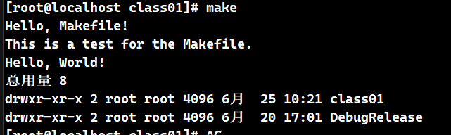
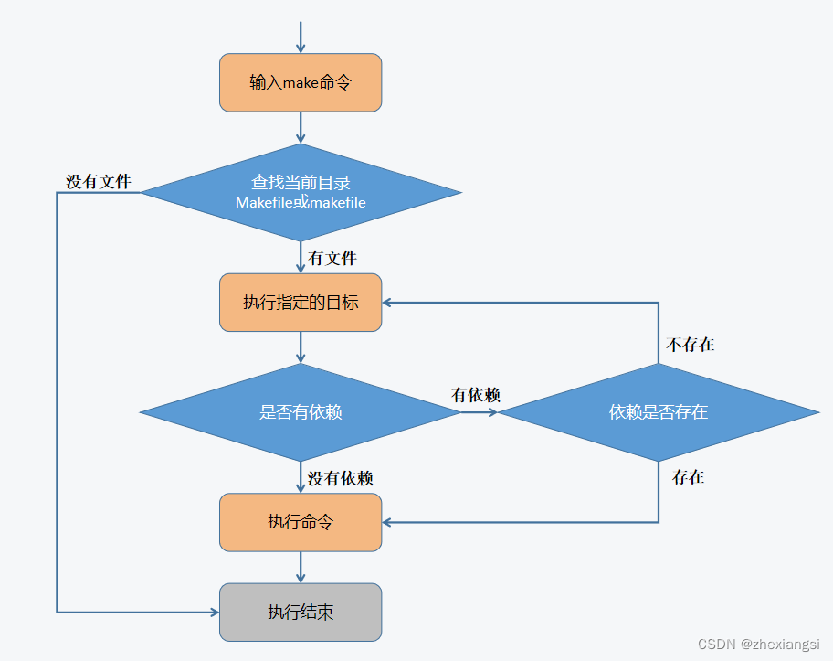

# Makefile 学习笔记

## 一、相关概念

### 1.1 Makefile 是什么

一个工程中的源文件不计其数，其按类型、功能、模块分别放在若干个目录中，makefile定义了一系列的规则来指定哪些文件需要先编译，那些文件需要后编译，那些文件需要重新编译，甚至于进行更复杂的功能操作。
[【Makefile百度百科】](https://baike.baidu.com/item/Makefile/4619787)

### 1.2 make 与 Makefile 的关系

make是一个命令工具，他解释Makefile中的指令。在Makefile文件中描述了整个工程所有文件的编译顺序、编译规则。

### 1.3 Makefile 命名规则

Makefile或makefile，一般使用Makefile。

### 1.4 Cmake 是什么

Cmake是一个跨平台的安装（编译）工具，可以用简单的语句来描述所有平台的安装（编译过程）。他能够输出各种各样的makefile或者project文件，能测试编译器所支持的C++特性，类似UNIX下的automake。
[Cmake百度百科](https://baike.baidu.com/item/cmake/7138032)

### 1.5 Cmake 与 CMakeLists 的关系

Cmake是一个命令工具，可用来生成Makefile。但也要根据CMakeLists.txt中的内容来生成，CMakeLists.txt就是写给Cmake的规则。

### 1.6 重点总结

- make是一个命令工具，Makefile是一个文件
- Cmake是一个命令工具，CMakeLists.txt是一个文件


## 二、从 hello world 开始

### 2.1 Makefile 基本语法

```makefile
目标:依赖
Tab 命令
```

- **目标**：编译目标或动作
- **依赖**：执行当前目标所需的依赖项
- **命令**：具体执行的命令
- **table键**：**一定不要使用空格键代替，不然会报错**

```makefile
# 基本示例
# a 编译目标或者动作 b c 是依赖项 所以执行make 输出的是
# Hello, Makefile!
# This is a test for the Makefile.
# Hello, World!
# 列出上一个目录的所有文件
a: b c
	@echo "Hello, World!"
	@ls -l ../
b:
	@echo "Hello, Makefile!"

c:
	@echo "This is a test for the Makefile."
```

```bash
[root@localhost class01]# make
Hello, Makefile!
This is a test for the Makefile.
Hello, World!
总用量 8
drwxr-xr-x 2 root root 4096 6月  25 10:21 class01
drwxr-xr-x 2 root root 4096 6月  20 17:01 DebugRelease
```



### 2.2 make 常用选项

```makefile
make[-f file][options][target]
```

> **常用选项**：
>
> - `-f`：指定输入文件
> - `-v`：显示版本号
> - `-n`：只输出命令不执行
> - `-C dir`：指定makefile所在目录

### 2.3 示例

#### **`-f`**：指定输入文件

指定输入文件 为mk 和 上一个makefile文件一样

```bash
[root@localhost class01]# make -f mk
Hello, Makefile!
This is a test for the Makefile.
Hello, World!
总用量 8
drwxr-xr-x 2 root root 4096 6月  25 10:21 class01
drwxr-xr-x 2 root root 4096 6月  20 17:01 DebugRelease
```

#### **`-v`**：显示版本号

```bash
[root@localhost class01]# make -v
GNU Make 3.81
Copyright (C) 2006  Free Software Foundation, Inc.
This is free software; see the source for copying conditions.
There is NO warranty; not even for MERCHANTABILITY or FITNESS FOR A
PARTICULAR PURPOSE.

This program built for x86_64-redhat-linux-gnu
```

#### **`-n`**：只输出命令不执行

```bash
[root@localhost class01]# make  -n
echo "Hello, Makefile!"
echo "This is a test for the Makefile."
echo "Hello, World!"
ls -l ../
```

#### **`-s`**:只执行命令，但不显示具体命令，此处和使用"@"符号抑制命令输出一样

- 使用 **`-s`** 执行

```makefile
a: b c
	echo "Hello, World!"
	ls -l ../
b:
	echo "Hello, Makefile!"

c:
	echo "This is a test for the Makefile."

```

```bash
[root@localhost class01]# make
echo "Hello, Makefile!"
Hello, Makefile!
echo "This is a test for the Makefile."
This is a test for the Makefile.
echo "Hello, World!"
Hello, World!
ls -l ../
总用量 8
drwxr-xr-x 2 root root 4096 6月  25 10:21 class01
drwxr-xr-x 2 root root 4096 6月  20 17:01 DebugRelease
[root@localhost class01]# make -s
Hello, Makefile!
This is a test for the Makefile.
Hello, World!
总用量 8
drwxr-xr-x 2 root root 4096 6月  25 10:21 class01
drwxr-xr-x 2 root root 4096 6月  20 17:01 DebugRelease
[root@localhost class01]#
```

- 使用"**`@`**"符号抑制命令输出

```makefile
a: b c
	@echo "Hello, World!"
	@ls -l ../
b:
	@echo "Hello, Makefile!"

c:
	@echo "This is a test for the Makefile."
```

```bash
[root@localhost class01]# make
Hello, Makefile!
This is a test for the Makefile.
Hello, World!
总用量 8
drwxr-xr-x 2 root root 4096 6月  25 10:21 class01
drwxr-xr-x 2 root root 4096 6月  20 17:01 DebugRelease
[root@localhost class01]#
```

#### **`-C dir`**：指定makefile所在目录

```bash
[root@localhost makefile]# make -C ./class01/
make: Entering directory `/root/makefile/class01'
Hello, Makefile!
This is a test for the Makefile.
Hello, World!
总用量 8
drwxr-xr-x 2 root root 4096 6月  25 10:21 class01
drwxr-xr-x 2 root root 4096 6月  20 17:01 DebugRelease
make: Leaving directory `/root/makefile/class01'
```

### 2.3 gcc/g++ 编译流程

- **预处理**：  `g++ -E main.ccp -o main.i`
- **编译**：    `g++ -S main.i -o main.s`
- **汇编**：    `g++ -c main.s -o main.o`
- **连接**：    `g++ main.o -o main`

```makefile
# 分步编译
calc:add.o sub.o multi.o
    gcc add.o sub.o multi.o calc.cpp -o calc

add.o:add.cpp
    gcc -c add.cpp -o add.o
```

## 三、Makefile 中的变量

### 3.1 自定义变量

- **定义**：

```makefile
定义：变量名=变量值
使用：$(变量名)/${变量名}
```

- **示例**：

```makefile
# 自定义变量 目标和二进制文件
OBJS = add.o div.o multi.o sub.o calc.o
TARGET = calc

$(TARGET):$(OBJS)
	g++ $(OBJS) -o $(TARGET)

add.o : add.cpp
	g++ -c add.cpp -o add.o

div.o : div.cpp
	g++ -c div.cpp -o div.o

multi.o : multi.cpp
	g++ -c multi.cpp -o multi.o

sub.o : sub.cpp
	g++ -c sub.cpp -o sub.o

calc.o : calc.cpp
	g++ -c calc.cpp -o calc.o

clean:
	rm -f $(TARGET) $(OBJS)

```

执行

```bash
[root@localhost class03]# make clean;make
rm -f calc add.o div.o multi.o sub.o calc.o
g++ -c add.cpp -o add.o
g++ -c div.cpp -o div.o
g++ -c multi.cpp -o multi.o
g++ -c sub.cpp -o sub.o
g++ -c calc.cpp -o calc.o
g++ add.o div.o multi.o sub.o calc.o -o calc
[root@localhost class03]# ./calc
Addition: 15
Subtraction: 5
Multiplication: 50
Division: 2
[root@localhost class03]#
```


### 3.2 系统常量

- **定义**：

```makefile
AS  #汇编程序的名称，默认为as
CC  #C编译器名称，默认为cc
CPP #C预编译器名称，默认为cc -E
CXX #C++编译器名称，默认为g++
RM  #文件删除程序别名，默认rm -f
```

- **示例**：

```makefile
#$(CC)可替换为$(CXX)，因为$(CXX)可实现跨平台
calc:add.o sub.o multi.o calc.o
	$(CC) add.o sub.o multi.o calc.o -o calc

add.o:add.cpp
	$(CC) -c add.cpp -o add.o

sub.o:sub.cpp
	$(CC) -c sub.cpp -o sub.o

multi.o:multi.cpp
	$(CC) -c multi.cpp -o multi.o

calc.o:calc.cpp
	$(CC) -c calc.cpp -o calc.o

clean:
	$(RM) *.o calc

```

执行

```bash
[root@localhost class03]# make clean;make
rm -f calc add.o div.o multi.o sub.o calc.o
g++ -c add.cpp -o add.o
g++ -c div.cpp -o div.o
g++ -c multi.cpp -o multi.o
g++ -c sub.cpp -o sub.o
g++ -c calc.cpp -o calc.o
g++ add.o div.o multi.o sub.o calc.o -o calc
[root@localhost class03]# ./calc
Addition: 15
Subtraction: 5
Multiplication: 50
Division: 2
[root@localhost class03]#
```

### 3.3 系统变量

- **定义**：

```makefile
$* #不包括扩展名的目标文件名称
$+ #所有的依赖文件，以空格分隔
$< #表示规则中的第一个条件
$? #所有时间戳比目标文件晚的依赖文件，以空格分隔
$@ #目标文件的完整名称
$^ #所有不重复的依赖文件，以空格分隔
$% #如果目标是归档成员，则该变量表示目标的归档成员名称
```

- **示例**：

```makefile
calc:add.o sub.o multi.o calc.o
	gcc $^ -o $@

add.o:add.cpp
	gcc -c $^ -o $@

sub.o:sub.cpp
	gcc -c $^ -o $@

multi.o:multi.cpp
	gcc -c $^ -o $@

calc.o:calc.cpp
	gcc -c $^ -o $@

clean:
	rm -f *.o calc

```

执行

```bash
[root@localhost class03]# make clean;make
rm -f calc add.o div.o multi.o sub.o calc.o
g++ -c add.cpp -o add.o
g++ -c div.cpp -o div.o
g++ -c multi.cpp -o multi.o
g++ -c sub.cpp -o sub.o
g++ -c calc.cpp -o calc.o
g++ add.o div.o multi.o sub.o calc.o -o calc
[root@localhost class03]# ./calc
Addition: 15
Subtraction: 5
Multiplication: 50
Division: 2
[root@localhost class03]#
```

## 四、伪目标和模式匹配

### 4.1 伪目标

- **伪目标** `.PHONY:clean`
  - 声明目标为伪目标之后，`makefile`将不会判断目标是否存在或该目标是否需要更新。即当make 命令与文件名重名了。不使用为目标make会去判断目标是否存在或则是否需要更新，而不会去执行make 命令，所以需要使用为目标将命令于文件区分出来，让其去执行make命令而不是去判断文件是否存在和文件是否为需要更新。

- **例如**：下列Makefile文件没有声明伪目标。存在一个和命令相同的文件

```makefile
OBJS = add.o div.o multi.o sub.o calc.o
TARGET = calc

$(TARGET):$(OBJS)
	$(CXX) $^ -o $@

add.o : add.cpp
	$(CXX) -c $^ -o $@

div.o : div.cpp
	$(CXX) -c $^ -o $@

multi.o : multi.cpp
	$(CXX) -c $^ -o $@

sub.o : sub.cpp
	$(CXX) -c $^ -o $@

calc.o : calc.cpp
	$(CXX) -c $^ -o $@

clean:
	$(RM) $(TARGET) $(OBJS)

```

执行

```bash
[root@localhost class04]# touch clean;
[root@localhost class04]# make clean
make: “clean”是最新的。
```

```Makefile
OBJS = add.o div.o multi.o sub.o calc.o
TARGET = calc

.PHONY:clean

$(TARGET):$(OBJS)
	$(CXX) $^ -o $@

add.o : add.cpp
	$(CXX) -c $^ -o $@

div.o : div.cpp
	$(CXX) -c $^ -o $@

multi.o : multi.cpp
	$(CXX) -c $^ -o $@

sub.o : sub.cpp
	$(CXX) -c $^ -o $@

calc.o : calc.cpp
	$(CXX) -c $^ -o $@

clean:
	$(RM) $(TARGET) $(OBJS)
```

执行

```bash
[root@localhost class04]# make clean
rm -f calc add.o div.o multi.o sub.o calc.o
```

### 4.2 模式匹配

- **模式匹配**: %目标:%依赖
  目标和依赖相同部份，可用%来通配 `%.o:%.cpp` 表示 .o目标文件依赖于同名称的.cpp文件 所以上述的 `add.o:add.cpp`, `div.o : div.cpp` 可直接使用`%.o:%.cpp` 代码如下

```makefile
OBJS = add.o div.o multi.o sub.o calc.o
TARGET = calc

.PHONY:clean

$(TARGET):$(OBJS)
	$(CXX) $^ -o $@

%.o:%.cpp
	$(CXX) -c $^ -o $@

clean:
	$(RM) $(TARGET) $(OBJS)
```

执行

```bash
[root@localhost class04]# make clean;make
rm -f calc add.o div.o multi.o sub.o calc.o
g++ -c add.cpp -o add.o
g++ -c div.cpp -o div.o
g++ -c multi.cpp -o multi.o
g++ -c sub.cpp -o sub.o
g++ -c calc.cpp -o calc.o
g++ add.o div.o multi.o sub.o calc.o -o calc
[root@localhost class04]# ./calc
Addition: 15
Subtraction: 5
Multiplication: 50
Division: 2
```

### 4.3 makefile 内置函数

- **内置函数** `wildcard` 和 `patsubst`

```makefile
# 获取当前目录下所有.cpp文件
SRC = $(wildcard ./*.cpp)

# 将对应的cpp 文件名替换成 .o 文件名
OBJ = $(patsubst %.cpp, %.o, $(SRC))
```

- **示例**：

```makefile
# 获取当前目录所有.cpp文件，并将扩展名替换为.o
OBJS = $(patsubst %.cpp, %.o, $(wildcard ./*.cpp))

# 定义目标可执行文件名
TARGET = calc

# 声明伪目标
.PHONY:clean show

# 主构建规则：将.o文件链接成可执行文件
$(TARGET):$(OBJS)
	$(CXX) $^ -o $@

# 模式规则：将.cpp源文件编译为.o目标文件
%.o:%.cpp
	$(CXX) -c $^ -o $@

# 清理规则：删除生成的文件
clean:
	$(RM) $(TARGET) $(OBJS)

# 调试规则：显示Makefile变量信息
show:
	@echo "源文件: $(wildcard ./*.cpp)"
	@echo "目标文件: $(patsubst %.cpp,%.o,$(wildcard ./*.cpp))"
	@echo "OBJS: $(OBJS)"
```

执行

```bash
[root@localhost class04]# make clean;make
rm -f calc  ./add.o  ./calc.o  ./div.o  ./multi.o  ./sub.o
g++ -c add.cpp -o add.o
g++ -c calc.cpp -o calc.o
g++ -c div.cpp -o div.o
g++ -c multi.cpp -o multi.o
g++ -c sub.cpp -o sub.o
g++ add.o calc.o div.o multi.o sub.o -o calc
[root@localhost class04]# ./calc
Addition: 15
Subtraction: 5
Multiplication: 50
Division: 2
```

## 五、Makefile 运行流程



```makefile
calc:add.o sub.o multi.o
    gcc add.o sub.o multi.o calc.cpp -o calc

add.o:add.cpp
    gcc -c add.cpp -o add.o

sub.o:sub.cpp
    gcc -c sub.cpp -o sub.o

multi.o:multi.cpp
    gcc -c multi.cpp -o multi.o

clean:
    rm -f *.o calc
```

> **注意**：
>
> - 代码执行流程如上图所示
> - 保证目标使用最新的依赖生成
> - 第一次完全编译，后面只编译最新的代码（部分编译）

## 六、编译动态链接库

### 6.1 动态链接库特点

动态链接库：不会把代码编译到二进制文件中，而是在运行时才去加载，所以需要维护一个地址

- **动态**：动态加载，运行时才加载
- **链接**：指库文件和二进制程序分离，用某种手段维护两者之间的关系
- **扩展名**：Windows(.dll)，Linux(.so)
- **常用选项**：

  ```makefile
  -fPIC     # 位置无关代码
  -shared   # 共享库
  -l        # 指定动态库
  -I        # 指定头文件目录，默认当前目录
  -L        # 指定库搜索目录
  ```

- **优点**：程序可以和库文件分离，可以分别发版，然后库文件可以被多处共享

### 6.2 动态库示例

**`soTest.h`**

```cpp
#ifndef __SOTEST_H__
#define __SOTEST_H__
class SoTest
{
private:
    /* data */
public:
    void func1();
    virtual void func2();
    virtual void func3() = 0;
};

#endif
```

**`soTest.cpp`**

```cpp
#include "SoTest.h"
#include <iostream>

void SoTest::func1()
{
    std::cout << "SoTest::func1()" << std::endl;
}

void SoTest::func2()
{
    std::cout << "SoTest::func2()" << std::endl;
}

```

```makefile
# 共享库目标：创建共享库
libSoTest.so: SoTest.o
	$(CXX) -shared SoTest.o -o libSoTest.so

# SoTest 编译规则：编译共享库组件（位置无关代码）
SoTest.o: SoTest.cpp
	$(CXX) -fPIC -c SoTest.cpp -o SoTest.o
```

- **`soTest.cpp`** 编译后会产生 **`SoTest.o`** ，不用担心文件名不同会出现问题，在后续引用中，lib自动会被丢弃

**`Test.cpp`**

```cpp
#include <iostream>
#include "SoTest.h"

class Test : public SoTest
{
public:
    void func2()
    {
        std::cout << "Test::func2()" << std::endl;
    }
    void func3()
    {
        std::cout << "Test::func3()" << std::endl;
    }
};

int main()
{
    Test t1;
    t1.func1();
    t1.func2();
    t1.func3();
    return 0;
}
```

```makefile
# 声明伪目标，这些目标不代表实际文件
.PHONY: all clean  test cleantest

# 设置库文件所在目录（当前目录）
LIB_DIR := ./

# 主要目标：构建测试程序，依赖lib目标（先构建库）
# 编译测试程序并链接共享库
# -I$(LIB_DIR) 指定头文件搜索路径
# -L$(LIB_DIR) 指定库文件搜索路径
# -lSoTest 链接libSoTest.so共享库
# -Wl,-rpath='$$ORIGIN/$(LIB_DIR)' 设置运行时库搜索路径
all: libSoTest.so

# 测试程序目标：链接测试程序
test: test.o libSoTest.so
	$(CXX) -L$(LIB_DIR) test.o -lSoTest -o test -Wl,-rpath='$$ORIGIN'

# 测试程序编译规则 编译测试程序
test.o: test.cpp
	$(CXX) -I$(LIB_DIR) -c test.cpp -o test.o

# 共享库目标：创建共享库
libSoTest.so: SoTest.o
	$(CXX) -shared SoTest.o -o libSoTest.so

# SoTest 编译规则：编译共享库组件（位置无关代码）
SoTest.o: SoTest.cpp
	$(CXX) -fPIC -c SoTest.cpp -o SoTest.o

# 清理目标：删除所有生成的文件
clean:
	$(RM) test test.o SoTest.o libSoTest.so

cleantest:
	$(RM) test test.o
```

```bash
[root@localhost 001]# make clean;make
rm -f test test.o SoTest.o libSoTest.so
g++ -fPIC -c SoTest.cpp -o SoTest.o
g++ -shared SoTest.o -o libSoTest.so
```

- 指定动态库文件 **`soTest`**，编译后由 **`Test.cpp`** 文件产生 **`Test.o`** 文件

**`main.cpp`**

```cpp
#include "SoTest.h"
#include <iostream>

class MainTest : public SoTest
{
public:
    void func2()
    {
        std::cout << "MainTest::func2()" << std::endl;
    }

    void func3()
    {
        std::cout << "MainTest::func3()" << std::endl;
    }
};

int main()
{
    MainTest t1;
    t1.func1();
    t1.func2();
    t1.func3();

    return 0;
}
```

```makefile
.PHONY: all clean

# 设置库目录（使用相对路径）
LIB_DIR := ./001

all: main

# 主程序依赖 main.o
# 链接主程序并设置运行时库路径
# 检查动态库是否存在
main: main.o
	@test -f $(LIB_DIR)/libSoTest.so || (echo "错误：找不到动态库 $(LIB_DIR)/libSoTest.so"; exit 1)
	$(CXX) -L$(LIB_DIR) main.o -lSoTest -o main -Wl,-rpath='$$ORIGIN/$(LIB_DIR)'

# 主程序编译规则：编译主程序
# -I$(LIB_DIR) 指定头文件搜索路径
main.o: main.cpp
	$(CXX) -I$(LIB_DIR) -c main.cpp -o main.o

# 清理目标:删除所有生成的文件
clean:
	$(RM) main main.o
```

- 编译时指定了要依赖的动态库，但运行时，会无法找到 **`.so`** 文件
- **解决方法：**
  - 在Makefile 添加 `-Wl,-rpath='$$ORIGIN/$(LIB_DIR)'` 即可 不用设置环境变量 也不用将.so动态库添加到 `/usr/lib` 或 `/usr/local/lib`不用污染源库环境。
  - 将动态库文件移动到main.cpp文件同级目录下
  - 运行时手动指定动态库文件所在目录

## 七、编译静态链接库

### 7.1 静态链接库特点

- **扩展名**：Windows(.lib)，Linux(.a)
- **优点**：运行时速度快
- **缺点**：程序体积大，更新需重新编译

### 7.2 动态库 vs 静态库

| 特性 | 动态链接库       | 静态链接库     |
| ---- | ---------------- | -------------- |
| 部署 | 需与程序同时部署 | 可单独部署     |
| 更新 | 更新库文件即可   | 需重新编译程序 |
| 大小 | 较小             | 较大           |

### 7.3 静态库示例

```bash
# 编译静态库
g++ -c aTest.cpp -o aTest.o
ar -r libaTest.a aTest.o

# 使用静态库
g++ -lsoTest -laTest main.cpp -o main
```

## 八、通用部分做公共文件头

### 8.1 项目结构示例

```bash
project/
├── 003/
│   ├── a.cpp
│   ├── b.cpp
│   ├── c.cpp
│   └── Makefile
├── 004/
│   ├── x.c
│   ├── y.c
│   ├── z.c
│   └── Makefile
└── makefile
```

### 8.2 公共Makefile

```makefile

# makefile (公共部分)
SOURCE = $(wildcard ./*.cpp ./*.c)
OBJ = $(patsubst %.cpp, %.o, $(SOURCE))
OBJ := $(patsubst %.c, %.o, $(OBJ))

$(TARGET):$(OBJ)
    $(CXX) $^ -o $@
```

### 8.3 示例

**`003/a.cpp`**

```cpp
#include <iostream>

void func_a(){
    printf("func-a.cpp");
}
```

**`003/b.cpp`**

```cpp
#include <iostream>

void func_b(){
    printf("func-b.cpp");
}
```

**`003/c.cpp`**

```cpp
extern void func_a();
extern void func_b();

int main(){
    func_a();
    func_b();

    return 0;
}
```

**`003/Makefile`**

```cpp
TARGET = c

include ../makefile
```

**`004/x.c`**

```cpp
#include <stdio.h>

void func_x(){
    printf("func-x.c");
}
```

**`004/y.c`**

```cpp
#include <stdio.h>

void func_y(){
    printf("func-y.c");
}
```

**`004/z.c`**

```cpp
extern void func_x();
extern void func_y();

int main(){
    func_x();
    func_y();

    return 0;
}
```

**`004/Makefile`**

```makefile
TARGET = z

include ../makefile

makefile

SOURCE = $(wildcard ./*.cpp ./*.C)
OBJ = $(patsubst %.cpp, %.o, $(SOURCE))
OBJ := $(patsubst %.c, %.o, $(OBJ))

.PHONY:clean

$(TARGET):$(OBJ)
    $(CXX) $^ -o $@

clean:
    $(RM) $(TARGET) $(OBJ)
```

**Makefile**中，都是先展开所有变量，再调用指令

- = 赋值，但是用终值，就是不管变量调用写在赋值前还是赋值后，调用时都是取终值
- **`:=`** 也是赋值，但是只受当前行及之前的代码影响，而不会受后面的赋值影响

## 九、调用 shell 命令

### 9.1 shell 命令使用示例

```makefile
FILE = abc

A := $(shell ls ../)                                        # 列出上级目录中的所有目录
B := $(shell pwd)                                           # 显示当前所在工作目录的绝对路径
C := $(shell if [ ! -f $(FILE) ]; then touch $(FILE); fi;)  # 判断文件是否存在

a:
    echo $(A)
    echo $(B)
    echo $(C)

clean:
    $(RM) $(FILE)


```

## 十、嵌套调用和多项目编译

### 10.1 多项目编译方法

源文件为 **八、Makefile 中通用部分做公共文件头** 中的例子用到的

**`makefile`** 更名为 **`makefile-head`**
**`003/Makefile`**、**`004/Makefile`** 中的 **`include ../makefile`** 改为 **`include ../makefile-head`**
新建的 **`Makefile`** 与 **`makefile-head`** 在同一级目录下

```makefile
# 方法1：逐个调用
all:
    make -C ./003
    make -c ./004

clean:
    make -C ./003 clean
    make -C ./004 clean

# 方法2：循环调用
.PHONY:003 004

DIR = 003 004

all:$(DIR)

$(DIR):
    make -C $@

clean:
    echo $(shell for dir in $(DIR); do make -C $$dir clean; done)
```

## 十一、条件判断

### 11.1 条件判断类型

```makefile
ifeq   # 判断相等
ifneq  # 判断不等
ifdef  # 判断变量存在
ifndef # 判断变量不存在
```

```makefile
A := 123

RS1 :=
RS2 :=
RS3 :=
RS4 :=

ifeq ($(A), 123)
    RS1 := RS1-yes
else
    RS1 := RS1-no
endif

ifneq ($(A), 123)
    RS2 := RS2-yes
else
    RS2 := RS2-no
endif

ifdef A
    RS3 := RS3-yes
else
    RS3 := RS3-no
endif

ifndef A
    RS4 := RS4-yes
else
    RS4 := RS4-no
endif

ifdef FLAG
    FLAG := default
endif

all:
    echo $(RS1)
    echo $(RS2)
    echo $(RS3)
    echo $(RS4)
    echo flag = $(FLAG)

```

- **命令行传参**

```bash
make -f Makefile FLAG=456

#如果有 Makefile
make FLAG=456
```

### 11.2 条件判断示例

```makefile
ifeq ($(ARCH), arm)
    CC = arm-linux-gcc
else
    CC = gcc
endif
```

## 十二、循环操作

### 12.1 循环使用示例

**`Makefile`**

- makefile 中只有一个循环 foreach，只支持 GNU Make，其他平台的 make 需要使用 shell 中的循环来实现

```makefile
TARGET = a b c d

all:
    echo $(TARGET)
    echo $(foreach v, $(TARGET), $v)
    echo $(foreach v, $(TARGET), $v.txt)

```

- **`foreach`** 可以在循环中逐个的修改值

```makefile
TARGET = a b c d

all:
    touch $(TARGET)
    touch $(foreach v, $(TARGET), $v)
    touch $(foreach v, $(TARGET), $v.txt)

clean:
    $(RM) $(TARGET) *.txt


```

## 十三、自定义函数

### 13.1 函数定义与调用

**`Makefile`**

- 自定义函数不是真正的函数，本质上是多行命令放在了目标外
- 可以传递参数

  - $(0) 为本身文件名
  - $(1) **为要接受的参数** (A)
  - $(2) 为要接受的参数 asd
- 没有返回值
  **`(callFUNC2)`** 会报错，可以在 **`(call FUNC2)`** 前加 **`echo`** 命令，将 **`return`** 当作一个字符串，和 **`123`** 一起输出

```makefile
A := 123

define FUNC1
    echo func
    echo $(0) $(1) $(2)
endef

define FUNC2
    return 123
endef

define FUNC3
    echo $(shell ls)
endef

all:
    $(call FUNC1, $(A), asd)
    $(call FUNC2)
    $(call FUNC3)

```

## 十四、make install 实现

### 14.1 安装流程实现

- **`make`**

  - 将源文件编译成二进制可执行文件（包括各种库文件）
- **`make install`**

  - 创建目录，将可执行文件拷贝到指定目录（安装目录）
  - 加全局可执行的路径
  - 加全局的启停脚本
- **`make clean`**

  - 重置编辑环境，删除无关文件

**`main.cpp`**

```cpp
#include <iostream>
#include <unistd.h>
using namespace std;

int main(){
    int i = 0;
    while (true){
        i++;
        cout<<"main-running-"<<i<<endl;
        sleep(1);
    }

    return 0;
}

```

**`Makefile`**

```makefile
MYPATH := /test/main/
BIN := /usr/local/bin/

START_S := $(MYPATH)$(TARGET)_start
STOP_S := $(MYPATH)$(TARGET)_stop
LOG := $(MYPATH)$(TARGET).log

TARGET := main
OBJ := $(TARGET).o

CC = g++

$(TARGET):$(OBJ)

install:$(TARGET)
    if [ -d $(MYPATH) ];\
        then echo $(MYPATH) exist;\
    else\
        mkdir $(MYPATH);\
        cp $(TARGET) $(MYPATH);\
        ln -sv $(MYPATH)$(TARGET) $(BIN);\
        touch $(LOG);\
        chmod a+rwx $(LOG);\
        echo "$(TARGET)>$(LOG) & echo $(TARGET) running...">$(MYPATH)$(START_S);\
        echo "killall $(TARGET)">$(MYPATH)$(STOP_S);\
        chmod a+x $(MYPATH)$(START_S);\
        chmod a+x $(MYPATH)$(STOP_S);\
        ln -sv $(MYPATH)$(START_S) $(BIN);\
        ln -sv $(MYPATH)$(STOP_S) $(BIN);\
    fi;

clean:
    $(RM) $(TARGET) $(OBJ) $(BIN)$(TARGET) $(BIN)$(START_S) $(BIN)$(STOP_S)
    $(RM) -rf $(MYPATH)

.PHONY:clean install

```

- 判断对应路径下是否存在
  - 存在
    - 输出路径存在
  - 不存在
    - 创建一个与路径相同的目录
    - 把可执行文件复制到对应目录下
    - 为该文件在某一位置创建一个同步的软链接，即全局可执行路径
    - 在目录下创建一个日志文件并增加权限
    - 在目录下创建启停脚本，增加权限，并创建一个同步的软链接
