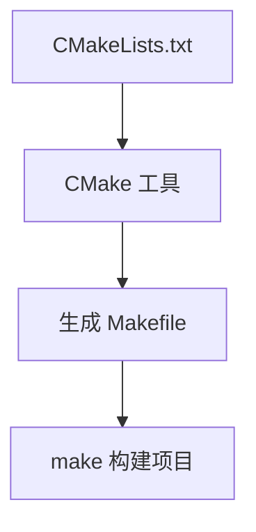

# Makefile 全面学习指南

## 一、核心概念解析

### 1. Makefile 是什么

Makefile 是定义项目构建规则的文本文件，包含：

- **编译顺序**：指定文件编译的先后关系
- **依赖关系**：定义文件之间的依赖链
- **构建规则**：描述如何从源文件生成目标文件
- **自动化操作**：支持安装、清理等辅助操作

### 2. make 与 Makefile 的关系


### 3. 命名规范

- 首选文件名：`Makefile`（首字母大写）
- 备选文件名：`makefile`
- 特殊文件名：`GNUmakefile`（仅 GNU make 使用）

### 4. CMake 与 Makefile



### 5. 核心区别

| 工具  | 输入文件       | 主要功能               | 优势             |
| ----- | -------------- | ---------------------- | ---------------- |
| make  | Makefile       | 执行构建规则           | 精细控制构建过程 |
| cmake | CMakeLists.txt | 生成平台相关的构建文件 | 跨平台，配置简单 |

## 二、基础语法与实践

### 1. 基本语法结构

```makefile
target: dependencies
[TAB]command1
[TAB]command2
```

### 2. Hello World 示例

```makefile
# 简单示例
hello:
    @echo "Hello Makefile World!"
    @ls -l

# 带依赖的构建
build: hello
    @echo "Building project..."
    g++ main.cpp -o app

clean:
    @rm -f app
    @echo "Cleaned build artifacts"
```

### 3. make 常用选项

| 选项 | 说明                       | 示例                      |
| ---- | -------------------------- | ------------------------- |
| -f   | 指定 Makefile 文件         | `make -f custom.mk`     |
| -n   | 干运行（显示但不执行命令） | `make -n build`         |
| -s   | 静默模式（不显示命令）     | `make -s`               |
| -C   | 指定工作目录               | `make -C src/`          |
| -j   | 并行编译                   | `make -j4`（4线程编译） |
| -p   | 显示所有规则和变量         | `make -p > rules.txt`   |

## 三、变量系统详解

### 1. 变量类型

| 类型       | 定义方式         | 特点                     | 示例                    |
| ---------- | ---------------- | ------------------------ | ----------------------- |
| 系统变量   | 内置             | 自动维护                 | `$@`, `$<`, `$^`  |
| 系统常量   | 内置             | 工具链配置               | `CC`, `CXX`, `RM` |
| 自定义变量 | `VAR = value`  | 延迟求值                 | `CC = gcc`            |
|            | `VAR := value` | 立即求值                 | `CFLAGS := -O2`       |
|            | `VAR ?= value` | 条件赋值（不存在时设置） | `DEBUG ?= 1`          |

### 2. 自动变量

| 变量                                                           | 含义 | 示例 |
| -------------------------------------------------------------- | ---- | ---- |
| `$@` | 当前目标名                    | `gcc -c $@.c`       |      |      |
| `$<` | 第一个依赖文件                | `gcc -c $<`         |      |      |
| `$^` | 所有不重复的依赖文件          | `gcc $^ -o $@`      |      |      |
| `$?` | 比目标更新的所有依赖          | `tar cvf $@ $?`     |      |      |
| `$*` | 不包括扩展名的目标文件名称    | `gcc -c $*.c -o $@` |      |      |

### 3. 变量使用示例

```makefile
# 编译器配置
CC := gcc
CXX := g++
CFLAGS := -Wall -O2

# 文件管理
SRC_DIR := src
OBJ_DIR := obj
SOURCES := $(wildcard $(SRC_DIR)/*.c)
OBJECTS := $(patsubst $(SRC_DIR)/%.c,$(OBJ_DIR)/%.o,$(SOURCES))

# 目标配置
TARGET := app
INSTALL_DIR := /usr/local/bin
```

## 四、高级特性与应用

### 1. 伪目标声明

```makefile
.PHONY: clean install uninstall

clean:
    @rm -rf $(OBJ_DIR) $(TARGET)
```

### 2. 模式匹配规则

```makefile
# 通用编译规则
$(OBJ_DIR)/%.o: $(SRC_DIR)/%.c
    @mkdir -p $(@D)
    $(CC) $(CFLAGS) -c $< -o $@
```

### 3. 条件判断

```makefile
# 调试模式配置
DEBUG ?= 0

ifeq ($(DEBUG),1)
    CFLAGS += -g -DDEBUG
else
    CFLAGS += -O3
endif

# 平台检测
ifdef SystemRoot
    RM := del /Q
else
    RM := rm -f
endif
```

### 4. 内置函数

```makefile
# 查找所有源文件
SRC_FILES := $(shell find src -name '*.cpp')

# 生成对象文件列表
OBJ_FILES := $(patsubst src/%.cpp,obj/%.o,$(SRC_FILES))

# 添加前缀
INCLUDE_DIRS := include lib/include
INCLUDES := $(addprefix -I,$(INCLUDE_DIRS))
```

## 五、库文件管理

### 1. 静态库（.a）

```makefile
# 创建静态库
libmath.a: add.o sub.o
    $(AR) rcs $@ $^

# 使用静态库
calculator: main.o libmath.a
    $(CC) $^ -o $@ -L. -lmath
```

### 2. 动态库（.so）

```makefile
# 创建动态库
libprint.so: print.o
    $(CC) -shared $^ -o $@

# 编译位置无关代码
print.o: print.c
    $(CC) -fPIC -c $< -o $@
```

### 3. 库特性对比

| 特性       | 静态库                     | 动态库                      |
| ---------- | -------------------------- | --------------------------- |
| 文件扩展名 | .a (Linux), .lib (Windows) | .so (Linux), .dll (Windows) |
| 链接方式   | 编译时嵌入                 | 运行时加载                  |
| 优点       | 无运行时依赖，执行速度快   | 节省磁盘空间，易于更新      |
| 缺点       | 增大可执行文件体积         | 需要部署依赖库              |
| 编译选项   | `ar rcs`                 | `-shared -fPIC`           |

## 六、多目录项目管理

### 1. 项目结构示例

```
project/
├── src/
│   ├── main.cpp
│   ├── utils/
│   │   ├── file.cpp
│   │   └── log.cpp
│   └── math/
│       ├── add.cpp
│       └── sub.cpp
├── include/
│   ├── utils/
│   │   ├── file.h
│   │   └── log.h
│   └── math/
│       ├── add.h
│       └── sub.h
├── lib/
├── build/
└── Makefile
```

### 2. 跨目录构建实现

```makefile
# 自动发现源文件
SRC_FILES := $(shell find src -name '*.cpp')
OBJ_FILES := $(patsubst src/%,build/obj/%,$(SRC_FILES:.cpp=.o))
DEP_FILES := $(OBJ_FILES:.o=.d)

# 包含依赖关系
-include $(DEP_FILES)

# 编译规则
build/obj/%.o: src/%.cpp
    @mkdir -p $(@D)
    $(CXX) $(CXXFLAGS) -Iinclude -MMD -c $< -o $@

# 最终目标
$(TARGET): $(OBJ_FILES)
    $(CXX) $^ -o $@
```

## 七、安装与部署

### 1. make install 实现

```makefile
.PHONY: install uninstall

install: $(TARGET)
    @echo "Installing to $(INSTALL_DIR)"
    @install -d $(BIN_INSTALL_DIR)
    @install -m 755 $(TARGET) $(BIN_INSTALL_DIR)
    @echo "Installation complete"

uninstall:
    @rm -f $(BIN_INSTALL_DIR)/$(TARGET)
    @echo "Uninstallation complete"
```

### 2. 完整安装示例

```makefile
MYPATH := /opt/myapp/
BIN_LINK := /usr/local/bin/myapp

install: $(TARGET)
    # 创建安装目录
    @mkdir -p $(MYPATH)

    # 复制可执行文件
    @cp $(TARGET) $(MYPATH)

    # 创建符号链接
    @ln -sf $(MYPATH)$(TARGET) $(BIN_LINK)

    # 创建启动脚本
    @echo '#!/bin/sh' > $(MYPATH)start.sh
    @echo 'cd $(MYPATH) && ./$(TARGET) &' >> $(MYPATH)start.sh
    @chmod +x $(MYPATH)start.sh

    # 创建停止脚本
    @echo '#!/bin/sh' > $(MYPATH)stop.sh
    @echo 'pkill -f $(TARGET)' >> $(MYPATH)stop.sh
    @chmod +x $(MYPATH)stop.sh

    @echo "Installation complete"
```

## 八、调试与优化

### 1. 调试技巧

```makefile
# 打印变量值
debug-vars:
    @echo "Sources: $(SOURCES)"
    @echo "Objects: $(OBJECTS)"

# 警告信息
check-dir:
    $(if $(wildcard $(BUILD_DIR)),,$(warning Build directory does not exist))

# 错误处理
validate:
    $(if $(CONFIG_FILE),,$(error CONFIG_FILE is not defined))
```

### 2. 高级调试选项

```bash
# 显示详细执行过程
make --debug=v

# 显示所有变量和规则
make -p > make_rules.txt

# 显示执行时间
time make -j8
```

### 3. 性能优化

```makefile
# 并行编译
.NOTPARALLEL: # 禁用并行（默认启用）

# 避免重复规则匹配
.SUFFIXES: # 清空后缀列表

# 二次展开
.SECONDEXPANSION:
target: $$(addprefix $$(OBJ_DIR)/, $$(notdir $$(SOURCES:.c=.o))
```

## 九、最佳实践指南

1. **目录分离**：源文件、头文件、构建产物分目录存放

   ```makefile
   SRC_DIR := src
   INC_DIR := include
   BUILD_DIR := build
   BIN_DIR := bin
   ```
2. **自动依赖生成**：使用 `-MMD` 选项自动处理头文件依赖

   ```makefile
   CFLAGS += -MMD
   -include $(OBJ_FILES:.o=.d)
   ```
3. **模块化设计**：将大型项目分解为多个 Makefile

   ```makefile
   # 包含子模块
   include module1/Makefile
   include module2/Makefile
   ```
4. **错误处理**：关键命令前添加 `-` 忽略错误

   ```makefile
   clean:
       -@rm -rf build 2>/dev/null
   ```
5. **文档支持**：添加帮助目标

   ```makefile
   .PHONY: help
   help:
       @echo "Available targets:"
       @echo "  build    - 构建项目"
       @echo "  clean    - 清理构建产物"
       @echo "  install  - 安装到系统"
   ```

## 十、完整项目示例

### 1. 项目结构

```
calculator/
├── src/
│   ├── main.cpp
│   ├── math/
│   │   ├── add.cpp
│   │   ├── sub.cpp
│   │   └── mul.cpp
│   └── util/
│       └── logger.cpp
├── include/
│   ├── math/
│   │   ├── add.h
│   │   ├── sub.h
│   │   └── mul.h
│   └── util/
│       └── logger.h
├── lib/
├── build/
└── Makefile
```

### 2. Makefile 实现

```makefile
# ================= 配置区域 =================
TARGET := calculator
CC := g++
CXXFLAGS := -std=c++17 -Wall -Wextra -Iinclude

# 调试配置
DEBUG ?= 0
ifeq ($(DEBUG),1)
    CXXFLAGS += -g -O0 -DDEBUG
else
    CXXFLAGS += -O3
endif

# 目录配置
SRC_DIR := src
BUILD_DIR := build
BIN_DIR := bin

# ================ 文件自动发现 ===============
# 查找所有源文件
SRC_FILES := $(shell find $(SRC_DIR) -name '*.cpp')
# 生成对象文件列表
OBJ_FILES := $(patsubst $(SRC_DIR)/%.cpp,$(BUILD_DIR)/%.o,$(SRC_FILES))
# 生成依赖文件列表
DEP_FILES := $(OBJ_FILES:.o=.d)

# ================ 构建规则 ==================
$(BIN_DIR)/$(TARGET): $(OBJ_FILES)
    @mkdir -p $(@D)
    $(CC) $^ -o $@ $(LDFLAGS)

# 包含依赖关系
-include $(DEP_FILES)

# 通用编译规则
$(BUILD_DIR)/%.o: $(SRC_DIR)/%.cpp
    @mkdir -p $(@D)
    $(CC) $(CXXFLAGS) -MMD -c $< -o $@

# ================ 辅助目标 ==================
.PHONY: all clean install

all: $(BIN_DIR)/$(TARGET)

clean:
    @rm -rf $(BUILD_DIR) $(BIN_DIR)
    @echo "Project cleaned"

install: $(BIN_DIR)/$(TARGET)
    @install -d /usr/local/bin
    @install -m 755 $< /usr/local/bin/$(TARGET)
    @echo "Installed to /usr/local/bin"

# ================ 帮助文档 ==================
help:
    @echo "Makefile for Calculator Project"
    @echo "Targets:"
    @echo "  make all     - 构建项目 (默认)"
    @echo "  make clean   - 清理构建产物"
    @echo "  make install - 安装到系统"
    @echo "  make help    - 显示此帮助"
```

## 学习路径建议

1. **入门阶段**：

   - 掌握基本规则语法（目标-依赖-命令）
   - 理解变量和自动变量的使用
   - 练习简单项目的构建
2. **中级阶段**：

   - 学习模式匹配和通配符应用
   - 掌握多目录项目构建技巧
   - 理解静态库和动态库的创建与使用
3. **高级阶段**：

   - 实现自动化依赖处理
   - 开发跨平台构建系统
   - 优化大型项目的构建性能
   - 集成测试和持续构建流程
4. **专家阶段**：

   - 设计元构建系统（如 CMake）
   - 开发构建工具插件
   - 优化分布式构建
   - 实现增量编译的极致优化

> 建议学习资源：
>
> - GNU Make 官方文档：https://www.gnu.org/software/make/manual/
> - 《Managing Projects with GNU Make》书籍
> - CMake 官方教程：https://cmake.org/cmake/help/latest/guide/tutorial/index.html
